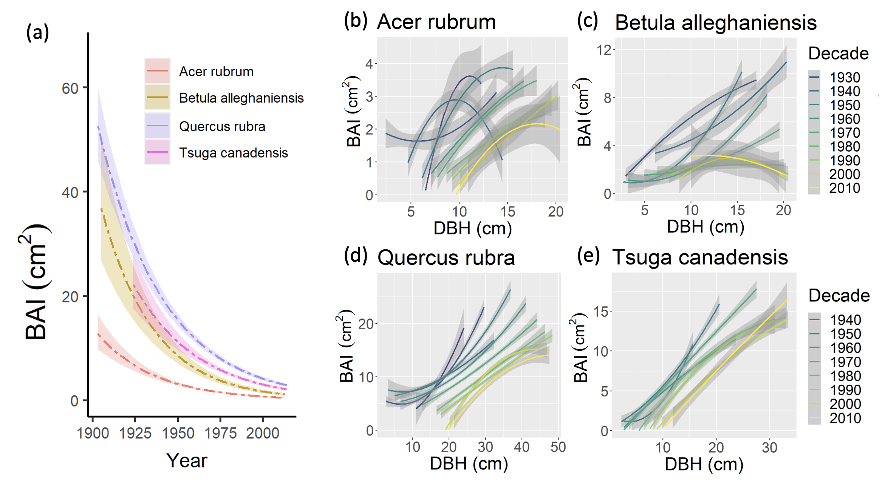
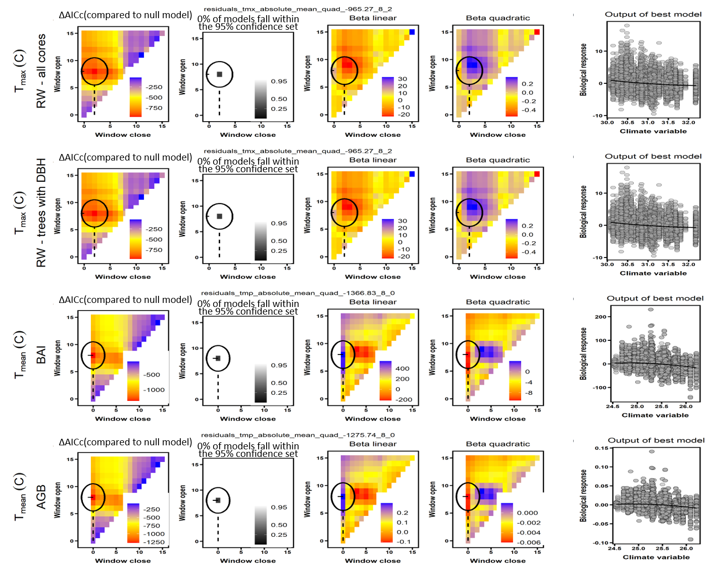
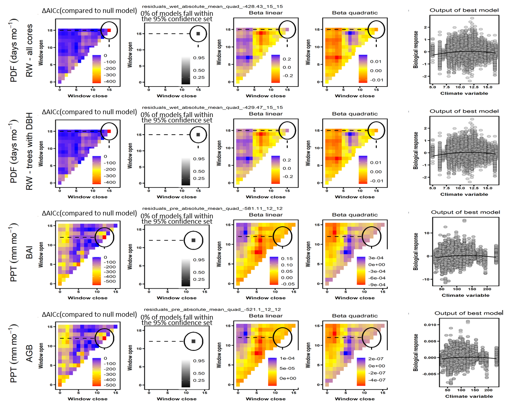

```{r, include=FALSE}
options(tinytex.verbose = TRUE)
options(knitr.table.format = "latex")
```

```{r eval = TRUE, echo=FALSE, warning=FALSE, results='hide'}
#READING IN TABLES TO GET STATS FOR TEXT
path_to_dir <- dirname(dirname(getwd())) # get path to repo (ForestGEO-tree-rings)

# MOVE FIGURE FILES (doing this because I got an error when using the absolute path to call figures)
#traditional comparison
do.call(file.remove, list(list.files("/Users/kteixeira/Dropbox (Smithsonian)/GitHub/EcoClimLab/ForestGEO-tree-rings/doc/manuscript/tables_figures/SI_figures/traditional_comparison/", full.names = TRUE))) # first remove old files
flist <- list.files("/Users/kteixeira/Dropbox (Smithsonian)/GitHub/EcoClimLab/ForestGEO-tree-rings/results/formal_comparison/figures/", "^climwin_vs_dcc_.+[.]png$", full.names = TRUE)
file.copy(flist, "/Users/kteixeira/Dropbox (Smithsonian)/GitHub/EcoClimLab/ForestGEO-tree-rings/doc/manuscript/tables_figures/SI_figures/traditional_comparison/")

# climwin plots
do.call(file.remove, list(list.files("/Users/kteixeira/Dropbox (Smithsonian)/GitHub/EcoClimLab/ForestGEO-tree-rings/doc/manuscript/tables_figures/SI_figures/climwin_plots_combined/", full.names = TRUE))) # first remove old files
flist <- list.files("/Users/kteixeira/Dropbox (Smithsonian)/GitHub/EcoClimLab/ForestGEO-tree-rings/results/climwin_plots_combined/", full.names = TRUE)
file.copy(flist, "/Users/kteixeira/Dropbox (Smithsonian)/GitHub/EcoClimLab/ForestGEO-tree-rings/doc/manuscript/tables_figures/SI_figures/climwin_plots_combined/")


#composite plots
do.call(file.remove, list(list.files("/Users/kteixeira/Dropbox (Smithsonian)/GitHub/EcoClimLab/ForestGEO-tree-rings/doc/manuscript/tables_figures/SI_figures/composite_plots/", full.names = TRUE))) # first remove old files
flist <- list.files("/Users/kteixeira/Dropbox (Smithsonian)/GitHub/EcoClimLab/ForestGEO-tree-rings/results/composite_plots/", full.names = TRUE)
file.copy(flist, "/Users/kteixeira/Dropbox (Smithsonian)/GitHub/EcoClimLab/ForestGEO-tree-rings/doc/manuscript/tables_figures/SI_figures/composite_plots/")

#decadal plots
do.call(file.remove, list(list.files("/Users/kteixeira/Dropbox (Smithsonian)/GitHub/EcoClimLab/ForestGEO-tree-rings/doc/supplementary_figures/decadal_plots/", full.names = TRUE))) # first remove old files
flist <- list.files("/Users/kteixeira/Dropbox (Smithsonian)/GitHub/EcoClimLab/tree-rings_global-change/decadal_plots/", full.names = TRUE)
file.copy(flist, "/Users/kteixeira/Dropbox (Smithsonian)/GitHub/EcoClimLab/ForestGEO-tree-rings/doc/supplementary_figures/decadal_plots/")

#recruitment plots
do.call(file.remove, list(list.files("/Users/kteixeira/Dropbox (Smithsonian)/GitHub/EcoClimLab/ForestGEO-tree-rings/doc/supplementary_figures/recruitment_years/", full.names = TRUE))) # first remove old files
flist <- list.files("/Users/kteixeira/Dropbox (Smithsonian)/GitHub/EcoClimLab/ForestGEO_dendro/data_processed/", "^Recrutement_years_.+[.]png$",  full.names = TRUE)
file.copy(flist, "/Users/kteixeira/Dropbox (Smithsonian)/GitHub/EcoClimLab/ForestGEO-tree-rings/doc/supplementary_figures/recruitment_years/")

# MAIN ARTICLE DISPLAY ITEMS
#Tables
sites = 1

#Figures
schematic=1
SCBI_example=2
SummaryFigure=3
clim_sens=4
interactions_fig = 5 
size=6
year_fig = 7

# SUPPLEMENTARY INFO (this chunk must be repeated in MEE_manuscript_SI.Rmd)

#Appendices
site_details_appendix <- "S1"
DBH_reconstruction <- "S2"
climate_correction <- "S3"
traditional_comparison <- "S4"
changing_climate <- "S5"

site_details_appendix_title<- "Appendix S1. Descriptions of sites included in this analysis"
DBH_reconstruction_title <- "Appendix S2. Methods for reconstruction of diameter breast height (DBH)"
climate_correction_title <- "Appendix S3. Methods for climate data evaluation and correction"
traditional_comparison_title <- "Appendix S4. Methods for comparing our approach with traditional methods"
changing_climate_title <- "Appendix S5. Dealing with rapidly changing climate and tree growth"

#SI table numbers
site_details = "S1"
species_table = "S2"
sampling_details_table = "S3"
bark_allometries = "S4"
qualitative_results_comparison = "S5"

#SI table captions
site_details_legend <- "Table S1. Additional information on sites included in this analysis."
species_table_legend <-"Table S2. Tree species analyzed, their characteristics, and bark allometries applied."
sampling_details_legend <- "Table S3. Sampling details for tree species by site."
bark_allometries_legend <- "Table S4. Allometric equations for tree bark thickness."
qualitative_results_comparison_legend <- "Table S5. Qualitative comparison of results from this study with previous studies employing conventional methods."

#SI figure numbers
##traditional comparisons
all_traditional_comparisons = "S1-S4"
SCBI_traditional_comparison = "S1"
Zofin_traditional_comparison = "S2"
CB_traditional_comparison = "S3"
SC_traditional_comparison = "S4"

decadal_analysis_verification_example = "S5"

##climwin
all_climwin = "S6-S9"
climwin_HKK_T = "S6"
climwin_SCBI_W = "S7"
climwin_SCBI_T = "S8"
climwin_HF_W = "S9"

##GLS
GLS_BCNM = "S10"
GLS_SCBI = "S11"
GLS_SCBI_year = "S12"
GLS_LT_year = "S13"

SC_1970break = "S14"

RW_interactions_all= "S15"

year_trends_all= "S16"


#SI figure captions

SCBI_traditional_comparison_legend <- "Figure S1. Comparison of our approach with traditional methods of identifying climate signals: *Liriodendron tulipifera* L. at the Smithsonian Conservation Biology Institute (SCBI), VA, USA."
Zofin_traditional_comparison_legend <- "Figure S2. Comparison of our approach with traditional methods of identifying climate signals: *Abies alba* Mill. at Zofin, Czech Republic."
CB_traditional_comparison_legend <- "Figure S3. Comparison of our approach with traditional methods of identifying climate signals: *Pseudotsuga menziesii* (Mirb.) Franco at Cedar Breaks, UT, USA."
SC_traditional_comparison_legend <- "Figure S4. Comparison of our approach with traditional methods of identifying climate signals: *Picea mariana* a (Mill.) Britton, Sterns and Poggenb. at Scotty Creek, NT, Canada."

year_validation_legend <- "Figure S5. Example comparison of year effect in GLS model with independent decadal analysis for Harvard Forest, MA, USA."

climwin_HKK_T_legend = "Figure S6. Climwin output describing the strongest predictor of interannual variation in tree growth within the temperature variable group at Huai Kha Khaeng, Thailand."
climwin_SCBI_W_legend  = "Figure S7. Climwin output describing the strongest predictor of interannual variation in tree growth within the water variable group at the Smithsonian Conservation Biology Institute (SCBI), VA, USA."
climwin_SCBI_T_legend = "Figure S8. Climwin output describing the strongest predictor of interannual variation in tree growth within the temperature variable group at the Smithsonian Conservation Biology Institute (SCBI), VA, USA."
climwin_HF_W_legend =  "Figure S9. Climwin output describing the strongest predictor of interannual variation in tree growth within the water variable group at Harvard Forest, MA, USA."

GLS_BCNM_legend = "Figure S10. Best generalized least squares (GLS) models describing annual tree growth based on climate and diameter breast height (DBH) for Barro Colorado National Monument (BCNM), Panama."
GLS_SCBI_legend = "Figure S11. Best generalized least squares (GLS) models describing annual tree growth based on climate and diameter breast height (DBH) for Smithsonian Conservation Biology Institute (SCBI), VA, USA."
GLS_SCBI_year_legend = "Figure S12. Best generalized least squares (GLS) models describing annual tree growth based onclimate, diameter breast height (DBH), and year for Smithsonian Conservation Biology Institute (SCBI), VA, USA."
GLS_LT_year_legend = "Figure S13. Best generalized least squares (GLS) models describing annual tree growth based on climate, diameter breast height (DBH), and year for Little Tesuque, NM, USA."

SC_1970break_legend = "Figure S14. Interannual climate sensitivity of annual tree growth at Scotty Creek, NT, Canada before and after 1970."

RW_interactions_all_legend = "Figure S15. Significant climate - diameter breast height (DBH) interactions in generalized least squares (GLS) models describing interannual variation in ring width (RW) for tree species at 10 sites."

year_trends_all_legend= "Figure S16. Responses of annual growth, expressed as ring width (RW), (b) basal area increment (BAI), or (c) aboveground biomass (AGB) increase, to calendar year for 35 tree species at 10 sites."


# ~~~~~~~~~~ (below here does not need to be copied to main doc) ~~~~~~~~~~
# Generic legends

traditional_comparison_generic_legend = "Shown are responses to the precipitation- and temperature-group variables selected as most influential by the *climwin* analysis. Left panels show a month-by-month comparison of *beta* (slope) coefficients for the relationship between tree growth and the monthly climate variable from species-level residual chronologies (traditional approach) and from individual-level analysis in *climwin* (approach presented here). Center panels compare the monthly *beta* coefficient estimates, with the dotted line indicating 1:1 correspondence. Finally, the right panels compare *beta* coefficients for the most influential window selected by *climwin*. Error bars indicate standard error of slope estimates. Note that 1:1 correspondence is not necessarily expected. See Appendix 5 for analysis methods and discussion of expected correspondence."

climwin_generic = "Rows correspond to the four different models run: (1) all ring width (RW) data, (2) RW for the subset of cores for which diameter at breast height (DBH) could be reconstructed, (3) basal area increment (BAI), and (4) aboveground biomass (AGB) growth. The first four columns give statistics for seasonal windows tested in *climwin*, where window open and close indicate months prior to the last month in the climwin analysis window for the site (Table S1). Difference in in Akaike information criterion corrected for small sample size (AICc) relative to a model with no climate term (first column) is used to select the most influential seasonal window (second column). The third and fourth columns give values of linear and quadratic terms for each seasonal window. The final column shows the correlation of individual-level residuals to the selected climate driver, with the function fit in *climwin* (not the final fit). Parallel figures for all sites may be found at https://github.com/EcoClimLab/ForestGEO-tree-rings/tree/master/doc/manuscript/tables_figures/SI_figures/climwin_plots_combined."

GLS_generic_legend = "For each species that met the criteria for inclusion in the analysis, relationships are plotted if included in top model. For each relationship shown, other terms in the model are held constant at their medians. Best-fit polynomials are plotted with solid lines when both first- and second-order terms are significant (t-test’s p-value <0.05), dash-dotted lines when only one term is significant, and dotted lines when neither is significant. Transparent ribbons indicate 95% confidence intervals. *Climwin*-selected climate drivers are coded on the x-axes as the climate variable name followed by the range of months (p=previous year, c=current year) over which it is most influential. Vertical grey lines indicate the long-term mean for the climate driver over the analysis period; shading indicates 1 SD. Parallel figures for all sites may be found at https://github.com/EcoClimLab/ForestGEO-tree-rings/tree/master/doc/manuscript/tables_figures/SI_figures/composite_plots."

```


\newpage

## `r site_details_appendix_title`

### Barro Colorado Nature Monument, Panama

Cores were collected within the Barro Colorado Nature Monument (BCNM), a 5,600-ha reserve established in 1923 that includes Barro Colorado Island (BCI) and the surrounding mainland peninsulas [@alfaro-sanchez_growth_2017]. 
BCNM contains a mix of old-growth and mature secondary tropical moist forest. 
Live canopy trees on the peninsulas were cored between January 2015 and April 2015. 
In addition, several fallen dead trees on BCI were sampled by taking discs with chain saws. 

We note that the secondary forest status of much of BCNM differs from ForestGEO's 50-ha plot on BCI, which is old-growth, and shows little directional trend in woody productivity [@rutishauser_testing_2020].

### Huai Kha Khaeng, Thailand

Cores were collected within a ~300 ha acre area of seasonal dry evergreen and mixed deciduous forest in the Huai Kha Khaeng Wildlife Sanctuary (HKK).
The site underwent a widespread, catastrophic disturbance in the mid-1800s and several smaller, more localized disturbances in the 1910s, 1940s, and 1960s [@baker_disturbance_2005].

Cores were collected between December 2010 and December 2011, sampling trees >5 cm diameter at breast height (DBH) with the goal or representing a random subset of the local population of the target species. 
Details are given in @vlam_temperature_2014.

### Smithsonian Conservation Biology Institute, Virginia, USA

Cores were collected within the ForestGEO plot at the Smithsonian Conservation Biology Institute (SCBI). 
The forest is a secondary temperate broadleaf deciduous forest, which developed following agricultural abandonment in the mid 19th-century, dominated by the species included in our analysis [@bourg_initial_2013]. 
Specifically, the 14 species sampled together account for 97% of woody productivity at the site [@helcoski_growing_2019].

In 2010-2011, cores were collected from a random subset of live trees $\ge$ 10 cm DBH.
In 2016 and 2017, cores were extracted from trees found newly dead during an annual tree mortality census [@gonzalez-akre_patterns_2016].
Details are given in @helcoski_growing_2019.

### Lilly Dickey Woods, Indiana, USA

Lilly Dickey Woods (LDW) is a secondary temperate broadleaf deciduous forest dominated by oaks (*Quercus* spp.) and hickories (*Carya* spp.).

Cores were collected outside the ForestGEO plot, but within a contiguous patch of forest.
In 2012 - 2014, cores were collected from live or dead dominant canopy trees with morphological characteristics typical of older trees [@maxwell_declining_2016].
In 2020, additional cores were collected following an ecological study design, wherein nest subplots were used within a large plot to increase sample depth across age classes of the forest. The first subplot was 5.0 m in radius and all trees larger than 5 cm diameter at breast height (DBH) were cored. In the next subplot, 5-20 m from plot center, all trees >15 cm DBH were cored. In the final subplot, 20-30 m from plot center, all trees >40 cm DBH were cored. 

### Harvard Forest, USA

Harvard Forest (HF) is a secondary temperate mixed forest dominated by *Tsuga canadensis* (L.) Carrière and northern hardwood species including *Quercus rubra* L., *Acer rubrum* L., and *Betula alleghaniensis* Britton.
Cores were collected at two plots within the ForestGEO megaplot, and in the footprint of the original HF eddy-flux tower [@finzi_carbon_2020]. 
Samples were collected following an ecological study design of nested circular plots [@dye_comparing_2016], where sampling included all living or dead trees $\ge$ 10 cm DBH within a 13-m radius and $\ge$ 20 cm within a 20-m radius.

### $\v{Z}$of$\'{i}$n Forest Dynamics Plot, Czech Republic

The $\v{Z}$of$\'{i}$n forest (ZOF) is a well-preserved natural forest remnant dominated by *Fagus sylvatica* L., with some *Picea abies* L. and rare occurrence of *Abies alba* Mill.
The forest is not fully without past human direct interventions, and a limited historical land use effect is also possible [see @kozakova_contrasting_2011].

In total, 2210 individuals were cored either within the 25 ha ForestGEO plot or a larger, 74 ha plot in which it is embedded. 
The tree-ring data were collected for several studies around 2010 [@samonil_individualbased_2013; @samonil_disturbances_2014; @samonil_uncertainty_2015; @samonil_uncertainty_2016; @vasickova_true_2016; @vasickova_driving_2019; @kaspar_species_2021]. 
The sampling strategy was mainly connected with the disturbance history of the forest and evaluation of growth of juvenile trees in gaps. 
Therefore, these data consist mainly of dominant and codominant tree species and relatively low number of young trees. 

### Niobrara, Nebraska, USA

The Niobrara site sits at the prairie-forest ecotone of the North American Great Plains. 
There, forests occur in cool, moist canyons formed by spring-fed tributaries along the Niobrara River. 
*Betula papyrifera* Marshall occur in these canyons, in spots where there are groundwater springs that flow all year long.
Niobrara is near the southern range limit of this species, and populations at this site are small and highly disjunct.
Cores were taken from seven north-facing *Betula papyrifera* stands along a 27 km section of the Niobrara River, as detailed in @bumann_assessing_2019. 
The largest healthy trees within each stand were selected for coring.

### Little Tesuque, New Mexico, USA
The Little Tesuque (LT) site is in a mature dry mixed conifer forest outside of Santa Fe, NM, in the foothills of the Sangre de Cristo Mountains.
The site had not undergone stand-clearing disturbance (e.g., fire) in more than one hundred years. Tree-ring records suggest that there has been no stand-clearing fire for at least 500 years. 
Low-severity fires burned the site regularly since at least 1542, with the last one in 1880.  
The growth of trees in the region, including at this site, are being severely affected by a strong drying trend under climate change [@touchan_millennial_2011; @williams_temperature_2013], with many missing growth rings in recent years.

In 2020, live canopy and sub-canopy trees, all >20 cm DBH, were sampled within a 1 ha plot (Little Tesuque plot 3; *lts3*). 

### Cedar Breaks, Utah, USA
Cores were collected within the Utah Forest Dynamics Plot ForestGEO plot on the Colorado Plateau in Cedar Breaks National Monument [CB, @furniss_reconciling_2017]. 
The plot sits on the edge of cliff, which descends ~750 m to a valley below.
The mature spruce-fir forest is dominated by the species analyzed here (*Abies bifolia* A. Murray, *Populus tremuloides* Michx., *Picea engelmannii* Engelm., *Pinus flexilis* E. James, *Pinus longaeva* D.K. Bailey, *Picea pungens* Engelm., and *Pseudotsuga menziesii* (Mirb.) Franco).
The site is largely undisturbed. 
The most recent fire occurred in 1802, and many currently living trees established before then. Living *Pinus longaeva* at the site date back ~1600 years, and deadwood at the site dates back to 0 AD [@lutz_largediameter_2021].

In 2019, living individuals of each dominant species were cored.  
Chronologies are published on ITRDB [@birch_birch_2020; @birch_birch_2020a; @birch_birch_2020b; @birch_birch_2020c].

### Scotty Creek, Northwest Territories, Canada
The Scotty Creek site is a black spruce (*Picea mariana* (Mill.) Britton, Sterns & Poggenb.) forest on rapidly thawing discontinuous permafrost [@baltzer_forests_2014; @sniderhan_growth_2016; @dearborn_permafrost_2020].
Vertical permafrost thaw has been causing drought stress in the shallow-rooted trees, resulting in growth declines [@sniderhan_growth_2016] and high mortality [@dearborn_permafrost_2020].

A large recruitment pulse in the 1930s suggests that the site burned severely at that time, as would be consistent with a fire return interval of ~77 years in the Taiga Plains ecoregion [@johnstone_fire_2010; @walker_crossscale_2018].  

In the summers of 2012 and 2013, seven forest stands within a 2 km^2^ area were sampled.
In five stands with clearly defined boundaries at edges of permafrost plateaus, all living and dead trees $\ge$ 7 cm DBH were cored. 
In two stands without well-defined edges, cores were taken from a $\ge$ 7 cm DBH tree nearest to every 20 m interval in a 100 × 100 m grid, totaling 36 trees per stand.
Sampling details are given in @sniderhan_growth_2016.

\newpage

## `r DBH_reconstruction_title`

Tree diameter at breast height (or height of coring), DBH, was reconstructed over the time span for which a core record existed.
DBH was reconstructed either from the outside in or from the inside out, depending on the availability of recent DBH measurements (see next paragraph).
We gave precedence to the outside-in approach; that is, when a recent DBH measurement was available, DBH was reconstructed from the outside in. 
In cases where DBH was not available, but when we knew that the core hit pith or could reasonably estimate how far off it was based on the curvature of the rings [@applequist_simple_1958; @duncan_evaluation_1989], DBH was reconstructed from the inside out. 

DBH measurements were taken at the time of coring or -- for some of the trees cored within ForestGEO plots -- obtained from the most recent ForestGEO census prior to coring.
For these trees, we applied the outside-in approach to DBH reconstruction (detailed below).
For a minority of trees (n=50 at LDW), DBH measurements were not available, requiring use of inside-out approach to DBH reconstruction (detailed below).

The outside-in approach to DBH reconstruction started with a recent DBH measurement, $DBH_m$, where reference measurement year $m$ is often but not necessarily at the time or coring.
DBH for each year ($y$) of interest, $Y$, was  then estimated using the following equation:

$$DBH_Y  = DBH_{m} - 2*\left[r_{bark,m} - r_{bark,Y} + \sum_{y=Y}^{m} RW_{y} \right]$$
Here, $r_{bark}$ denotes bark thickness, which was estimated on a species-specific basis from allometries (Tables `r species_table`, `r bark_allometries`).
If $DBH_m$ was taken before coring, RW values between $y=m$ and $y=Y$ were added instead of subtracted.
If $DBH_m$ was taken $\le$ 10 years after the last year of measurement in the core, we used the equation above, assuming that the $n$ missing measurements between the year of the last RW record in the core and year $m$ were equal to the last $n$ records in the core. 

In some cases, negative values of $DBH_Y$ were predicted for the earliest years in the core record; that is, the sum of RW from the earliest year in the core record to year $m$, plus the predicted change in $r_{bark}$, was greater than half of $DBH_m$. 
Such cases could occur due to a measurement or data error, or if the tree's growth was asymmetrical around the pith, as commonly occurs [@speer_fundamentals_2010]. 
In cases where the error was egregious -- i.e., where predicted $DBH_Y$ of the earliest year in the record divided by $DBH_m$ was < -0.5 -- we removed the tree from the analysis.
We assumed that smaller errors were attributable to asymmetrical growth, and re-distributed the error evenly across years so that $DBH_Y$ prior to the first year in the core was zero. 
This correction was applied only to $DBH_Y$, and not to any RW records.

When a measurement of $DBH_m$ was not available, and when the core hit pith or the distance to pith could be reliably estimated, DBH was reconstructed from the inside-out. 
Specifically, 
DBH for each year ($y$) of interest, $Y$, was estimated using the following equation:

$$DBH_Y  = 2*\left[r_{bark,Y} + \sum_{y=0}^{Y} RW_{y} \right]$$
Again, $r_{bark}$ was estimated on a species-specific basis from allometries (Tables `r species_table`, `r bark_allometries`).

When there was more than one core for a tree, the DBH reconstructions from each core were averaged to produce a single estimate of the tree's DBH through time. 
When the start or end dates of the records from the cores differed, we extrapolated growth of the shorter core to match the years covered by the longer core. 
Specifically, to fill in years at the more recent end, we assumed that the average growth rate of the ten years prior to the missing records applied to the missing years. 
To fill in years at the beginning of the tree's lifespan, we likewise assumed that the ten years adjacent to the missing record applied to the missing years; however, if this yielded a negative DBH estimate for the earliest year in the reconstruction, we divided the existing minimum DBH by number of years missing and applied that value to each year.
We note again that these reconstructed growth records were used only for the reconstruction of DBH and were not included as response variables in any of our analyses.

For trees on which a measurement of $DBH_m$ was not available and the distance to pith could be reliably estimated for any cores, DBH could not be reconstructed.
These trees were excluded from all analyses including DBH as an independent variable.

Regardless of the DBH reconstruction approach (outside-in or inside-out), accurate reconstructions require accounting for $r_{bark}$, particularly for species that can attain very thick bark (e.g., *Pseudotsuga menziesii*, *Pinus ponderosa* P. Lawson & C. Lawson).
For the majority of species, including all thick-barked species, we assigned allometries relating $r_{bark}$ to DBH, which were constructed for the species of interest or a related species (Tables `r species_table`, `r bark_allometries`).
When raw data on bark thickness data were available, we generated species-specific lognormal scaling relationships with the intercept forced to zero (Table `r bark_allometries`). 
When raw bark thickness data were not available, we applied published bark allometries from other sources (Table `r bark_allometries`).

\newpage
## `r climate_correction_title`

Monthly climate data for 1901-2019 were obtained from CRU v.4.04 [@harris_updated_2014; @harris_version_2020], and in a few cases corrected based on more local records. 
For BCNM, we calculated monthly PPT and PDF from daily precipitation readings made on Barro Colorado Island starting in 1929 [@paton_barro_2019] and used these to replace the corresponding CRU records.

Additionally, we used 800 m resolution PRISM records [@daly_mapping_2015; @daly_physiographically_2008] from 1930 to 2015 to test and correct for cases where the coarser-resolution CRU values were not locally representative. 
Variables in the PRISM data set included $T_{max}$, $T_{mean}$, $T_{min}$, and PPT.
To test for substantial differences between CRU and PRISM records, each variable was compared on a monthly basis using linear regression. We considered CRU records to be inappropriate if (1) a paired t-test revealed a significant difference between CRU and PRISM records, and (2) the absolute value of the mean monthly difference between CRU and PRISM exceeded 2.5°C (temperature variables) or 10 mm per month (precipitation).
Two sites met these criteria: LT and CB, both located in mountainous terrain in the western United States. 
For these sites, we used linear regression to characterize the relationship between the CRU and PRISM, and then used this relationship to correct CRU data outside the time frame of PRISM (i.e., pre-1930 and post-2015). 
CRU records were replaced with PRISM records over the time frame for which they were available.
For these sites, CRU records for variables not included in the PRISM data set (PDF, PET) were considered unreliable and excluded from the analysis.


\newpage

## `r traditional_comparison_title`

To test whether our methods gave similar results to traditional methods, we conducted qualitative comparisons of our results to previous studies based on the same cores (Table `r qualitative_results_comparison`) and conducted a formal quantitative comparison for four species (Figs. `r all_traditional_comparisons`), as detailed below. 

*Qualitative comparison*

For all species-site combinations, we reviewed previous studies characterizing the climate sensitivity of growth using conventional methods. 
In most cases, we were able to compare with previous studies from the same sites and sets of cores. 
When these were not available, we reviewed regional-level analyses believed to be representative of the site. 

Results from previous studies were compiled alongside results from the climate-only model in this study (Table `r qualitative_results_comparison`). 
Where previous studies examined numerous climate variables or seasonal windows [e.g., @helcoski_growing_2019], we focus on those most relevant to our findings. 

Beyond the methodological differences, original studies based on the same sets of cores varied from this one and from one another in factors including
the exact set of cores analyzed,
climate data sources,
time frame of analysis,
approaches to identifying candidate climate variables and windows (including whether this is done on a site or species level), 
methods for detrending and standardizing to build chronologies,
and whether the effects of temperature and precipitation are considered separately (original studies) or additively (this study).
To standardize for such differences, we selected a subset of species for a standardized quantitative comparison, as detailed below.

*Quantitative comparison*

We also conducted a formal comparison of our approach to conventional methods using identical tree-ring and climate data for four species: *Liriodendron tulipifera* L. at SCBI, *Abies alba* at Zof, *Pseudotsuga menziesii* at CB, and *Picea mariana* at SC (Figs. `r all_traditional_comparisons`). 
These species were selected for analysis because they have been well-studied in the past.
For each species, we compared climate sensitivities for the top precipitation- and temperature- group variables, as identified in the main analysis. 

Prior to analysis, data were prepared and cleaned as described in the Methods section, resulting in an identical set of records for input into each analysis.
For the approach developed here, analysis was conducted as described in the Methods section, but with the *climwin* climate variable selection process limited to just the species of interest (as opposed to all species at the site), climate variables considered individually rather than additively, analysis of only first-order linear relationships, and with start date adjusted to match the conventional method (see below).
The R package *Climwin* is a useful analytical tool that automates the process of running and comparing numerous regressions, but its use does not alter results relative to what would be obtained via a more conventional approach; numerous climate drivers and seasonal windows can be compared without *climwin* [e.g., @meko_seascorr_2011], and *climwin* can also be used on residual or standard chronologies. 
Following the *climwin* analysis step, we extracted *beta* coefficients describing the slope of the relationship between climate and RW.
*Beta* coefficients, along with their standard error, were obtained for each month within the analysis time frame (Table `r site_details`) and for the seasonal window identified as most influential by *climwin*.

For the analysis using conventional methods, the ring-width series from each core was standardized via ARSTAN using a 2/3rds $n$ spline, where $n$ is the number of years in the series [@cook_time_1985; @cook_methods_1990]. 
We used the adaptive power transformation [@cook_calculating_1997] to reduce the influence of outliers and stabilize the variance over time. 
Next, to adjust for changes in variance as series replication decreased towards the earlier portion of each chronology, we stabilized each series using either the average correlation between raw ring-width series (rbar) method or a 1/3rds spline method [@jones_estimating_1997]. 
We applied the 1/3rds spline method when replication in the inner portion of each chronology (~30–50 yrs, depending on full chronology length) dropped below three trees. 
Next, we calculated a robust biweight mean chronology for each species from the ring-width indices [@cook_time_1985]. 
We used residual chronologies because the autoregressive standardization process in creating them removes much of the tree-level autocorrelation in growth, such that these chronologies would be expected to contain the most conservative information on interannual growth drivers [@cook_time_1985].

We defined chronology start dates according to the subsample signal strength (SSS), using a cutoff of SSS = 0.80 (or 80% of the population signal).
Thus, for this analysis only, we defined chronology start dates as the year the SSS exceeded 0.80 or two years after the start of the climate record, whichever came later. 
SSS exceeded 0.80 well before the start of the 1901 start of climate records for *Pseudotsuga menziesii* (1800s), *Abies alba* (1700), and *Picea mariana* (1850s). For *Liriodendron tulipifera*, SSS reached 0.8 with 11 trees in 1919, which we used as the start date for this series.
We note that these start date criteria differ from those used in the main analysis (Table `r sampling_details_table`), which had earlier start dates because the analysis was not constrained by a need to represent the full population signal.
End dates were defined as the last full year prior to sampling (Table `r sampling_details_table`), or 2007 for CB.

*Beta* (slope) coefficients for the relationship between tree growth and the monthly climate variable were derived as in @helcoski_growing_2019.
Briefly, we used the R packages *dplR* [@bunn_dendrochronology_2008] and *bootRes* [@zang_dendroclimatic_2013] to analyze relationships between RW and monthly climate following the bootstrapping methodology of [@biondi_dendroclim2002_2004].
Pearson correlations between climate variables and tree-ring chronologies were converted to linear slopes using the method of @charney_observed_2016.

Finally, we generated plots comparing month-by-month *beta* coefficients describing climate sensitivity, and also comparing *beta* coefficients for the window identified as most influential by *climwin* Figs. `r all_traditional_comparisons`). 

We note that despite designing the analyses to be as comparable as possible, one-to-one correspondence of *beta* coefficients is not necessarily expected for several reasons.
First, although the analysis time frame is standardized between the two approaches, the relative influence of each year will generally vary between the two approaches. 
The traditional approach, which all cores into a single residual chronology with one value per year, gives equal weighting to each year.
In contrast, under the approach developed here, the number of records per year can vary across the analysis time frame, generally increasing over time as the younger trees enter the analysis. 
Thus, particularly when many younger trees are included in the analysis, the two approaches will effectively apply different weighting schemes to the years of the analysis period. 
In cases where climate-sensitivity differs between old and young trees, or where the climate and/or climate response changed substantially over the analysis time frame [e.g., at Scotty Creek; Fig. `r SC_traditional_comparison`; @sniderhan_growth_2016], this may lead to divergence of the climate sensitivities estimated by the two methods.  

Second, traditional analysis methods (using ARSTAN) were primarily designed to distill population-level variation to obtain the strongest possible climate signal for the reconstruction of past climate [@cook_methods_1990], not to characterize climate responses on the individual level, where variation is inherently higher. 
While conversion of Pearson correlations to linear slopes *sensu* @charney_observed_2016 approximates climate responses, it does not provide an exact slope describing the relationship between individual-level or population mean growth and climate. 
This is because standardization of variance and averaging of individual-level residuals prior to the climate analysis fundamentally alters and obfuscates individual-level responses [@carrer_individualistic_2011; @pederson_framework_2020].

We suspect that both of these factors may underlie the tendency for the traditional method to estimate stronger climate sensitivity than the approach developed here for Scotty Creek (Fig. `r SC_traditional_comparison`), a comprehensively sampled black spruce forest (i.e., including young trees) on thawing permafrost. 
We note, however, that there were no statistically significant differences in the *beta* coefficients of the two approaches at this site.


\newpage

## `r changing_climate_title`

Our analysis included two sites where climate change has had pronounced effects on tree growth: Little Tesuque, New Mexico, USA (LT) and Scotty Creek, NW Territories, Canada (SC).
At LT, increasingly warm drought has dramatically reduced growth [@touchan_millennial_2011; @williams_temperature_2013], resulting in many missing rings in recent years.
At SC, rapidly rising temperatures are causing permafrost thaw, summer moisture stress, resulting in negative growth trends in basal area index (BAI) starting around 1950 and significant growth declines since 1970 in `r round(249/(249+69+127)*100, digits=0)`% of trees [@sniderhan_growth_2016].

Problematically, correlating tree growth residuals from which climate-driven trends had been removed against a climate signal with a strong directional trend would not necessarily identify the most relevant climate drivers (step 1 in Fig. `r schematic`).
To explore whether selection of climate driver variables was strongly affected by directional trends in climate, we experimented with three different approaches to identifying the most important climate drivers at three sites: LT, SC, and SCBI (where the climate has not changed strongly). 
The first approach was the baseline method described in the Methods and presented in throughout the manuscript, where detrended growth residuals were correlated with raw climate data (step 1 in Fig. `r schematic`).

The second approach involved detrending the climate variables using a GAM with automated selection of the number of knots prior to the *climwin* step.
Thus, this approach correlates growth anomalies to climate anomalies around a more slowly changing mean, and using it to select climate driver variables inherently assumes that the most important climate drivers of high-frequency (annual) growth variation are also the most important drivers of longer-term growth changes in response to changing climate.
For PPT at LT, this approach and our baseline method identified identical seasonal windows for all growth metrics. 
For the temperature variable at LT, this approach and our baseline method consistently identified $T_{max}$ as the most important variable, but selected slightly different seasonal windows with RW the response metric (May-July for baseline method, April-July when $T_{max}$ was detrended). 
For the water variable at SC, the two methods identified identical climate drivers (previous May or June - previous August PPT, depending on growth metric but not the analysis method).
For the temperature variable at SC, the methods identified different variables and windows, with the baseline method selecting July $T_{max}$ and the detrending method selecting previous December $T_{mean}$ (which makes little sense biologically). 
For the water variable at SCBI, this approach and our baseline method consistently identified previous June- current August PPT as the strongest climate driver, with the exception that current May-August came out as the strongest driver in the detrended analysis for $\Delta$AGB. 
For the temperature variable at SCBI, results were somewhat different, with this approach identifying $T_{max}$ as the most important variable, and the baseline approach identifying PET. Both identified seasonal windows within the current growing season when RW was the metric, but seasonal windows were not similar when BAI or $\Delta$AGB was the metric.
Given little meaningful difference between these approaches, and no clear advantage of detrending the climate variable, we preferred the baseline method.

The third approach involved splitting analyses into decades before and after 1970 [*sensu*  @sniderhan_growth_2016] -- an approach that has also been applied in other studies in rapidly warming climates [e.g., @lloyd_spatial_2002; @driscoll_divergent_2005;@wilmking_recent_2004].
This approach should accurately capture the most important climatic drivers of growth variation prior to the acceleration of climate change in recent decades, and should also identify the drivers of recent high-frequency growth variation.
For PPT at LT, the most influential seasonal windows pre-1970 and post-1970 were similar to those for the entire time period.
For the temperature variable at LT, $T_{max}$ was consistently identified as the most important variable, but it's most influential seasonal window extended back to the previous growing season pre-1970, but was limited to the current growing season post-1970 and for the analysis as a whole.
For the water variable at SC, PPT was consistently selected as a better predictor than PDF, and responses pre- and post-1970 were generally similar to those over the full time period.
For the temperature variable at SC, the pre- and post- 1970 time periods both identified $T_{min}$ temperatures during a single month in the previous summer as the most influential climate driver for RW, whereas the analysis for the full time period identified $T_{max}$ of current July (Fig. `r SC_1970break`).
For the water variable at SCBI, PPT was consistently selected as a better predictor than PDF, with similar seasonal windows pre-1970 and for the full analysis period, compared to only a weak effect over a different time period (current May) post-1970 (Fig. `r SC_1970break`).
For the temperature variable at SCBI, selected variables (PET, $T_{max}$, or $T_{mean}$) and seasonal windows were variable across the three analysis periods, with only weak relationships in the post-1970 analysis period.
These results indicate potentially shifting climate sensitivities, particularly at SC (Fig. `r SC_1970break`), which may not be adequately captured by our baseline method.
Further analysis into how climate sensitivities may be shifting would be valuable, but is beyond the scope of this analysis. 

While we determined that our baseline method was suitable for the current analysis, we note that it remains problematic in that detrending of growth sequences ahead of identification of climate drivers precludes the possibility of the analysis capturing the climatic drivers of low-frequency growth changes. 
The ideal solution would likely be to avoid any type of detrending of growth sequences, but rather to use full GLS models (as in step 2 in Fig. `r schematic`) to assess the explanatory power of potential climate variables, but this would be computationally time-consuming and is beyond the scope of the current analysis. 

\newpage
## `r site_details_legend` 
```{r eval = TRUE, echo=FALSE, warning=FALSE}
library(knitr)
library(kableExtra)
S1 <- read.csv("tables_figures/site_details.csv", stringsAsFactors = FALSE, check.names = FALSE)
kable(S1, format = "latex", booktabs = TRUE,   escape = F)%>%
  column_spec(2, width = "3cm") %>%
  column_spec(5, width = "2cm") %>%
  column_spec(6, width = "2cm") %>%
  column_spec(7, width = "1.5cm") %>%
  kable_styling(latex_options = c("scale_down", "hold_position"), protect_latex = T) 
```
*Refers to ForestGEO plot (exception: LT) and is not necessarily the most accurate value for exact locations at which cores were taken. Geographic coordinates were used to extract climate data from CRU. 

**Refers to approximate period during which woody growth slows or ceases (dry season in the tropics, winter for temperate and boreal sites), resulting in ring formation.

m.a.s.l.  = meters above sea level 

\newpage
## `r species_table_legend` 


```{r eval = TRUE, echo=FALSE, warning=FALSE}
library(knitr)
library(kableExtra)
S2 <- read.csv("tables_figures/species.csv",  
               col.names = c("species code", "family", "x", "latin name", "sites sampled", "leaf type", "leaf phenology", "light requirements*", "bark allometry**"),
               stringsAsFactors = FALSE, check.names = FALSE)
S2 <- subset(S2, select = -c(x)) 
kable(S2, format = "latex", booktabs = TRUE,  escape = F, linesep = c('\\addlinespace'))%>%
  row_spec(0, italic = F, bold = T) %>%
  column_spec(3, width = "4.5cm") %>%
  kable_styling(latex_options = c("scale_down", "hold_position")) 
```
*For extratropical species, light requirements are classified based on the database of @niinemets_tolerance_2006. For tropical species, categorization is based on @alfaro-sanchez_growth_2017 for BCNM and @vlam_temperature_2014 for HKK.

**Bark allometry field indicates the species and site sampled to construct the bark allometry. When neither raw data nor an allometric equation for the study species was available, we selected the most appropriate equation that could be located for similar species. Equations are given in Table `r bark_allometries`.

\newpage

## `r sampling_details_legend` 

```{r eval = TRUE, echo=FALSE, warning=FALSE}
library(knitr)
library(kableExtra)
ss_table <- read.csv("tables_figures/sampling_details.csv", col.names = c("site", "species code", "n trees", "n cores", "n trees", "n cores", "sampled", "reconstructed*", "date range", "year effect analyzed"), stringsAsFactors = FALSE, check.names = FALSE)
kable(ss_table, format = "latex", booktabs = TRUE,   escape = F, linesep = c('\\addlinespace'), longtable = T)%>%
  add_header_above(c(" ", " ", "all"=2, "with DBH"=2, "DBH range" = 2, " ")) %>%
  column_spec(2, width = "1cm") %>%
  column_spec(3:6, width = "1cm") %>%
  column_spec(10, width = "1.5cm") %>%
  kable_styling(latex_options = c("scale_down", "hold_position","repeat_header"), protect_latex = T) 
```
*Maximum reconstructed diameters at breast height (DBH's) analyzed are less than maximum sampled DBH's because we discard size ranges with < 3 conspecific trees.

NA = not applicable (species was not included in analysis because of limited sample size).

\newpage

## `r bark_allometries_legend`

```{r eval = TRUE, echo=FALSE, warning=FALSE}
library(knitr)
library(kableExtra)
allometries_table <- read.csv("/Users/kteixeira/Dropbox (Smithsonian)/GitHub/EcoClimLab/ForestGEO_dendro/data_processed/dbh_to_bark_allometries_table.csv", stringsAsFactors = FALSE, check.names = FALSE)
kable(allometries_table, format = "latex", booktabs = TRUE,   escape = F, linesep = c('\\addlinespace'))%>%
  column_spec(1, italic = T) %>%
  column_spec(6, width = "3cm") %>%
  column_spec(7, width = "6cm") %>%
  row_spec(0, italic = F, bold = T) %>%
  kable_styling(latex_options = c("scale_down", "hold_position"), protect_latex = T) 

# NOTE: references for this table are in the nocite list below table S5. Apparently refs in the first of two nocite sections don't appear in references list.
```
For assignments of species as proxies for those with out available bark allometries, see Table `r species_table`.

NA = not applicable (allometry based on published equation, value not reported).


\newpage
## `r qualitative_results_comparison_legend`

```{r eval = TRUE, echo=FALSE, warning=FALSE}
library(knitr)
library(kableExtra)
breakrow1<-15
breakrow2<-29
breakrow3<-42
col_width<-"2.5cm"
table_pt1 <- read.csv("tables_figures/qualitative_results_comparison.csv", 
                     colClasses=c("NULL", NA, NA, NA, NA, NA, NA), 
                     col.names=c("NULL", "species", "previously observed", "observed here", "previously observed", "observed here", "reference"), 
                     skip=0, nrows=breakrow1,
                     stringsAsFactors = FALSE, check.names = FALSE)
kable(table_pt1, format = "latex", booktabs = TRUE, longtable = TRUE,  escape = F, linesep = c('\\addlinespace'))%>%
  add_header_above(c(" ", "Precipitation response" = 2, "Temperature response" = 2)) %>%
  column_spec(2:5, width = col_width) %>%
  column_spec(6, width = "2cm") %>%
  pack_rows("Barro Colorado Nature Monument, Panama", 1, 3, latex_gap_space = "1em", colnum = 4, hline_before = FALSE) %>%
  pack_rows("Huai Kha Khaeng, Thailand", 4, 7, latex_gap_space = "1em", colnum = 4, hline_before = FALSE) %>%
  pack_rows("Smithsonian Conservation Biology Institute, Virginia, USA", 8, 15, latex_gap_space = "1em", colnum = 4, hline_before = FALSE) %>%
  kable_styling(latex_options = c( "hold_position", "repeat header"), protect_latex = T, font_size = 7) 
# refs in this table need to go in the nocite field below
```

\newpage
`r qualitative_results_comparison`, cont.
```{r eval = TRUE, echo=FALSE, warning=FALSE}
table_pt2 <- read.csv("tables_figures/qualitative_results_comparison.csv", 
                     colClasses=c("NULL", NA, NA, NA, NA, NA, NA), 
                     col.names=c("NULL", "species", "previously observed", "observed here", "previously observed", "observed here", "reference"), 
                     skip=breakrow1, nrows=breakrow2-breakrow1,
                     stringsAsFactors = FALSE, check.names = FALSE)
kable(table_pt2, format = "latex", booktabs = TRUE, longtable = TRUE,  escape = F, linesep = c('\\addlinespace'))%>%
  add_header_above(c(" ", "Precipitation response" = 2, "Temperature response" = 2)) %>%
  column_spec(2:5, width = col_width) %>%
  column_spec(6, width = "2cm") %>%
  pack_rows("Smithsonian Conservation Biology Institute, Virginia, USA (cont.)", 1, 6, latex_gap_space = "1em", colnum = 4, hline_before = FALSE) %>%
  pack_rows("Lilly Dickey Woods, Indiana, USA", 7, 10, latex_gap_space = "1em", colnum = 4, hline_before = FALSE) %>%
  pack_rows("Harvard Forest, Massachusetts, USA", 11, 14, latex_gap_space = "1em", colnum = 4, hline_before = FALSE) %>%
  kable_styling(latex_options = c( "hold_position", "repeat header"), protect_latex = T, font_size = 7) 
# refs in this table need to go in the nocite field below
```

\newpage
`r qualitative_results_comparison`, cont.
```{r eval = TRUE, echo=FALSE, warning=FALSE}
table_pt3 <- read.csv("tables_figures/qualitative_results_comparison.csv", 
                     colClasses=c("NULL", NA, NA, NA, NA, NA, NA), 
                     col.names=c("NULL", "species", "previously observed", "observed here", "previously observed", "observed here", "reference"), 
                     skip=breakrow2, nrows=breakrow3-breakrow2,
                     stringsAsFactors = FALSE, check.names = FALSE)
kable(table_pt3, format = "latex", booktabs = TRUE, longtable = TRUE,  escape = F, linesep = c('\\addlinespace'))%>%
  add_header_above(c(" ", "Precipitation response" = 2, "Temperature response" = 2)) %>%
  column_spec(2:5, width = col_width) %>%
  column_spec(6, width = "2cm") %>%
  pack_rows("Žofín Forest Dynamics Plot, Czech Republic", 1, 4, latex_gap_space = "1em", colnum = 4, hline_before = FALSE) %>%
  pack_rows("Niobrara, Nebraska, USA", 5, 5, latex_gap_space = "1em", colnum = 4, hline_before = FALSE) %>%
  pack_rows("Little Tesuque, New Mexico, USA", 6, 8, latex_gap_space = "1em", colnum = 4, hline_before = FALSE) %>%
  pack_rows("Cedar Breaks, Utah, USA", 9, 9, latex_gap_space = "1em", colnum = 4, hline_before = FALSE) %>%
  pack_rows("Scotty Creek, NW Territories, Canada", 10, 10, latex_gap_space = "1em", colnum = 4, hline_before = FALSE) %>%
  kable_styling(latex_options = c( "hold_position", "repeat header"), protect_latex = T, font_size = 7) 
# refs in this table need to go in the nocite field below
```
---
nocite: | 
 @miles_specific_2009; @anderson-teixeira_sizerelated_2015; @zeibig-kichas_bark_2016
  @alfaro-sanchez_growth_2017; @vlam_temperature_2014; @helcoski_growing_2019; @maxwell_declining_2016; @bumann_assessing_2019; @tumajer_increasing_2017; @sniderhan_growth_2016; @kaspar_speciesspecific_2021; @touchan_millennial_2011; @williams_temperature_2013; @alexander_potential_2019
---
*Indicates results from a regional study including but not limited to cores from the focal site.

**Indicates results from a regional study not including the focal site, but believed to be representative.

PPT = precipitation, PET = potential evapotranspiration.


\newpage

## `r SCBI_traditional_comparison_legend`
**Precipitation**

{ width=95% }

**Potential Evapotranspiration**

{ width=95%}

`r SCBI_traditional_comparison_legend`  `r traditional_comparison_generic_legend`

\newpage 

## `r Zofin_traditional_comparison_legend`

**Precipitation Day Frequency**

{ width=95% }

**Maximum temperature**

{ width=95% }

`r Zofin_traditional_comparison_legend`  `r traditional_comparison_generic_legend`

\newpage 
## `r CB_traditional_comparison_legend`

**Precipitation**

{ width=95% }

**Maximum temperature**

{ width=95% }

`r CB_traditional_comparison_legend`  `r traditional_comparison_generic_legend`

\newpage 
## `r SC_traditional_comparison_legend`

**Precipitation**

{ width=95% }

**Maximum temperature**

{ width=95% }

`r SC_traditional_comparison_legend`  `r traditional_comparison_generic_legend`

\newpage

## `r year_validation_legend`



`r year_validation_legend`. Panel (a) shows results the effect of year in the full GLS model (all significant with t-test’s p-value <0.05). Other terms in the model are held constant at their medians. Transparent ribbons indicate 95% confidence intervals. Panels (b-e) show relationships between diameter breast height (DBH) and basal area increment (BAI) by decade for each species individually. These plots visualize the data included in the GLS model, separated by decade, using a probability density function. Transparent ribbons indicate 95% confidence intervals. Parallel plots for all sites are available in the GitHub repository for this project: https://github.com/EcoClimLab/ForestGEO-tree-rings/tree/master/doc/supplementary_figures/decadal_plots.

\newpage
## `r climwin_HKK_T_legend`


`r climwin_HKK_T_legend` `r climwin_generic`

\newpage
## `r climwin_SCBI_W_legend`


`r climwin_SCBI_W_legend` `r climwin_generic`

\newpage
## `r climwin_SCBI_T_legend`


`r climwin_SCBI_T_legend` `r climwin_generic`


\newpage
## `r climwin_HF_W_legend`


`r climwin_HF_W_legend` `r climwin_generic`


\newpage
## `r GLS_BCNM_legend`


{ width=85% }


\newpage
## `r GLS_SCBI_legend`

{ width=85% }

\newpage
## `r GLS_SCBI_year_legend`

{ width=85% }


\newpage
## `r GLS_LT_year_legend`

{ width=85% }


\newpage

## `r SC_1970break_legend`

**(a) pre-1970**

{ width=50% }

**(b) post-1970**

![`r SC_1970break_legend` *Climwin*-selected climate drivers are coded on the x-axes as the climate variable name followed by the range of months (p=previous year, c=current year) over which it is most influential. For each relationship shown, other terms in the model are held constant at their medians. Best-fit polynomials are plotted with solid lines when both first- and second-order terms are significant (t-test’s p-value <0.05), dash-dotted lines when only one term is significant, and dotted lines when neither is significant. Transparent ribbons indicate 95% confidence intervals. Vertical grey lines indicate the long-term mean for the climate driver over the analysis period; shading indicates 1 SD. PIMA = *Picea mariana*; number in parentheses in legend is sample size.](tables_figures/SI_figures/GLS_post1970_ScottyCreek.png){ width=50% }


\newpage
## `r RW_interactions_all_legend`

![`r RW_interactions_all_legend` Shown are modeled response functions for species at the minimum and maximum and maximum ends of the DBH range. Other terms in the model are held constant at their medians. Transparent ribbons indicate 95% confidence intervals. Vertical grey lines indicate the long-term mean for the climate driver over the analysis period; shading indicates 1 SD. PDF = precipitation day frequency, PPT = precipitation, PET = potential evapotranspiration. Species are color coded as in Figure 6.](tables_figures/pre_temp_groups_dbh_interactions_log_core_measurement_dbh.png){ width=90% }

\newpage

## `r year_trends_all_legend`

![`r year_trends_all_legend` For each species (color coded as in Figure 6), relationships are plotted if the year effect could be analyzed and was included in the top model. Other terms in the model are held constant at their medians. Best-fit polynomials are plotted with solid lines when both first- and second-order terms are significant (t-test’s p-value <0.05), dash-dotted lines when only one term is significant, and dotted lines when neither is significant.  Transparent ribbons indicate 95% confidence intervals. ](tables_figures/Year_responses.png){ width=75% }


\newpage

*Note: Any use of trade, firm, or product names is for descriptive purposes only and does not imply endorsement by the U.S. Government.*

## SI References