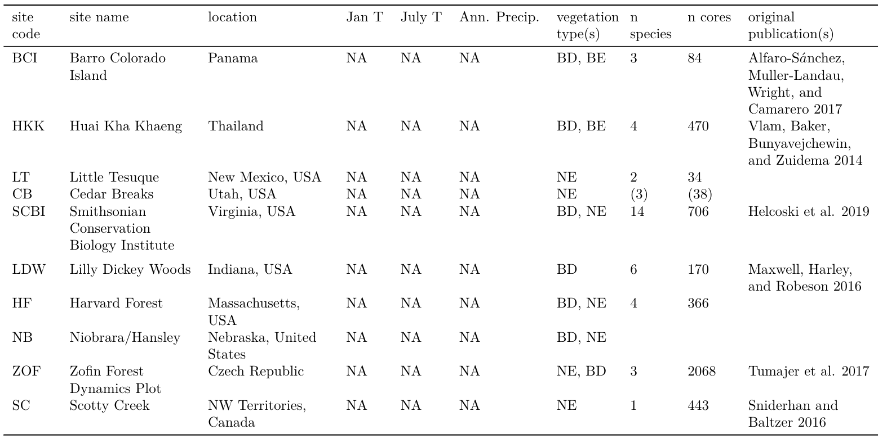
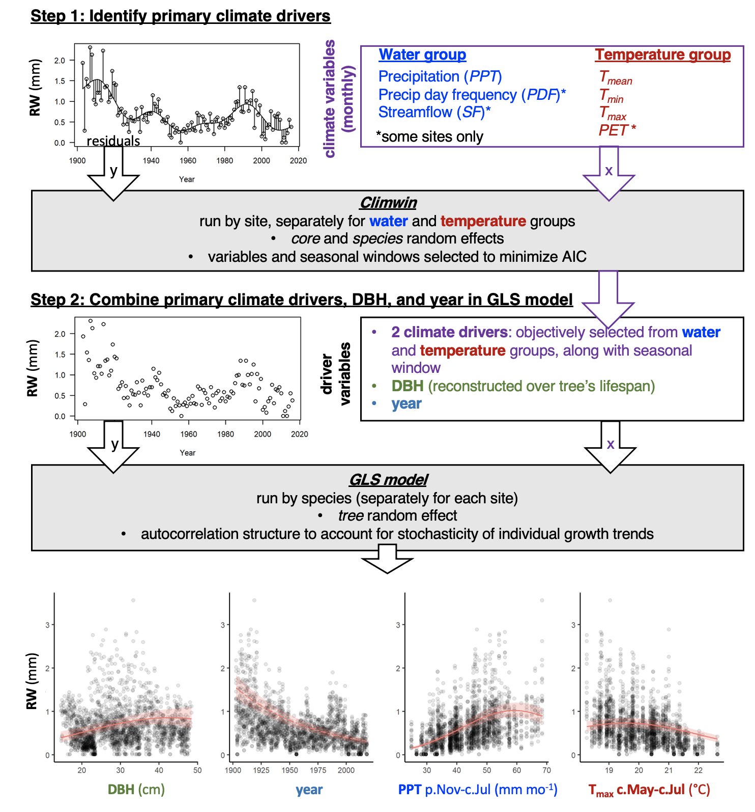
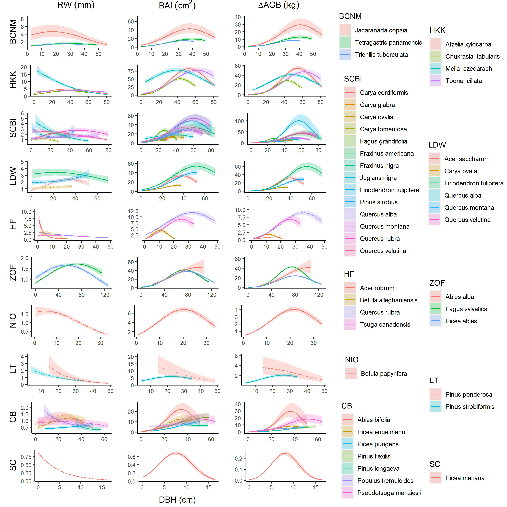

```{r setup, include=FALSE}
knitr::opts_chunk$set(echo = TRUE)
```


\raggedright

**Title:** Using tree-ring records to simultaneously characterize the influence of tree size, climate, and other environmental drivers on annual growth

**Authors (not yet complete, final order TBD):** 

Kristina J. Anderson-Teixeira^1,2^*,
Valentine Herrmann^1^,
Christy Rollinson^#^,
Erika B. Gonzalez-Akre^1^,
Bianca Gonzalez^1^,
Neil Pederson^#^,
Camille Piponiot^1,2^,
Ross Alexander^#^,
Craig D. Allen,
Raquel Alfaro-Sánchez,
Taia Awada,
Jennifer Baltzar,
Patrick Baker,
Sarayudh Bunyavejchewin,
Paulo Cherubini,
Justin Cooper,
Stuart Davies,
Ryan Helcoski^1^,
Vasickova Ivana,
Kaspar Jakub,
Kamil Kral,
James Lutz,
Ellis Q. Margolis,
Justin Maxwell,
Sean McMahon,
Helene Muller-Landau,
Samonil Pavil,
Sabrina Russo,
Anastasia Sniderhan,
Alan J. Tepley^1,#^,
Mart Vlam,
Peter Zuidema


*List not yet complete. Current list includes all those who have contributed tree-ring data and/or intellectually, but all not site PIs.*

*other contributors may move up in the list if they contribute a lot*


**Author Affiliations:**

1. Conservation Ecology Center; Smithsonian Conservation Biology Institute; Front Royal, VA 22630, USA

2. Center for Tropical Forest Science-Forest Global Earth Observatory; Smithsonian Tropical Research Institute; Panama, Republic of Panama

X#. Harvard Forest, Petersham, MA 01366, USA

X#. Canadian Forest Service, Northern Forestry Centre, Edmonton, Alberta, Canada

*corresponding author: teixeirak@si.edu; +1 540 635 6546

**Running headline:** [45 chars]

```{r eval=FALSE, echo=FALSE}
## Target journal: Methods in Ecology & Evolution (IF 7.09)
## Instructions for authors: https://besjournals.onlinelibrary.wiley.com/hub/journal/2041210X/author-guidelines
# Research article:  should have a maximum of 6000-7000 words (including tables/figure captions and references) and describe new methods and how they may be used.

### Length planning:
## Main text ~4300 words --> ~28 paragraphs averaging 150 words
# Intro- 900/ 6
# Methods- 1500 / (11)
# Results - 1000/ (6)
# Discussion - 900 / (5)
## References: figure ~40 words each, so 50 refs = 2000
## Display items: figure ~100 words for each caption = 700 words
# Table1- table of sites
# Fig1- schematic illustrating our process
# Fig2- climate senstivity (SCBI example): (a) Helcoski quilt plot, (b) Climwin panel a, (c) GLS output
# Fig3-  multipanel- GLS results for climate sensitivity at all sites (3 columns with the 3 variable type groupings, 1 row per site) 
# Fig4-relationship of ∆r and ∆AGB to DBH (all site-species combinations)
# Fig5/ table2- DBH/climate interactions


```

\newpage

### Abstract

```{r eval=FALSE, echo=FALSE}
## The Abstract must not exceed 350 words and should list the main results and conclusions, using simple, factual, numbered statements:

#Point 1: set the context for and purpose of the work;

#Point 2: indicate the approach and methods;

#Point 3: outline the main results;

#Point 4: identify the conclusions and the wider implications.

# Key-words: A list in alphabetical order not exceeding eight words or short phrases. The most important key-words should appear in the title and the abstract as well as the key-word list. More advice on selecting good keywords can be found here.
```


1. Tree rings provide a valuable long-term record for understanding how climate shapes forest productivity. However, traditional analysis methods have not been designed to simultaneously account for the effects of tree size and climate, which has limited the potential to use tree-rings to understand forest productivity in the current era of rapid climate change. 

2. Here, we develop a new method that allows simultaneous non-linear modeling of the effects of objectively determined principle climate drivers and tree diameter. 
Specifically, we first identify the most important climate drivers using the climwin R package.
We then include these in generalized least squares models that simultaneously fit the detrending splines needed to pull out climate signals and flexibly account for nonlinearity of responses to tree diameter and climate variables.
We apply this method to tree-ring data from **#** species at **nine/ten** globally distributed sites spanning a wide range of forest types. 

3. Our analysis identified similar climate drivers to those obtained via traditional methods, but revealed that non-linear responses to climate variables were common. Radial growth increments, basal area increments, and biomass increments all varied non-linearly with tree diameter. [*something about interactions between climate sensitivity and diameter*] 

4. Our method provides a novel approach to objectively identifying the most important climate drivers of tree growth and combining them with tree diameter in nonlinear models.
Our finding that nonlinear growth responses to climate variables are common contrasts with the assumption behind most contemporary dendrochonological analyses of the climate sensitivity of tree growth, but is consistent with physiological and ecological studies showing that biological rates often respond nonlinearly to climate drivers. 
The nonlinear relationship between tree diameter and growth rate implies that no metric of growth can be assumed independent of tree size, and therefore diameter must be accounted for in analyses seeking to quantify the impact of slowly-changing environmental drivers on tree growth.
Our approach opens the door for using tree-ring records improved understanding of forest responses to climate change, while opening the door for simultaneous accounting of climate, tree size, and slowly changing environmental drivers. 

**Keywords**:  climate sensitivity;  diameter; environmental change; Forest Global Earth Observatory (ForestGEO); generalized least squares; nonlinear; tree-ring

\newpage

### Introduction

**Tree rings provide a long-term record of annual growth increments that is invaluable for understanding forests in an era of global change.** 
Spanning time scales of decades to centuries or even millennia, they provide by far the most robust method for characterization of the interannual climate sensitivity of tree growth (REFS) and how it is changing [e.g., @sniderhan_growth_2016; @maxwell_declining_2016]. 
Combined with forest censuses, they can be used to estimate forest woody productivity [@graumlich_long-term_1989; @teets_linking_2018] and its climate sensitivity [@klesse_sampling_2018; @teets_quantifying_2018; @helcoski_growing_2019]. 
They may also be used to examine long-term growth trends in response to changing environmental drivers, including climate, increasing atmospheric CO~2~ [reviewed in @walker_integrating_nodate], and deposition of pollutants including sulfur dioxide (SO~2~) and nitrogen oxides (NO~x~) [@mathias_disentangling_2018]. 
This information is critical to predicting forest responses to climate change [@walker_integrating_nodate; REFS], and thereby reducing the enormous uncertainty surrounding future contributions of Earth's forests to the global carbon cycle [@friedlingstein_climatecarbon_2006].
Yet, dendrochronological methods have been optimized to detect climate signals (DENDRO REFS) rather than to predict forest productivity and its climate sensitivity [@klesse_sampling_2018]. 
As a result, prevailing approaches hold a number of limitations for using tree-rings to address pressing questions concerning forest productivity in the current era of rapid environmental change.

**To predict annual tree growth or forest productivity based on climate, a necessary first step is identification of the most important climate variables, the time frames over which they have the strongest influence over annual growth, and their additive or interactive effects.** 
Traditional dendrochronological methods identify climate signals by examining month-by-month correlations of growth index chronologies to select climate variables--typically T, PPT, and PDSI--over the current year and, typically, previous year. 
While appropriate for identifying the strongest signals for purposes such as historical climate reconstructions (e.g., DENDRO_REFS), this approach does not systematically examine the numerous potential multiple-month time windows to determine the single most influential window over which a given variable influences annual growth. 
Needed is an objective approach to systematically evaluate the numerous potential climate variables and time windows. 
Further, tree-ring studies generally do not consider additive or interactive effects of climate variables on annual growth [DENDRO_REFS; *but see VS-Lite* @foster_predicting_2016]. 
Such effects are expected based on observations that temperature and moisture jointly shape photosynthesis (REFS), tree growth [@foster_predicting_2016], and forest productivity [e.g., @taylor_temperature_2017; EXTRATROPICAL_AND_TREE_LEVEL_REFS; @banbury_morgan_global_nodate].

**Traditional methods characterize only linear climate responses, potentially missing important nonlinearities that have been widely observed at other spatio-temporal scales.**
Over time frames of seconds to days, most biological rates—- from photosynthesis to plant and animal respiration—-display a unimodal relationship to temporal variation in temperature. 
Specifically, these rates generally increase exponentially with temperature up to a point [e.g., @brown_toward_2004], typically reflective of the environment to which the organism is acclimated [@kumarathunge_acclimation_2019], and decrease at higher temperatures [e.g., REFS].
On the other end of the spatio-temporal spectrum, across regional to global climate gradients, annual forest productivity plateaus or decreases at high temperature, $T_{max}$, and potential evapotranspiration, $PET$ [@sullivan_long-term_2020; @banbury_morgan_global_nodate].
Similarly, across global gradients, annual forest productivity increases with precipitation only up to a point, after which it plateaus or decreases [@banbury_morgan_global_nodate]. 
Filling a critical gap between short-term physiological responses and the global gradients representing millennia of community assembly and species adaptation, the annual growth records of tree-rings capture tree growth responses to interannual climatic variation.
Yet, the standard practice in dendrochronology has been to fit linear relationships (exception is VS-Lite, which fits plateau [@tolwinski-ward_bayesian_2013]), and we therefore know little about what, if any, nonlinearities occur in tree growth responses to interannual variation in climate.

**Traditional methods do not characterize the effect of tree size or its potential interactions with climate variables.** 
Tree size (most commonly diameter breast height, $DBH$) is among the most important variables affecting tree growth rate [@muller-landau_testing_2006; @foster_predicting_2016; REFS]. 
Radial growth increments (*i.e.*, tree-ring widths; $\Delta r$) may increase or decrease with tree size, often in a non-linear manner.
Following a "juvenile growth phase", which is typically removed in traditional dendrological analyses, $\Delta r$ may decline, particularly in open-grown conifers (??; DENDRO_REFS).
In contrast, in mesic closed-canopy forests, $\Delta r$ typically increases with tree diameter at breast height [$DBH$; @muller-landau_testing_2006; @anderson-teixeira_size-related_2015; REFS, DENDRO_REFS].
For dendrological studies aimed at deciphering climate signals, tree size is not typically a variable of interest, and its influence is removed through detrending (DENDRO_REFS).
While suitable for identifying climate signals (DENDRO_REFS), this approach is not optimal for subsequent inference of the climate sensitivity of forest productivity. 
Although climate correlations can be transformed to climate sensitivity [*sensu* @charney_observed_2016]  and scaled to characterize the climate sensitivity of $ANPP_{stem}$ based on the scaling of $\Delta r$ with $DBH$ [@helcoski_growing_2019], they cannot be used to characterize known interactive effects of $DBH$ and climate on tree growth.
For example, larger trees tend to exhibit greater growth reductions in drought years [@bennett_larger_2015 ; @mcgregor_tree_nodate].
Thus, to use tree-rings to predict $ANPP_{stem}$ for a forest where not every tree was cored, we need models that include tree size.

**Here, we develop a new method that allows simultaneous consideration of the effects of tree size, objectively determined principle climate drivers, and other environmental drivers on annual tree growth.** 
This allows us to ask:
(1) What are the most important climate drivers of annual growth, and over which time windows?
(2) What is the shape of the relationship between annual growth and climate drivers?
(3) How do $\Delta r$, $BAI$, and aboveground biomass increments ($\Delta AGB$) vary with DBH?
(4) Are interactions between DBH and climate drivers common?


### Materials and Methods

#### Data sources and preparation

We analyzed previously collected tree-ring data from ten sites ranging from 9.15$^\circ$ to 61.30$^\circ$ N latitude and representing a wide range of forest and tree types: tropical broadleaf deciduous and evergreen, temperate broadleaf deciduous and needleleaf evergreen, and boreal needleleaf evergreen (Tables 1, S1-S2).
Nine of these sites (exception: LT) are large forest dynamics plots of the Forest Global Earth Observatory [ForestGEO; @anderson-teixeira_ctfs-forestgeo:_2015].
Trees of species represented within the ForestGEO plots were cored within the plot (n=#) and/or in the vicinity (n=#; max distance: # km), following a variety of sampling protocols designed to meet the varied objectives of the original studies (Table 1). 
In using this variety of data sources, we ensured that our approach was able to handle a variety of challenges presented by varying methodologies and forest types.


```{r eval=FALSE, echo=FALSE}

# I tried to put in table, as in [Camille's paper](https://github.com/EcoClimLab/ForestGEO-tree-size-carbon/blob/master/paper_treesize_draft.Rmd), but couldn't make it work.
library(knitr)
library(kableExtra)
sites <- read.csv("tables_figures/sites.csv", stringsAsFactors = FALSE, check.names = FALSE)
kable(sites)
      #caption = "Study sites")
```

**Table 1 | Sites included in this analysis**

```{r eval=FALSE, echo=FALSE}
# refs in this table need to go in the nocite metadata field at the top of the document
```

All tree cores were measured and cross-dated by the original researchers using standard dendrochronological practices. 
The full record for all cores was retained for analysis, with the exception of records that had to be excluded due to insufficient sample size or anomalous growth patterns.
Specifically, we excluded
(1) species with <7 cores,
(2) cores with <30 years of record,
(3) parts of records before or after (whichever was shorter) any year where $\Delta r$ exceeded the mean plus five times the standard deviation of $\Delta r$ for the entire core, along with a 5-year buffer in the opposite direction, 
and (4) the final 20 years prior to death of trees cored dead. 
The final criteria was implemented to avoid periods of growth decline and potentially altered climate sensitivity prior to death [@cailleret_synthesis_2017] ; REF on climate sensitivity).
From analyses including $DBH$ (see below), we further excluded
(1) trees for which we lacked data required to reconstruct $DBH$,
(2) trees for which there was a significant inconsistency between measured $DBH$ and the sum of $\Delta r$'s across the core (*Appendix S1*),
(3) parts of records where reconstructed $DBH$ (see below) was represented by <3 conspecific trees.

For each year in the tree-ring records, we reconstructed $DBH$, as detailed in *Appendix S1*. 
In most cases, when a recent $DBH$ measurement was available, $DBH$ was reconstructed from the outside in. 
In cases where $DBH$ was not available, but when we knew that the core hit pith or could reasonably estimate how far off it was based on the curvature of the rings (DENDORO_REF), $DBH$ was reconstructed from the inside out. 
In either case, we used allometric equations between $DBH$ and bark thickness to account for changes in bark thickness as the tree grew (Appendix S1; Table S2).

Once $DBH$ had been reconstructed, we calculated aboveground biomass growth increments ($\Delta AGB$) based on $DBH$ and $\Delta r$.
Specifically, for each year $y$, we used biomass allometries to estimate $ABG_y$ based on $DBH_y$ and $AGB_{y+1}$ based on [$DBH_y + \Delta r$]. 
We then calculated $\Delta AGB_y$ as [$AGB_{y+1}-AGB_y$]. 
For temperate sites, biomass allometries were sourced from allo-db (DETAILS; Gonzalez-Akre et al. in prep).
For tropical sites, biomass allometries were sourced from the BIOMASS package (REF).

Monthly climate data for 1901-2019 were obtained from CRU v.4.04 [@harris_updated_2014; @harris_version_2020]. 
Variables considered here included average daily minimum, maximum, and mean temperatures ($T_{min}$, $T_{max}$, $T_{mean}$, respectively); potential evapotranspiration ($PET$); precipitation ($PPT$); and precipitation day frequency ($PDF$). 
For BCI, we calculated $PPT$ and $PDF$ from daily precipitation readings made on BCI starting in 1929 [@paton_barro_2019].
All ForestGEO climate records used here are archived in the ForestGEO Climate Data Portal, v1.0-alpha [@anderson-teixeira_forestgeoclimate_2020].

#### Analysis methods

Our analysis consisted of two main steps: (1) identification of the most important climate drivers, and (2) combining $DBH$ and climate drivers into a multivariate model (Fig. 1). The analysis was run separately for each site.



*Identifying key climate drivers*

First, we identified the most important climate driver for each of two categories of variables, all at the monthly timescale: a temperature group (mean, min, and max temperature; PET) and a precipitation group (precipitation, number of days with precipitation). 
Our first step was detrending to remove the influence of all non-climatic drivers (*e.g.*, growth and aging of the tree, change in competitive dynamics, atmospheric pollution), which is essential for identifying climatic drivers (DENDRO_REFS).
Specifically, we used a generalized additive model (GAM) to fit a spline to individual tree growth records ($log[\Delta r]$, $log[BAI]$, or $log[\Delta AGB]$), thereby producing residuals.
We then used the *climwin* package in R (REF) [@van_de_pol_identifying_2016] to identify the most significant climate driver and time window for each variable group. 
*Climwin* searches through multiple climate variables and over a wide range of time frames to identify which are most strongly correlated to the biological variable of interest--in this case, residuals of $log[\Delta r]$, $log[BAI]$, or $log[\Delta AGB]$.
We began by verifying that *climwin* identified similar climate variable-month combinations as what would be identified using traditional methods for individual species, as detailed in Appendix S2. (**[ISSUE #35 in ForestGEO-climate-sensitivity ](https://github.com/EcoClimLab/ForestGEO-climate-sensitivity/issues/35))

We then used *climwin* to identify the best climate variables across the full set of cores from each site, noting that whereas our goal was to identify the most significant climate drivers at a site level, identification of the top climate drivers for individual species would be optimized by analyzing each species separately.
Within *climwin*, we specified a mixed effects model using species and tree identity as random effects: `residual ~ [climate] + (1 | sp) + (1 | treeID)`. 
Here, for each permutation, `climate` specifies one of the climate drivers in the climate variable group, analyzed over one of all possible combinations of time periods, at monthly resolution, over a 15 month period ending near the time of cessation of formation of each annual ring (*Table S1*). (**[ISSUE #51 in ForestGEO-climate-sensitivity ](https://github.com/EcoClimLab/ForestGEO-climate-sensitivity/issues/51))
*Climwin* can check for linear and quadratic relationships, and does k-fold cross-validation in its computation of AIC to guard against over-fitting [@van_de_pol_identifying_2016]. 
We specified quadratic relationships only because (i) quadratic relationships are more consistent with known biological mechanisms (see Introduction), (ii) preliminary tests revealed that quadratic fits usually had lower AIC, and when not there tended to be little difference in AIC and the curve would approximate a straight line, (iii) modeling only quadratic improves coding efficiency and speeds up the analysis process.
For each group of candidate climate variables, we move forward with the best variable over the time window identified by climwin as a candidate climate variable for the multivariate models. 

A challenge to this system arose for the sites that have undergone the most rapid changes in climate and tree growth: SC and LT, where trees exhibit significant growth declines attributed to rising temperatures [@sniderhan_growth_2016] and increasing drought (REF), respectively. 
*([ISSUE #25 in ForestGEO-climate-sensitivity ](https://github.com/EcoClimLab/ForestGEO-climate-sensitivity/issues/25))*
Problematically, correlating tree growth residuals from which climate-driven trends had been removed against the climate signal with a strong directional trend would not necessarily identify the most relevant climate drivers.
For these sites, we experimented with three approaches to identifying the most important climate drivers (1) the method described above, (2) detrending the climate variables prior to the climwin step, and (3) excluding *decades with the most pronounced climate change* from the climwin step of the analysis (Appendix S3).
After determining that... , here we present results *(method)*. 

*Combining drivers in GLS model*

Second, we combined candidate climate drivers and reconstructed $DBH$ data in a GLS model (Fig. 1). 
*(DBH not included in models focused on climate sensitivity.)*
We checked for collinearity among the full set of variables using the *vifstep* function (**REF**) and removed any variable with a variance inflation factor > 3. 
For each species (at each site) independently, we ran a GLS model including every combination of the candidate climate variables (as a 2-degree polynomial to allow quadratic curve), $DBH$, and fit one year spline for each treeID, plus a random intercept for each tree. 
We also ran models with a spline of DBH (3 knots).
Across all possible models, variable AICc weights were summed to determine which drivers are most important. (*Valentine, we'll need some more details here.*)
We considered the model containing those variables as the top model, noting that the top model can contain terms that are not individually significant in the context of that model.

*Testing for climate-DBH interactions*

**Table / figure on climate - DBH interactions?** (*See [ISSUE #42 in ForestGEO-climate-sensitivity ](https://github.com/EcoClimLab/ForestGEO-climate-sensitivity/issues/42)*)

### Results

*Identifying climate drivers*

**Our process picked out similar climate drivers to what would be obtained via traditional methods (Figs. 2, S#; Appendix S2).**

![**Figure 2 | Example comparison of climate sensitivity derived via traditional methods (**a**) and our approach (**b-f**).** Example is for the sensitivity of 14 species at SCBI (codes given in Table S1) to potential evapotranspiration (PET), identified by both traditional methods and our method to be among the top climate drivers. Panel (**a**) shows a matrix of Pearson correlations between ring- width index and monthly climate variables. Panels (**b-d**) give statistics for time windows tested in *climwin*, where window open and close indicate months prior to current August, and cells across the lower diaganol indicate single-month tests (akin to panel **a**). Panels (**b**) and (**c**) give values of linear and quadratic terms for each time window, and (**d**) gives the $\Delta AIC$ for each. The time window with the minimum $\Delta AIC$ (0-3 months prior to August, or May-July; black circles), was identified as the optimal window. Panel (**e**) shows the correlation of individual-level residuals to PET, with the function fit in *climwin*. Finally, panel (**f**) shows GLS model output, where $PET$ was a candidate driver variable (along with $PPT$; $DBH$ not included in this model). Plotted are responses of species for which $PET$ was included in the top model.](tables_figures/quilt_comparison.png)

**Across the three metrics of growth, the "landscape" of climate effects over various time windows was generally similar, but the optimal time window or even the top climate variable sometimes differed (Figs. S2-S4).**
Specifically, $\Delta r$, $BAI$, and $\Delta AGB$ consistently exhibited similar strength of correlation and direction of response to climate variables within the temperature and precipitation variable groups. 
In some cases (n= # of #), both the optimal climate variable and time window were identical across growth metrics (e.g., Fig. S2). 
In #  cases, *climwin* identified the same climate variable but different time windows. 
In # cases, *climwin* identified different climate variables, but identical or overlapping time windows (e.g., Fig. S3).
Finally, in # cases, *climwin* identified different climate variables and different time windows (e.g., Fig. S4).
Henceforth, we focus on the climate drivers identified when $\Delta r$ was the growth metric and for the full set of cores (i.e., including those for which $DBH$ could not be reconstructed.)

**Climwin allowed objective selection of the strongest climate drivers and the time windows over which they were most influential.**
The most commonly selected variables within the temperature group were $T_{max}$ and $PET$, each of which was identified by climwin as the top temperature-related driver *at four of the eight sites*. $T_{mean}$ and $T_{min}$ were never identified as top variables within the temperature group (Fig. 3).
Within the precipitation group, precipitation amount (PRE) was identified as the top variable most frequently (n=*5 of 8* sites), but it was not uncommon that it was surpassed by precipitation frequency (WET; n=*3 of 8* sites). 
Optimal time windows often coincided with a site's peak growing season (n= *# of 10* for temperature variables, *# of 10* for precipitation variables), but exceptions were common. 
At *4* sites (BCI, HKK, LT, and SCBI), the optimal window for precipitation variables spanned $\ge$ 8 months, ending during the peak growing months of the year of ring formation. 
Optimal windows for temperature variables tended to be shorter, the longest being a *6* month period during the summer (wet season) at HKK. 
At two of the higher-latitude temperate sites (HF and Zofin), temperatures were most influential during late winter/ early spring.
There were also a few instances where previous growing season conditions had the strongest influence.

  


*Climate sensitivity*

Precipitation responses were included in the best model at all sites and *for all but # species* (Fig. 3).
Responses were most commonly positive, and were most pronounced at the driest site (Little Tesque). 
Responses commonly showed some non-linearity, and in some cases it was quite pronounced (e.g., Little Tesque), with the most common pattern being a decelerating increase *([ISSUE #63 in ForestGEO-climate-sensitivity](https://github.com/EcoClimLab/ForestGEO-climate-sensitivity/issues/63))*.

Temperature responses were included in the best model at all sites *(but BCI? [ISSUE #62 in ForestGEO-climate-sensitivity](https://github.com/EcoClimLab/ForestGEO-climate-sensitivity/issues/62))* and *for the majority of species* (Fig. 3).
Specifically, a temperature term was included in the best model for # of # site-species combinations.
Responses shifted from *near*-universally negative below 40$^\circ$ latitude to positive above 45$^\circ$ latitude. Harvard Forest, at 42.5$^\circ$ N, exhibited a mix of responses.
*(It will be interesting to see what happens with Indian Creek, at 42.8 latitude.)*
*(Note that Scotty Creek was previously positive, later shifted negative; [ISSUE #25 in ForestGEO-climate-sensitivity](https://github.com/EcoClimLab/ForestGEO-climate-sensitivity/issues/25))*
Responses commonly showed some non-linearity, but there were *few, if any* cases of pronounced nonlinearity *(but how do we define this? [ISSUE #63 in ForestGEO-climate-sensitivity](https://github.com/EcoClimLab/ForestGEO-climate-sensitivity/issues/63))*.

*Influence of DBH*

**All three growth metrics, $\Delta r$, $BAI$, and $\Delta AGB$, varied with $DBH$ for most species at all sites (Fig. 4).** 
While $\Delta r$ varied significantly with $DBH$ for the majority of species-site combinations (n= # of #; Table **S#**), there was substantial variation in these trends, with patterns mixed across both forests and species within a single stand (Fig. 4).
On one end of the spectrum, *Melia azedarach* at HKK had extremely rapid growth at small $DBH$, with $\Delta r$ ranging up to ~15mm yr^-1^, followed by fairly rapid declines with increasing $DBH$. 
Similar patterns of approximately exponential decline in $\Delta r$ with $DBH$ were observed for conifer species at Little Tesque and Scotty Creek--both relatively open forests--and a number of species in mesic temperate forests (Fig. 4).
At the other end of the spectrum, a number of species at sites where they presumably established under closed-canopy conditions (e.g., *Fagus* at SCBI and Zofin) had $\Delta r$ <1 mm yr^-1^ at small $DBH$, increased to peak $\Delta r$ between # and # cm $DBH$, and subsequently declined.  

**The variable patterns in $\Delta r$ with $DBH$ translated into differences in variation in $BAI$ and $\Delta AGB$ with $DBH$, although trends in both of these were more consistent across sites and species, typically increasing to a peak at intermediate $DBH$ and then declining (Fig. 4).**




*Climate-DBH interactions*

 (*See [ISSUE #42 in ForestGEO-climate-sensitivity ](https://github.com/EcoClimLab/ForestGEO-climate-sensitivity/issues/42)*)


### Discussion
**We present a new method that allows simultaneous consideration of the effects of objectively determined principle climate drivers and tree size on annual growth.**
Results are broadly consistent with those obtained by traditional methods, but offer several new insights.

*Climate sensitivity*

Ideas to discuss:

* temperature sensitivity shifts from neg in warm climates to positive in cold climates, although @sniderhan_growth_2016 shows that the effect shifted to negative as warming progressed

* additive effects are common and should not be overlooked

* nonlinear effects occur sometimes

*Influence of DBH*

**The diversity of growth trends in relation to $DBH$ observed here (Fig. 4) is largely attributable to species ecology and stand history (Fig. 4).**
On one end of the spectrum, species that would have established in fairly open conditions--*i.e.*, shade-intolerant species and those at sites with more open canopies (e.g., LT, SC)-- exhibited rapid initial growth followed by exponential decline. 
The most pronounced example of this pattern was *Melia azedarach* --a highly shade-intolerant species that generally establishes in the open [@baker_suppression_2006] and was sampled opportunistically outside the ForestGEO plot at HKK [@vlam_temperature_2014], where it presumably established under open conditions.
Such patterns are consistent with dendrochronology's "textbook" patterns, which have been derived primarily from open-grown trees (DENDRO_REFS).
On the other end of the spectrum, shade-tolerant species (e.g. *Fagus* at SCBI and Zofin) exhibited initially low, but increasing, $\Delta r$.
This pattern is consistent with patterns observed in stand-level census data from closed-canopy forests, including several in this analysis, where $\Delta r$ increases continuously with $DBH$ [@muller-landau_testing_2006; @anderson-teixeira_size-related_2015; Piponiot et al. in prep]. 
While the low community mean $\Delta r$ at small $DBH$ observed in closed-canopy forests is in large part driven by slow-growing small stems that will never enter the cohort of trees sampled by coring (e.g., $\ge$ 10cm DBH), increases in $\Delta r$ with $DBH$ have also been observed for most species at SCBI using the same tree-ring data set analyzed here, but comparing across individuals using only contemporary data [@helcoski_growing_2019].
Thus, patterns of decreasing $\Delta r$ with $DBH$ are likely limited to open-grown trees or those establishing in gaps.  
--  (*cite paper that I reviewed several years back; [Clark et al. 2007?](https://esajournals-onlinelibrary-wiley-com.smithsonian.idm.oclc.org/doi/epdf/10.1890/06-1039.1); [Schleip et al. 2015](https://onlinelibrary-wiley-com.smithsonian.idm.oclc.org/doi/abs/10.1002/env.2324)*).

Contrary to the finding that $\Delta AGB$ increases continuously with $DBH$, which was derived from census data from globally distributed forests [@stephenson_rate_2014] and has also been observed in tree-rings [@foster_predicting_2016], we found evidence of saturation or decline in the majority **(`r round(20/26*100, digits=0)`%)** of species-site combinations analyzed.
$\Delta AGB$ declines at high $DBH$ are presumably because trees are investing fixed C elsewhere--for example, reproduction.

**These results have important implications for using tree-rings to infer growth responses to slowly-changing environmental drivers, including climate, atmospheric CO~2~, and deposition of SO~2~ and NO~x~.** 
The observed trends in $\Delta r$ and $BAI$ with $DBH$ (Fig. 4) imply that two of the most commonly used growth-trend detection methods [@peters_detecting_2015] are inappropriate. 
Specifically, conservative detrending, which applies stiff splines or mathematical functions (e.g., negative exponential) to remove trends in $\Delta r$ before analyzing residuals, would not be reliable across the diversity of $\Delta r$-$DBH$ relationships observed here, and also has a tendency to remove known long-term trends [@peters_detecting_2015].
Basal area correction -- i.e., assuming that $BAI$ is fundamentally independent of tree size after the removal of the juvenile growth phase--is also problematic because $BAI$ shows a variety of trends with $DBH$ across large size classes. The most common pattern--*an increase to a peak at intermediate sizes, followed by decrease*--would imply that the basal area correction is most commonly biased towards finding positive trends for smaller trees and negative trends for larger trees.
Alternative methods, such as regional curve standardization [e.g., REF] and size class isolation [e.g., @van_der_sleen_no_2015], are compatible with the size trends observed here and consistent with the recommendations of @peters_detecting_2015.


DBH is not always collected when cores are taken, and is not routinely preserved alongside tree-ring data. For example, the International Tree-Ring Data Bank (ITRDB) contains no structure for storing DBH records. DEN is new alternative. 

*Climate-DBH interactions*

*Conclusions* 

Sets the foundation for considering other, slowly changing environmental drivers.

### Acknowledgements
Scholarly Studies

### Authors' contributions

### References


