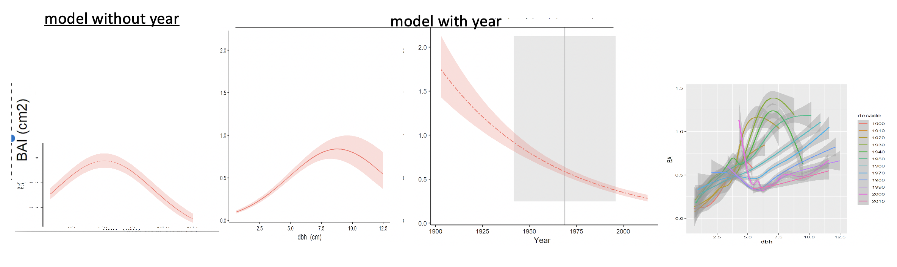

```{r setup, include=FALSE}
knitr::opts_chunk$set(echo = TRUE)
```


\raggedright

**Title:** Using tree-ring records to simultaneously characterize the influence of tree size and climate drivers on annual growth

**Authors:** 

[Kristina J. Anderson-Teixeira^1,2^*](0000-0001-8461-9713),
Valentine Herrmann^1^,
Christy Rollinson^3^,
Bianca Gonzalez^1^,
Erika B. Gonzalez-Akre^1^,
Neil Pederson^4^,
Camille Piponiot^1,2^,
Ross Alexander,
Craig D. Allen,
Raquel Alfaro-Sánchez^wl^,
Tala Awada,
Jennifer L. Baltzer^wl^,
Patrick J. Baker,
Sarayudh Bunyavejchewin,
Paolo Cherubini,
Justin Cooper,
Stuart J. Davies^2^,
Ryan Helcoski^1^,
[Jakub Kašpar^cz^](0000-0003-1780-6310),
James Lutz,
Ellis Q. Margolis,
Justin Maxwell^jm^,
Sean McMahon^2^,
Sabrina Russo,
[Pavel Šamonil^cz^](0000-0002-7722-8797),
Anastasia Sniderhan^wl^,
Alan J. Tepley^1,at^,
[Ivana Vašíčková^cz^](0000-0002-6070-5956), 
Mart Vlam,
Peter Zuidema


**Author Affiliations:**

1. Conservation Ecology Center; Smithsonian Conservation Biology Institute; Front Royal, VA 22630, USA

2. Center for Tropical Forest Science-Forest Global Earth Observatory; Smithsonian Tropical Research Institute; Panama, Republic of Panama

3. The Morton Arboretum, Lisle, Illinois, USA

4. Harvard Forest, Petersham, MA 01366, USA

wl. Biology Department, Wilfrid Laurier University, 75 University Ave W, Waterloo, ON, N2L 3C5

at. Canadian Forest Service, Northern Forestry Centre, Edmonton, Alberta, Canada

cz. Department of Forest Ecology, The Silva Tarouca Research Institute for Landscape and Ornamental Gardening, Lidická 25/27, 602 00 Brno, Czech Republic

jm. Department of Geography, Indiana University, Bloomington, Indiana, USA

*corresponding author: teixeirak@si.edu; +1 540 635 6546

**Running headline:** [45 chars]


```{r eval=FALSE, echo=FALSE}
## potential reviewers: Jane Foster, M. Evans,  van der Pol, 

## Target journal: Global Change Biology
## Instructions for authors: https://onlinelibrary-wiley-com.smithsonian.idm.oclc.org/page/journal/13652486/homepage/forauthors.html
## Primary Research Articles present the results of a completed research project and are up to 8000 words in length. Word limits apply to the main body of the text (Introduction, Materials and Methods, Results, Discussion, and Acknowledgements).
## I don't think GCB has an official limit on display items (a recently accepted article has 10 figures and 4 tables).

```

```{r eval = TRUE, echo=FALSE, warning=FALSE, results='hide'}
#Tables
sites = 1
#Figures
schematic=1
SCBI_example=2
clim_sens=3
size=4
full_examples = 5
# Fig5/ table2- DBH/climate interactions
year_fig = 7

# SUPPLEMENTARY INFO (this chunk must be repeated in MEE_manuscript_SI.Rmd)
#Appendices
site_details_appendix <- "S1"
DBH_reconstruction <- "S2"
climate_correction <- "S3"
traditional_comparison <- "S4"
changing_climate <- "S5"

site_details_appendix_title<- "Appendix S1. Methods for reconstruction of $DBH$"
DBH_reconstruction_title <- "Appendix S2. Methods for reconstruction of $DBH$"
climate_correction_title <- "Appendix S3. Methods for climate data evaluation and correction"
traditional_comparison_title <- "Appendix S4.  Methods for comparing climwin results with traditional methods"
changing_climate_title <- "Appendix S5.  Dealing with rapidly changing climate and tree growth"

#SI table numbers
site_details = "S1"
species_table = "S2"
sampling_details_table = "S3"
bark_allometries = "S4"
qualitative_results_comparison = "S5"
climate_interactions_summary = "S6"

#SI table captions
site_details_legend <- "Table S1. Site Details."
species_table_legend <-"Table S2. Species analyzed, their characteristics, and bark allometries applied."
sampling_details_legend <- "Table S3. Sampling details for species by site."
bark_allometries_legend <- "Table S4. Allometric equations for bark thickness."
qualitative_results_comparison_legend <- "Table S5. Qualtiative comparison of results from this study with previous studies employing conventional methods."
climate_interactions_summary_legend <- "Table S6. Frequency of $DBH$-climate interactions across all sites and growth metrics."

#SI figure numbers
all_traditional_comparisons = "S1-S4"
SCBI_traditional_comparison = "S1"
Zofin_traditional_comparison = "S2"
CB_traditional_comparison = "S3"
SC_traditional_comparison = "S4"

all_climwin = "S5-S7"
climwin_sameV_sameW = "S5"
climwin_sameV_diffW = "S6"
climwin_diffV_diffW = "S8"

all_GLS = "S9-S18"
GLS_BCI = "S9"
GLS_HKK = "S10"
GLS_SCBI = "S11"
GLS_LDW = "S12"
GLS_HF = "S13"
GLS_ZOF = "S14"
GLS_NE = "S15"
GLS_LT = "S16"
GLS_CB = "S17"
GLS_SC = "S18"

#SI figure captions
SCBI_traditional_comparison_legend <- "Figure S1. Comparison of our approach with traditional methods of identifying climate signals: LITU at SCBI."
Zofin_traditional_comparison_legend <- "Figure S2. Comparison of our approach with traditional methods of identifying climate signals: ABAL at Zofin."
CB_traditional_comparison_legend <- "Figure S3. Comparison of our approach with traditional methods of identifying climate signals: PSME at Cedar Breaks."
SC_traditional_comparison_legend <- "Figure S4. Comparison of our approach with traditional methods of identifying climate signals: PIMA at Scotty Creek."

climwin_sameV_sameW_legend = "Figure S5. (PRE at SCBI)"
climwin_sameV_diffW_legend = "Figure S6. (PET at SCBI)"
climwin_diffV_diffW_legend = "Figure S7. (TMP/TMN at BCI)"

GLS_BCI_legend = "Figure S9. Best GLS models for Barro Colorado Island (Panama)"
GLS_HKK_legend = "Figure S10. Best GLS models for Huai Kha Khaeng (Thailand)"
GLS_SCBI_legend = "Figure S11. Best GLS models for the Smithsonian Conservation Biology Institute (Virginia, USA)"
GLS_LDW_legend = "Figure S12. Best GLS models for Lilley Dickey Woods (Indiana, USA)"
GLS_HF_legend = "Figure S13. Best GLS models for Harvard Forest (Massachusetts, USA) "
GLS_ZOF_legend = "Figure S14. Best GLS models for Zofin Forest (Czech Republic)"
GLS_NE_legend = "Figure S15. Best GLS models for Niobrara/ Halsey (Nebraska, USA)"
GLS_LT_legend = "Figure S16. Best GLS models for Little Tesuque (New Mexico, USA)"
GLS_CB_legend = "Figure S17. Best GLS models for Cedar Breaks (Utah, USA)"
GLS_SC_legend = "Figure S18. Best GLS models for Scotty Creek (Northwest Territory, Canada)"
```

```{r eval = TRUE, echo=FALSE, warning=FALSE, results='hide'}
#READING IN TABLES TO GET STATS FOR TEXT
path_to_repo <- (dirname(dirname(getwd()))) # this gets path so that anybody to knit

#species
species <- read.csv(paste0(path_to_repo, "/doc/manuscript/tables_figures/species.csv"), stringsAsFactors = FALSE, check.names = FALSE)
  n_species <- nrow(species) 
  
sampling_details <- read.csv(paste0(path_to_repo, "/doc/manuscript/tables_figures/sampling_details.csv"), stringsAsFactors = FALSE, check.names = FALSE)
  n_trees_all <- sum(na.omit(sampling_details[, "n trees all"]))  #CHECK WITH V IF THIS IS BEFORE OR AFTER EXCLUSION of cores
  n_trees_dbh <- sum(na.omit(sampling_details[, "n trees dbh"]))
  n_cores_all <- sum(na.omit(sampling_details[, "n cores all"]))  #CHECK WITH V IF THIS IS BEFORE OR AFTER EXCLUSION of cores
  n_cores_dbh <- sum(na.omit(sampling_details[, "n cores dbh"]))
```
\newpage

# Abstract

```{r eval=FALSE, echo=FALSE}
## The Abstract must not exceed 350 words and should list the main results and conclusions, using simple, factual, numbered statements:

#Point 1: set the context for and purpose of the work;

#Point 2: indicate the approach and methods;

#Point 3: outline the main results;

#Point 4: identify the conclusions and the wider implications.

# Key-words: A list in alphabetical order not exceeding eight words or short phrases. The most important key-words should appear in the title and the abstract as well as the key-word list. More advice on selecting good keywords can be found here.
```


1. Tree rings provide a valuable long-term record for understanding how climate shapes forest productivity. However, traditional analysis methods aggregate growth records of multiple trees into residual chronologies, and therefore cannot simultaneously account for the effects of tree size and climate. This has limited the potential to use tree-rings to understand forest productivity and its climate sensitivity. 

2. Here, we develop a new method to simultaneously model non-linear effects of objectively determined principle climate drivers and reconstructed tree diameter ($DBH$). 
Specifically, we first identify the most important climate drivers and their appropriate time window of influence using the *climwin* R package.
We then include these in generalized least squares models to model tree growth while accounting for the temporal autocorrelation inherent to each individual tree's growth.
We apply this method to tree-ring data from `r n_trees_all` trees representing `r n_species` species at ten globally distributed sites spanning a wide range of forest types. 

3. Our analysis identified similar climate drivers operating over similar time windows to those obtained via traditional methods, but revealed that non-linear responses to climate variables were common. Growth rates--expressed as ring widths, basal area increments, or biomass increments--varied non-linearly with $DBH$. The relative importance of $DBH$ versus climate varied across sites, and interactions between $DBH$ and climate were prevalent (*~50%* of cases tested). 

4. Our method provides a rigorous analytical framework for objectively identifying the most important climate drivers of tree growth and combining them with $DBH$ in nonlinear models.
The need for such an approach is highlighted by our findings that nonlinear growth responses to climate variables are common, that growth rates vary nonlinearly with $DBH$, and that significant $DBH$ - climate interactions are common. 
These findings imply that $DBH$ should be accounted for in analyses seeking to quantify the impacts of climate and other environmental drivers on tree growth.
By providing a framework for such analyses, our approach opens the door for using tree-rings to improve our understanding of forest responses to climate change. 

**Keywords**:  climate sensitivity;  diameter; environmental change; Forest Global Earth Observatory (ForestGEO); generalized least squares; nonlinear; tree-ring

\newpage

# Introduction

**Tree rings provide a long-term record of annual growth increments that is invaluable for understanding forests in an era of global change.** 
Spanning time scales of decades to centuries or even millennia, they provide by far the most robust method for characterization of the interannual climate sensitivity of tree growth [@fritts_tree_1976] and how it is changing [e.g., @sniderhan_growth_2016; @maxwell_declining_2016]. 
Combined with forest censuses, they can be used to estimate forest woody productivity [$ANPP_{woody}$; @graumlich_long-term_1989; @teets_linking_2018] and its climate sensitivity [@klesse_sampling_2018; @teets_quantifying_2018; @helcoski_growing_2019]. 
This information is critical to predicting forest responses to climate change, and thereby reducing the enormous uncertainty surrounding future contributions of Earth's forests to the global carbon cycle [@friedlingstein_climatecarbon_2006].
Yet, dendrochronological records have been traditionally collected and analyzed to detect climate signals rather than to predict forest productivity and its climate sensitivity [@klesse_sampling_2018].
As a result, prevailing approaches hold a number of limitations for using tree-rings to address pressing questions concerning forest productivity in the current era of rapid environmental change.

**Dendrochronological methods to characterize the climate sensitivity of tree growth have been optimized to obtain the strongest possible climate signal for climate reconstructions, but face limitations when it comes to characterizing the climate sensitivity of individual trees or $ANPP_{woody}$.**
Traditional methods begin by fitting a function (commonly a spline) to the growth record captured by each core, extracting residuals around the long-term trends, and then standardizing and average the residuals across cores to form a species-level ring-width index chronology (*DENDRO_REFS*).
Climate signals are then identified by examining month-by-month or seasonal correlations of the ring-width index chronology to one or more climate variables over the current year and, typically, previous year [e.g., @fritts_tree_1976; @meko_seascorr_2011; @zang_treeclim_2015].
Following identification of the top climate driver(s), statistical models describing their relationships to tree growth can be used for applications such as climate reconstruction (*DENDRO_REFS*) or projection of tree growth responses to climate change [e.g., @charney_observed_2016].
An important caveat for the latter, however, is that the slopes of correlations between climate variables and ring-width index chronologies are not identical to the mean sensitivity of individuals within the population, as the process of building species chronologies fundamentally alters and obfuscates individual-level responses (*REF-NEIL?*). 
Although population-level climate responses have been approximated based on climate sensitives derived from species chronologies [e.g., @charney_observed_2016; @helcoski_growing_2019], the removal of individual-level variation prior to analysis of climate sensitivity limits potential for using species chronologies to characterize the climate sensitivity of $ANPP_{woody}$.
In particular, analysis of species-level chronologies does not allow characterization of known variation in climate sensitivity in relation to tree size (discussed below), canopy position, or microhabitat [e.g., @bennett_larger_2015; @mcgregor_tree_2020].

**Dendrochronological studies most commonly focus on linear climate responses to single climate drivers and the settings in which these occur, thereby missing  nonlinearities and additive or interactive climate effects known to be widespread within forest settings.** 
Nonlinearities in climate sensitivities of tree metabolism and growth have been observed across a wide range spatio-temporal scales.
Over time frames of seconds to days, photosynthesis and respiration display a unimodal relationships to temporal variation in temperature (REFS), typically peaking at temperatures *reflective of the environment to which the organism is acclimated [@kumarathunge_acclimation_2019]*. 
Across broad geographical climate gradients, annual forest productivity generally increases with temperature, precipitation, and potential evapotranspiration ($PET$)  up to a point, after which it plateaus or decreases [@sullivan_long-term_2020; @banbury_morgan_global_nodate]. 
Filling a critical gap between short-term physiological responses and the global gradients representing millennia of community assembly and species adaptation, the annual growth records of tree-rings capture tree growth responses to interannual climatic variation.
Yet, because non-linearities are very problematic for reconstructing climate variables [@esper_divergence_2009], systems exhibiting these are typically avoided--e.g., by sampling climate-limited forest boundaries, and analysis methods are designed around first-order linear growth-climate relationships [@fritts_tree_1976 **??**]. 
Dendrochronological studies allowing for nonlinear or threshold responses of tree growth to climate are less common [@cook_climate_1989; @woodhouse_artificial_1999; @tolwinski-ward_bayesian_2013; @tumajer_increasing_2017], and we therefore know little about the nonlinearities in growth responses to interannual variation in climate that occur for trees within forest settings.
Furthermore, tree-ring studies do not commonly consider the additive or interactive effects of climate variables on annual growth [but see @meko_seascorr_2011; @foster_predicting_2016]. 
Temperature and moisture are known to jointly shape tree growth [@beedlow_importance_2013; @foster_predicting_2016] and forest productivity [e.g., @alexander_relative_2018; @banbury_morgan_global_nodate], but their influence may occur over different time windows.

**Tree size (most commonly diameter breast height, $DBH$) is among the most important variables affecting tree growth rate [e.g., @muller-landau_testing_2006; @foster_predicting_2016] and its climate sensitivity [e.g., @bennett_larger_2015; @mcgregor_tree_2020], yet traditional methods do not characterize its effect or its potential interactions with climate.** 
For dendrochronological studies aimed at deciphering climate signals, $DBH$ is not typically a variable of interest, and its influence is removed through detrending [@cook_calculating_1997].
Moreover, many studies constrain sampling to only larger size classes.
While convenient for identifying climate signals [Fritz 1976?(DENDRO_REFS)], this approach is not optimal for subsequent inference of the climate sensitivity of forest productivity.
Although climate correlations can be transformed to climate sensitivity [*sensu* @charney_observed_2016] and scaled to characterize the climate sensitivity of $ANPP_{woody}$ based on the scaling of $RW$ with $DBH$ [@helcoski_growing_2019], they cannot be used to characterize known interactive effects of $DBH$ and climate on tree growth.
For example, larger trees tend to be relatively more sensitive to drought [@bennett_larger_2015; @gillerot_tree_2020; @mcgregor_tree_2020], and smaller trees can be more sensitive to temperature (*Rollinson et al. in review*).
However, the removal of $DBH$ signals via detrending makes it impossible to account for such size differences in climate sensitivity. 
To use tree-rings to predict tree growth, $ANPP_{woody}$, and forest dynamics, we need models that include $DBH$ and its potential climate interactions.

**Characterizing how tree growth is responding to global change (slowly-changing environmental drivers) is very challenging and uncertain.**


**Here, we develop a new method that allows simultaneous consideration of the effects of tree size and objectively determined principle climate drivers on annual tree growth.** 
This allows us to ask:
(1) What are the most important climate drivers of annual growth, and over which time windows?
(2) What is the shape of the relationship between annual growth and climate drivers?
(3) How do $RW$, $BAI$, and aboveground biomass increments ($\Delta AGB$) vary with $DBH$?
(4) How do climate drivers and $DBH$ additively and interactively shape growth? 
(5) How have growth rates changed through time?

# Materials and Methods

## Data sources and preparation

We analyzed previously collected tree-ring data from ten sites ranging from 9.15$^\circ$ to 61.30$^\circ$ N latitude and representing a wide range of forest and tree types: tropical broadleaf deciduous and evergreen, temperate broadleaf deciduous and needleleaf evergreen, and boreal needleleaf evergreen (Tables `r sites`, `r site_details`, `r species_table`).
Nine of these sites (exception: LT) are large forest dynamics plots of the Forest Global Earth Observatory [ForestGEO; @anderson-teixeira_ctfs-forestgeo_2015].
Trees of species represented within the ForestGEO plots were cored within the plot (n=#) and/or in the vicinity (n=#; max distance: # km), following a variety of sampling protocols designed to meet the varied objectives of the original studies (Tables `r site_details`, `r sampling_details_table`). 
In using this diversity of data sources, we ensured that our approach was able to handle challenges presented by varying methodologies and forest types.

```{r sites, eval=FALSE, echo=FALSE}
# This generates a table, but doesn't format nicely and messes up special characters in names, so turned off.
library(knitr)  
#kableExtra  library will mess it up!
sites <- read.csv("tables_figures/sites.csv", stringsAsFactors = FALSE, check.names = FALSE)

knitr::kable(sites[, c("site code",	"site name",	"location",	"July T",	"Jan T",	"Ann. Precip.",	"vegetation type(s)",	"n species",	"n cores",	"original publication(s)")], 
                  col.names = c("site code",	"site name",	"location",	"July T",	"Jan T",	"Ann. PPT",	"vegetation type(s)",	"n species",	"n cores",	"original publication(s)"), 
                  caption = "Table 1. Sites included in this analysis.") 
```


**Table 1 | Sites included in this analysis**. Here and throughout, sites are ordered by descending mean annual temperature. Additional site information is provided in Table `r site_details`, and species and their sample sizes are detailed in Tables `r species_table`-`r sampling_details_table`. 

```{r eval=FALSE, echo=FALSE}
# refs in this table need to go in the nocite field below
```
---
nocite: | 
  @vlam_temperature_2014; @maxwell_declining_2016; @sniderhan_growth_2016; @alfaro-sanchez_growth_2017; @helcoski_growing_2019 @gonzalez-akre_scbi-forestgeoscbi-forestgeo-data_2020-1; @aus_de_ar_tree_2018; @bumann_assessing_2019; @samonil_individual-based_2013; @kaspar_species-specific_nodate; @alexander_potential_2019; @finzi_carbon_2020
---

All tree cores were measured and cross-dated by the original researchers using standard dendrochronological practices. 
From among the full set of *#* original records, we excluded cores for which we detected errors (e.g., labeling inconsistencies, obvious dating errors) that could not be resolved before finalizing the analysis (n=*#*). 
We also excluded records that had to be excluded due to insufficient sample size or anomalous growth patterns, including
(1) species with <7 cores,
(2) cores with <30 years of record,
(3) contiguous portions of cores containing large outliers ($RW$ > mean plus 5 x SD of $RW$ for the entire core),
and (4) the final 20 years prior to death of trees cored dead. 
The final criteria was implemented to avoid periods of growth decline and potentially altered climate sensitivity prior to death [@cailleret_synthesis_2017; @desoto_low_2020].
From analyses including $DBH$ (see below), we further excluded
(1) trees for which we lacked data required to reconstruct $DBH$,
(2) trees for which there was a significant inconsistency between measured $DBH$ and the sum of $RW$'s across the core (Appendix `r DBH_reconstruction`),
and (3) parts of records where reconstructed $DBH$ (see below) was represented by <3 conspecific trees.
In total, this resulted in inclusion of *#* cores, `r n_cores_dbh` of which could be included in analyses with $DBH$ (Table `r sampling_details_table`).

For each year in the tree-ring records, we reconstructed $DBH$, as detailed in Appendix `r DBH_reconstruction`. 
We used allometric equations between $DBH$ and bark thickness to account for changes in bark thickness as the tree grew (Appendix `r DBH_reconstruction`; Tables `r species_table`, `r bark_allometries`).

Once $DBH$ had been reconstructed, we used biomass allometries to estimate the corresponding aboveground biomass and diameter to area equation to get the corresponding basal area. We then calculated aboveground biomass growth increments ($\Delta AGB$) as [$AGB_{y+1}-AGB_y$] and basal area increment ($BAI$) as [$BAI_{y+1}-BAI_y$].
Biomass allometries for temperate and tropical sites were calculated using the R packages *allo-db* (Gonzalez-Akre et al. in review) and *biomass* [@rejoumechain_biomass_2017], respectively.

Monthly climate data for 1901-2019 were obtained from CRU v.4.04 [@harris_updated_2014; @harris_version_2020], and in a few cases corrected based on more local records (Appendix `r climate_correction`). 
Variables considered here included average daily minimum, maximum, and mean temperatures ($T_{min}$, $T_{max}$, $T_{mean}$, respectively); precipitation ($PPT$); and, when deemed reliable (Appendix `r climate_correction`), potential evapotranspiration ($PET$) and precipitation day frequency ($PDF$).
All ForestGEO climate records used here are archived in the ForestGEO Climate Data Portal, *v1.0-alpha* [@anderson-teixeira_forestgeoclimate_2020].

## Analysis methods

Our analysis consisted of two main steps: (1) identification of the most important climate drivers and the time window over which they operate, and (2) combining $DBH$ and climate drivers into a multivariate model (Fig. `r schematic`). The analysis was run separately for each site and each response variable ($RW$, $BAI$, or $\Delta AGB$).


### Identifying key climate drivers

**We used the *climwin* package in R [@van_de_pol_identifying_2016] to identify the most important climate driver and the time window over which its effect was strongest for each of two categories of variables: a temperature group ($T_{min}$, $T_{max}$, $T_{mean}$, and $PET$) and a precipitation group ($PPT$, $PDF$).**
To remove low-frequency variation that most likely represents responses to non-climatic drivers (*e.g.*, growth and aging of the tree, change in competitive dynamics, atmospheric pollution), we detrended the response variables by using a generalized additive model (GAM) to fit a spline to individual growth records ($RW$, $BAI$, or $\Delta AGB$) from each core, thereby producing residuals. (*How did you decide how flexible to make the spline?*)
We then used *climwin* to identify the climate variables most strongly correlated to the residuals of $RW$, $BAI$, or $\Delta AGB$, specifying quadratic fits to allow for potential nonlinearities in the climate response.
Within *climwin*, we specified a mixed effects model using species and core identity as random effects: `residual growth index ~ [climate] + (1 | sp) + (1 | treeID)`.
Here, for each permutation, `climate` specifies one of the climate drivers in the climate variable group, analyzed over one of all possible combinations of consecutive months over a 15 month period ending near the time of cessation of formation of each annual ring (Table `r site_details`). 
*Climwin* runs all potential models to select the best fit (lowest AIC), and does k-fold cross-validation in its computation of AIC to guard against over-fitting [@van_de_pol_identifying_2016]. 
For each group of candidate climate variables, we moved forward with the best variable over the time window identified by *climwin* as a candidate climate variable for the multivariate models. 

We tested whether this process identified similar climate variable-month combinations as what would be identified using traditional methods for individual species, as detailed in Appendix `r traditional_comparison`. 
Furthermore, we explored alternate methods of climate variable selection for the two sites that have undergone the most rapid changes in climate and tree growth: SC, where rapidly rising temperatures are causing melting permafrost, summer moisture stress, and growth declines [@sniderhan_growth_2016], and LT, where increasingly warm drought has dramatically reduced growth [@williams_temperature_2012]. 
We ultimately determined that the method described above was reliable for the purposes of this analysis (Appendix `r changing_climate_title`).

### Combining drivers in GLS model

Having identified candidate climate drivers in temperature and precipitation variable groups, we next combined climate variables (all models) and $DBH$ (models with $DBH$ and its climate interactions) in a generalized least squares (GLS) model (Fig. `r schematic`). 
Before running the models, we checked for collinearity among the candidate variables using the *vifstep* function (**REF**) and removed any variable with a variance inflation factor > 3 (none required removal).
Within the GLS models, our response variables were $log[\Delta r]$, $log[BAI]$, or $log[\Delta AGB]$. 
Rather than detrending these variables to produce residuals, the temporal autocorrelation of individual tree's growth was accounted for by the specifying an autocorrelation structure of order 1, with $Year$ as a continuous time covariate and $coreID$ as a grouping factor, in the GLS's model specification.
For each species independently, we ran every combination of the candidate climate variables and $DBH$, including both first- and second-order terms of polynomial for each.
For climate responses, we allowed concave-down fits, but ignored any concave-up fits on the basis that these are not expected biologically and, when identified in initial analyses, often appeared to be cases of over-fitting.
For models including interactive effects of climate and $DBH$, we included only first-order linear terms for both $DBH$ and climate variables.
Within each of three categories of models run (climate only, $DBH$+climate, $DBH$ x climate), we selected as the top model that with the lowest AIC.  


# Results

### Identifying climate drivers

**Our process picked out similar climate drivers to what would be obtained via traditional methods (Figs. `r SCBI_example`, `r all_traditional_comparisons`; Table `r qualitative_results_comparison`; Appendix `r traditional_comparison`), with the advantage that *climwin* allowed automated selection of the strongest climate drivers and the time windows over which they were most influential.**
Within the precipitation group, precipitation amount ($PPT$) was identified as the top variable most frequently (n=*7 of 10* sites), but was sometimes surpassed by precipitation frequency ($PDF$; n=*3 of 10* sites). 
The most commonly selected variables within the temperature group were $T_{max}$ and $PET$, which were identified by *climwin* as the top temperature-related driver *at five and four of the ten sites, respectively*. $T_{min}$ was the top driver at only *one site (BCI)*, where it's effects were only marginally significant, and $T_{mean}$ was never identified as the top variable within the temperature group (Fig. `r clim_sens`).

![**Figure 2 | Example comparison of climate sensitivity derived via traditional methods (**a**) and our approach (**b-f**).** Example is for the sensitivity of 14 species at SCBI (codes given in Table `r species_table`) to potential evapotranspiration ($PET$). Panel (**a**) shows a matrix of Pearson correlations between ring-width index and monthly climate variables (using the chronologies of Helcoski et al. 2019). Black rectangle represents the period selected by *climwin* as the most influential window. Panels (**b-d**) give statistics for time windows tested in *climwin*, where window open and close indicate months prior to current August, and cells across the lower diaganol indicate single-month tests (akin to panel **a**). Panels (**b**) and (**c**) give values of linear and quadratic terms for each time window, and (**d**) gives the $\Delta AIC$ for each. The time window with the minimum $\Delta AIC$ (0-3 months prior to August, or May-July; black circles), was identified as the optimal window. Panel (**e**) shows the correlation of individual-level residuals to PET, with the function fit in *climwin*. Finally, panel (**f**) shows GLS model output, where $PET$ was a candidate driver variable (along with $PPT$; $DBH$ not included in this model). Plotted are responses of species for which $PET$ was included in the top model, with best-fit polynomials plotted with solid lines when both first- and second-order terms are significant, dashed lines when only one term is significant, and dotted lines when neither is significant. Transparent ribbons indicate 95% confidence intervals.](tables_figures/quilt_comparison.png)

Optimal time windows often coincided with a site's peak growing season (n= *# of 10* for temperature variables, *# of 10* for precipitation variables), but exceptions were common. 
At the *5 lowest latitude* sites (BCI, HKK, LT, CB, and SCBI), the optimal window for precipitation variables spanned $\ge$ 8 months, ending during the peak growing months of the year of ring formation. 
At the *3 highest latitude sites* (HF, ZOF, and SC), the optimal window for precipitation variables was a short ($\le$ 3 months) window during the previous growing season.
Optimal windows for temperature variables tended to be shorter, the longest being a *6*-month period during the summer (wet season) at HKK. 
At two of the higher-latitude temperate sites (HF and Žofín), temperatures were most influential during late winter/ early spring.
There were also a few instances where previous growing season conditions had the strongest influence.


**Across the three metrics of growth, the "landscape" of climate effects over various time windows was generally similar, but the optimal time window or even the top climate variable sometimes differed (Figs. `r all_climwin`).**
Specifically, $RW$, $BAI$, and $\Delta AGB$ consistently exhibited similar strength of correlation and direction of response to climate variables within the temperature and precipitation variable groups. 
In some cases (n= # of #), both the optimal climate variable and time window were identical across growth metrics (e.g., Fig. `r climwin_sameV_sameW`). 
In # cases, *climwin* identified the same climate variable but different (sometimes overlapping) time windows (e.g., Fig. `r climwin_sameV_diffW`). 
Finally, in *2 cases of variables that had only weak effects and mixed responses among species in the final models (temperature variable group at BCI, precipitation variable group at HF; Figs. `r clim_sens`, **S5, S11**)*, *climwin* identified different climate variables and different time windows (e.g., Fig. `r climwin_diffV_diffW`). 
Henceforth, we focus on the climate drivers identified when $RW$ was the growth metric and for the full set of cores (i.e., including those for which $DBH$ could not be reconstructed.)

  
![**Figure 3 | Species-level responses of $RW$ to climwin-selected variables in precipitation and temperature variable groups.** *Climwin*-selected climate variables are coded on the x-axes as the climate variable name followed by the range of months (p=previous year, c=current year) over which it is most influential. For each species (color-coded as in Fig. 4), relationships are plotted if included in top model. For each relationship shown, other terms in the model are held constant at their median. Best-fit polynomials are plotted with solid lines when both first- and second-order terms are significant (t-test’s p-value <0.05), dashed lines when only one term is significant, and dotted lines when neither is significant. Transparent ribbons indicate 95% confidence intervals. Vertical grey lines indicate the long-term mean for the climate variable, shading indicates 1 SD. (THIS FIGURE WILL PROBABLY CHANGED INTO A 4COL X 5 ROW MATIX, DROPPING SPECIES KEY, WHICH CAN BE SEEN IN OTHER FIGURES)](tables_figures/pre_temp_groups.png)

### Climate sensitivity

Precipitation responses ($PPT$ or $PDF$) were included in the best model at all sites and *for all but # species* (Fig. `r clim_sens`).
Responses were most commonly positive, and were most pronounced at the driest site (LT). 
Increases in growth rate decelerated or decreased at higher $PPT$ or $PDF$ (*i.e.*, the best model contained a negative second-order term) for #% of site-species combinations.

Temperature responses were included in the best model at all sites and *for the majority of species* (Fig. `r clim_sens`).
Specifically, a temperature term was included in the best model for # of # site-species combinations, with at least one polynomial term significant for #, and both for #.
Among the relationships with at least one significant term, responses shifted from near-universally negative below 40$^\circ$ latitude (exception: AFXY at HKK) to positive above 45$^\circ$ latitude. Harvard Forest, at 42.5$^\circ$ N, exhibited a mix of responses.
*(It will be interesting to see what happens with Indian Creek, at 42.8 latitude.)*
*(Note that Scotty Creek was previously positive, later shifted negative; [ISSUE #25 in ForestGEO-climate-sensitivity](https://github.com/EcoClimLab/ForestGEO-climate-sensitivity/issues/25))*
Temperature terms included in top models were non-linear #% *(most)* of the time, and significantly better than first-order linear model #% of the time.

### Influence of DBH

**All three growth metrics, $RW$, $BAI$, and $\Delta AGB$, varied with $DBH$ for most species at all sites (Fig. `r size`).** 
While $RW$ varied significantly with $DBH$ for the majority of species-site combinations (n= # of #; Table **S#**), there was substantial variation in these trends, with patterns mixed across both forests and species within a single stand (Fig. `r size`).
On one end of the spectrum, *Melia azedarach* at HKK had extremely rapid growth at small $DBH$, with $RW$ ranging up to ~15mm yr^-1^, followed by fairly rapid declines with increasing $DBH$. 
Similar patterns of approximately exponential decline in $RW$ with $DBH$ were observed for conifer species at Little Tesuque and Scotty Creek--both relatively open forests--and a number of species in mesic temperate forests (Fig. `r size`).
At the other end of the spectrum, a number of species at sites where they presumably established under closed-canopy conditions (e.g., *Fagus* at SCBI and Žofín) had $RW$ <1 mm yr^-1^ at small $DBH$, increased to peak $RW$ between # and # cm $DBH$, and subsequently declined.  

**The variable patterns in $RW$ with $DBH$ translated into differences in variation in $BAI$ and $\Delta AGB$ with $DBH$, although trends in both of these were more consistent across sites and species, typically increasing to a peak at intermediate $DBH$ and then declining (Fig. `r size`).**


### Additive and interactive effects of climate and DBH

**Both DBH and climate were included in the majority of top models, regardless of the growth metric used.** 
Specifically, $DBH$ was included in #% of top models for $RW$, #% of top models for $BAI$, and #% of top models for $\Delta AGB$.
In general, $DBH$ explained more variation in growth rates than did climate (Fig. `r full_examples`).

**The relative importance of $DBH$ and climate shifted across growth metrics and climates (Figs. `r full_examples`, `r all_GLS`).** 
The relative importance of $DBH$ tended to be least for $RW$, intermediate for $BAI$, and highest for $\Delta AGB$ (e.g., at SCBI; Fig. `r full_examples`).
However, there were exceptions, particularly when $RW$ decreased steeply with $DBH$ (e.g., at Little Tesuque; Fig. `r full_examples`).
The relative importance of climate was modest (but still significant) at sites including SCBI (Fig. `r full_examples`), HF (Fig. `r GLS_HF`), and SC (Fig. `r GLS_SC`), and stronger at sites including LT (Fig. `r full_examples`) and BCI (Fig. `r GLS_BCI`). 

![**Figure 5 | Comparison of full top models for each growth metric ($RW$, $BAI$, $\Delta AGB$) at sites where climatic controls are strong (Little Tesuque, left panel) and modest (SCBI, right panel).** Plotted are best fit models for each species, with transparent ribbons indicating 95% confidence intervals. For climate variables, best-fit polynomials are plotted with solid lines when both first- and second-order terms are significant, dashed lines when only one term is significant, and dotted lines when neither is significant. Vertical grey lines indicate the long-term mean for the climate variable, shading indicates 1 SD.](tables_figures/show_case_response_plots.png)

**Interactive effects of $DBH$ and climate were found for #% of species-variable combinations**. 
Interactions were significant for over half of $DBH$-precipitation variable interactions for all three growth metrics (*51% for all*; Table `r climate_interactions_summary`).
The majority (#%) of these interactions were positive, indicating that larger trees generally respond more positively (or less negatively) to precipitation or its frequency (Fig. **6?**).
Interactions between temperature variables and $DBH$ were significant for *~40%* of cases considered (Table `r climate_interactions_summary`). 
The majority (#%) of these interactions were positive, indicating that larger trees generally respond less negatively (or more positively) to $T_{max}$ or $PET$ (Fig. **6?**).

**figure on climate - DBH interactions?** (*See [ISSUE #42 in ForestGEO-climate-sensitivity ](https://github.com/EcoClimLab/ForestGEO-climate-sensitivity/issues/42)*)

### Effects of year
Growth rates changed directionally over time--i.e., there was a significant effect of `year` in the GLS model-- for # species at # sites (Table **XX**).
In the majority of cases (#%), the trend was negative.
Declines were particularly dramatic (**give some criteria**) for *all four species at Harvard Forest, PIPO at Little Tesuque, POTR at Cedar Breaks, and PIMA at Scotty Creek* (Fig. `r year_fig`).
In these cases, models without `year` predicted declines in growth at large DBH that should more propoerly be attributed to the effect of year (Fig. `r year_fig`).


# Discussion

**We present a new method that allows simultaneous consideration of the effects of objectively determined principle climate drivers and tree size on annual growth.**
Results are broadly consistent with those obtained by traditional methods, but offer several new insights.

## corroboration of insight from conventional methods
*( detecting similar climate sensitivity to  conventional methods-- identical not expected)*
  
  *(for identigying climate variables... Is the benefit of the new approach that it is a more objective way to reach the same interpretation, or are there cases when it would produce a different interpretation?)*

*(size patterns consistent with "textbook" for sun trees, consistent with known ecology)*

## new insight
*(could potentially provide new insight that would not be expected using more conventional methods.  It would be useful if there are examples from the analysis in this paper that could clearly illustrate new insight that would not have been found with conventional methods. )*

- non-linearities exist
- interactions exist
- growth rates changing directionally?

## future challenges (?)
*(still face a problem when future climate is outside of the range of values used to model the climate-growth relationship. )*

*(growth rate should respond strongly to a tree's relative DBH within a site, which we don't have going back in time)*

*Climate sensitivity*

Ideas to discuss:


* trees tend to be sensitive to water over longer time scales (makes sense-- lags caused by soil moisture storage)

* temperature sensitivity shifts from neg in warm climates to positive in cold climates (although @sniderhan_growth_2016 shows that the effect shifted to negative as warming progressed)

* additive effects are prevalent and should not be overlooked

* nonlinear effects are prevalent

* species climate sensitivity models could be improved by fitting climwin individually be species.

*Influence of DBH*

**The diversity of growth trends in relation to $DBH$ observed here (Fig. `r size`) is largely attributable to species ecology and stand history (Fig. 4).**
On one end of the spectrum, species that would have established in fairly open conditions--*i.e.*, shade-intolerant species and those at sites with more open canopies (e.g., LT, SC)-- exhibited rapid initial growth followed by a roughly exponential decline. 
The most pronounced example of this pattern was *Melia azedarach* --a highly shade-intolerant species that establishes in the open [@baker_suppression_2006] and was sampled opportunistically outside the ForestGEO plot at HKK [@vlam_temperature_2014], where it presumably established under open conditions (*Baker 2005, Ecological monographs*).
Such patterns are consistent with dendrochronology's "textbook" patterns, which have been derived primarily from trees that established in high-light environments (*DENDRO_REFS: See refs in Biondi and Qeadan 2008. Tree-Ring Research 64:81-96.; There are several earlier references in B&B 2006 describing this pattern. *).
On the other end of the spectrum, shade-tolerant species (e.g. *Fagus* at SCBI and Žofín) exhibited initially low, but increasing, $RW$.
This pattern is consistent with patterns observed in stand-level census data from closed-canopy forests, including several in this analysis, where $RW$ increases continuously with $DBH$ [@muller-landau_testing_2006; @anderson-teixeira_size-related_2015; Piponiot et al. in prep]. 
While the low community mean $RW$ at small $DBH$ observed in closed-canopy forests is in large part driven by slow-growing small stems that will never enter the cohort of trees sampled by coring (e.g., $\ge$ 10cm DBH), increases in $RW$ with $DBH$ have also been observed for most species at SCBI using the same tree-ring data set analyzed here, but comparing across individuals using only contemporary data [@helcoski_growing_2019].
Thus, patterns of decreasing $RW$ with $DBH$ are likely limited to open-grown trees or those establishing in gaps.  
--  (*cite Sheil et al. 2017 [Clark et al. 2007?](https://esajournals-onlinelibrary-wiley-com.smithsonian.idm.oclc.org/doi/epdf/10.1890/06-1039.1); [Schleip et al. 2015](https://onlinelibrary-wiley-com.smithsonian.idm.oclc.org/doi/abs/10.1002/env.2324)*).
-- *from PB: I think the one thing that is very hard to take into account (and which you noted in bold at the start of the paragraph) is stand history. I worry about looking for/finding general patterns just on tree size, as that ignores the historical dynamics that might influence these patterns.*

Contrary to the finding that $\Delta AGB$ increases continuously with $DBH$, which was derived from census data from globally distributed forests [@stephenson_rate_2014] and has also been observed in tree-rings [@foster_predicting_2016], we found evidence of saturation or decline in the majority **(`r round(20/26*100, digits=0)`%)** of species-site combinations analyzed.
$\Delta AGB$ declines at high $DBH$ are presumably because trees are investing fixed C elsewhere--for example, reproduction.

@forrester_does_2021 clarifies that $\Delta AGB$ increases with size across census data, but often declines with size over the course of a tree's life. 

**These results have important implications for using tree-rings to infer growth responses to slowly-changing environmental drivers, including climate, atmospheric CO~2~, and deposition of sulfur dioxide (SO~2~) and nitrogen oxides (NO~x~) [e.g., @mathias_disentangling_2018].** 
The observed trends in $RW$ and $BAI$ with $DBH$ (Fig. `r size`) imply that two of the most commonly used growth-trend detection methods (*clarify what this means*), conservative detrending and basal area correction [see @peters_detecting_2015], are inappropriate. 
Specifically, conservative detrending, which applies stiff splines or mathematical functions (e.g., negative exponential) to remove trends in $RW$ before analyzing residuals, would not be reliable across the diversity of $RW$-$DBH$ relationships observed here.
Basal area correction -- i.e., assuming that $BAI$ is fundamentally independent of tree size after the removal of the juvenile growth phase--is also problematic because $BAI$ shows a variety of trends with $DBH$ across large size classes. The most common pattern--an increase to a peak at intermediate sizes, followed by decrease--would imply that the basal area correction is most commonly biased towards finding positive trends for smaller trees and negative trends for larger trees.
It is therefore not surprising that tree-ring studies examining the impact of rising CO~2~ on long-term growth growth trends reach inconsistent conclusions [@walker_integrating_2020].


*Additive and interactive effects of climate and DBH*

**We show that DBH is a strong driver of growth (any metric) relative to climate and that climate sensitivity often varies with DBH-- findings that have important implications for understanding changes in forest productivity in response to climate change.**
The observed importance of $DBH$ as a driver of tree growth reinforces the concept that changes in forest structure/ demography are critical to changes in forest productivity [REFS; @mcdowell_pervasive_2020].
The prevalence of interactive $DBH$-climate effects reinforces the concepts that large trees tend to be disproportionately sensitive to drought  [@bennett_larger_2015; @mcgregor_tree_2020] but less sensitive to high temperatures *(Rollinson et al. in review)*, implying that size should be considered in tree-ring analyses of climate sensitivity.
(@hacket-pain_consistent_2016 show an interaction)
However, the relatively strong importance of $DBH$ in no way negates the importance of climate, as its effect would dominate changes in productivity in stands with relatively constant size structure.
Some studies have made a start at combining tree rings and forest census data to get at the climate sensitivity of whole-forest productivity [e.g., @helcoski_growing_2019], but have been limited in that they were not underlain by models of individual tree growth that simultaneously characterized the effects of tree size and climate, as we do here.
Further work will be required to combine this model with forest census data in order to understand the climate sensitivity of whole-forest productivity.

All this points to the potential importance of considering DBH in climate reconstructions *[but these reconstructions are often selecting trees at much bigger dbhs that what are at these sites.]*
Traditional dendro methods seek to remove the influence of $DBH$, but our finding of prevalent $DBH$-$RW$ interactions indicate that it should not be ignored.
*(Indeed, this is probably one factor contributing to the non-stationarity of climate signals in tree-ring records [@wilmking_global_2020].)*
*(	Interactive effects of DBH and climate may suggest significant impact of different sampling strategy on results per individual site. -- e.g., stronger drought signal if just large trees are sampled. This is consistent with the dendro tradition of sampling canopy trees for strongest drought signals; however, our results suggest that temperature signals may be stronger in young trees.  )*
*(height vs exposure/ social status of trees)*

*Recommendations*

Need to record/ preserve DBH.  DBH is not always collected when cores are taken, and is not routinely preserved alongside tree-ring data. For example, the International Tree-Ring Data Bank (ITRDB) contains no structure for storing DBH records. DEN is new alternative [@rayback_dendroecological_2020]. 

Also need to record canopy positions.

Sampling small trees should be important for disentangling whether non-stationarity of climate signals is a size artifact or driven by something else, may also be better for resolving temperature signals. 

*Conclusions* 

-  Sets the foundation for considering other, slowly changing environmental drivers.

- Framework can be used with other variables.

# Misc content/ notes to integrate
- Scotty temperture responses are probably not physiological, but due to permafrost.

# Acknowledgements
Thanks to Helene Muller-Landau and Pete Kerby-Miller for bark thickness data.
Helpful feedback was provided by Helene Muller-Landau, Albert Kim...
This analysis was funded by a Smithsonian Scholarly Studies grant to KAT, SM, HCM, and CP.
The participation of PS, JK, and IV from the Czech Republic was supported by the Czech Science Foundation, project No. 19-09427S

# Authors' contributions
KAT, VH, CR, RA, CP conceived the ideas and designed methodology; 
[most authors] collected the data; 
VH, BG, EGA, and NP organized and analysed the data; 
KAT led the writing of the manuscript. 
All authors contributed critically to the drafts and gave final approval for publication.

# Data availability
```{r eval=FALSE, echo=FALSE}
# To enable readers to locate archived data from papers, we require that authors list the database and the respective accession numbers or DOIs for all data from the manuscript that has been made publicly available.
```

*To enable readers to locate archived data from papers, we require that authors list the database and the respective accession numbers or DOIs for all data from the manuscript that has been made publicly available.*

Code and full results are available via the project repository in GitHub (github.com/EcoClimLab/ForestGEO-climate-sensitivity) and archived in Zenodo (DOI: TBD) .
Data for # of the sites are archived in the The DendroEcological Network (DEN) database [@rayback_dendroecological_2020]. 

# Supplementary files

`r DBH_reconstruction_title`

`r climate_correction_title`

`r traditional_comparison_title`

`r changing_climate_title` 

`r site_details_legend` 

`r species_table_legend`

`r sampling_details_legend`

`r bark_allometries_legend` 

`r qualitative_results_comparison_legend`

`r climate_interactions_summary_legend`

# References


