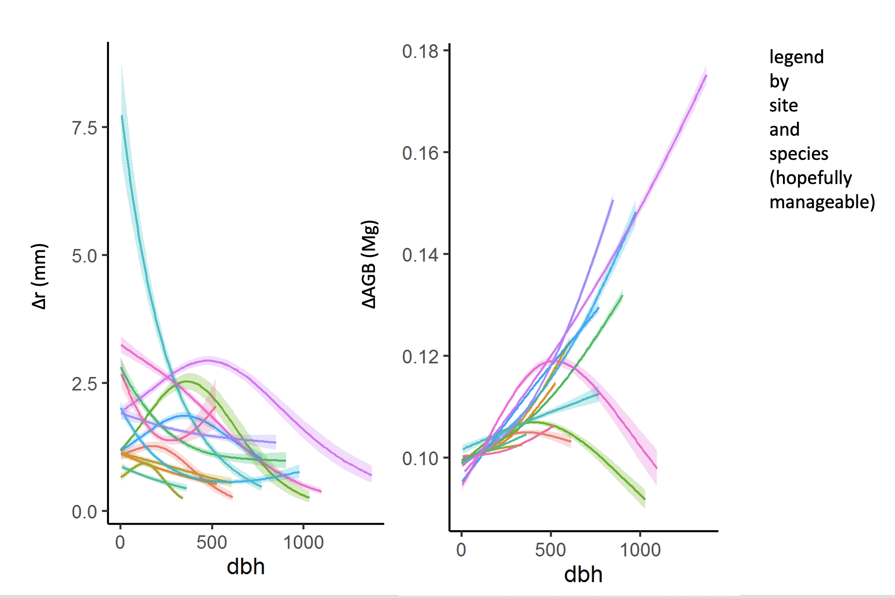
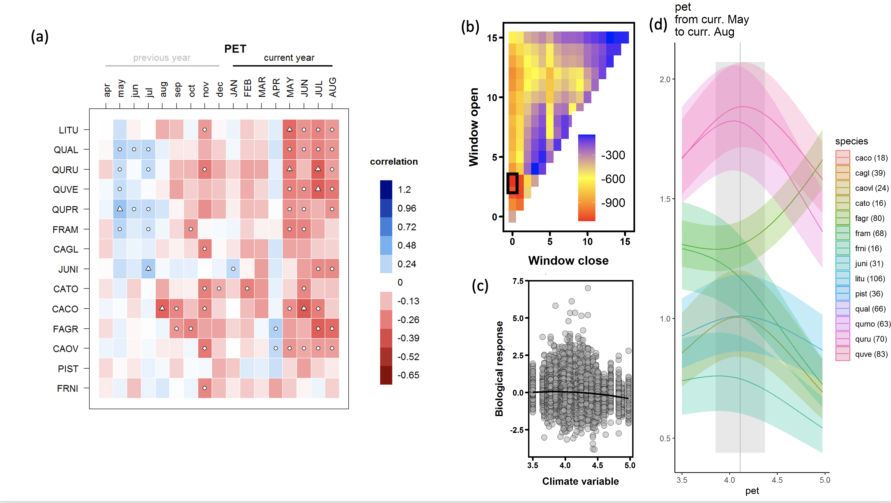

```{r setup, include=FALSE}
knitr::opts_chunk$set(echo = TRUE)
```


\raggedright

**Title:** Using tree-ring records to simultaneously characterize the influence of tree size, climate, and other environmental drivers on annual growth

**Authors (not yet complete, final order TBD):** 

Kristina J. Anderson-Teixeira^1,2^*

Valentine Herrmann^1^

Christy Rollinson^#^

Ross Alexander^#^

Erika B. Gonzalez-Akre^1^

Bianca Gonzalez^1^

[all other contributers (see spreadsheet) in alphabetical order, including:]

Ryan Helcoski^1^

Neil Pederson^#^

Alan J. Tepley^1,#^

*other contributers may move up in the list if they contribute a lot*


**Author Affiliations:**

1. Conservation Ecology Center; Smithsonian Conservation Biology Institute; Front Royal, VA 22630, USA
2. Center for Tropical Forest Science-Forest Global Earth Observatory; Smithsonian Tropical Research Institute; Panama, Republic of Panama
X#. Harvard Forest, Petersham, MA 01366, USA
X#. Canadian Forest Service, Northern Forestry Centre, Edmonton, Alberta, Canada

*corresponding author: teixeirak@si.edu; +1 540 635 6546

**Running headline:** [45 chars]

```{r eval=FALSE, echo=FALSE}
## Target journal: Methods in Ecology & Evolution (IF 7.09)
## Instructions for authors: https://besjournals.onlinelibrary.wiley.com/hub/journal/2041210X/author-guidelines
# Research article:  should have a maximum of 6000-7000 words (including tables/figure captions and references) and describe new methods and how they may be used.

### Length planning:
## Main text ~4300 words --> ~21 paragraphs averaging 200 words
# Intro- 6
# Methods- (9)
# Results - ()
# Discussion - (5)
## References: figure ~40 words each, so 50 refs = 2000
## Display items: figure ~100 words for each caption = 700 words
# Table1- table of sites
# Fig0?- schematic illustrating our process
# Fig1- relationship of ∆r and ∆AGB to DBH (all site-species combinations)
# Fig2- climate senstivity (SCBI example): (a) Helcoski quilt plot, (b) Climwin panel a, (c) GLS output
# Fig3- multipanel- GLS results for climate sensitivity at all sites (3 columns with the 3 variable type groupings, 1 row per site)
# Fig4/ table2- DBH/climate interactions
# Fig 4/5- responses to CO2 and atmospheric deposition

```

\newpage

### Abstract

```{r eval=FALSE, echo=FALSE}
## The Abstract must not exceed 350 words and should list the main results and conclusions, using simple, factual, numbered statements:

#Point 1: set the context for and purpose of the work;

#Point 2: indicate the approach and methods;

#Point 3: outline the main results;

#Point 4: identify the conclusions and the wider implications.

# Key-words: A list in alphabetical order not exceeding eight words or short phrases. The most important key-words should appear in the title and the abstract as well as the key-word list. More advice on selecting good keywords can be found here.
```

**Keywords**: 

\newpage

### Introduction

**Tree rings provide a valuable record for understanding forests in an era of global change.** 
[specifics/ example applications: 
estimating forest woody productivity; 
understanding the climate sensitivity of tree growth and forest woody productivity, and using this understanding to predict forest responses to climate change; 
understanding how CO2 and atmospheric deposition influence tree growth]... 
**Yet, traditional methods of analysis hold limitations for use of tree-rings to address these questions.** 

**Traditional methods do not characterize the effect of tree size or its potential interactions with climate variables.** 
Tree size is among the most important variables affecting tree growth rate (Muller-Landau et al. 2006; Foster et al. 2016; REFS). 
Radial growth increments (*i.e.*, tree-ring widths; $\Delta r$) may increase or decrease with tree size, often in a non-linear manner.
Following a "juvenile growth phase", which is typically removed in traditional dendrological analyses, $\Delta r$ may decline, particularly in open-grown conifers (??; DENDRO_REFS).
In contrast, in mesic closed-canopy forests, $\Delta r$ typically increases with tree diameter at breast height ($DBH$; Muller-Landau et al. 2006; REFS, DENDRO_REFS).
For dendrological studies aimed at deciphering climate signals, tree size is not typically a variable of interest, and its influence is removed through detrending (DENDRO_REFS).
While suitable for identifying climate signals (DENDRO_REFS), this approach is not optimal for subsequent inference of the climate sensitivity of forest productivity. 
Although climate correlations can be transformed to climate sensitivity (*sensu* Charney) and scaled to characterize the climate sensitivity of $ANPP_{stem}$ based on the scaling of $\Delta r$ with $DBH$ (Helcoski et al. 2019), they cannot be used to characterize known interactive effects of $DBH$ and climate on tree growth.

**[limitations in how traditional methods look at climate variables]**
- [subjectively selected variables (e.g., T, PPT, PDSI)]
- [month-by-month, reflective of fact that historical climate data products often presented at this time scale. While useful for characterizing how monthly climate influence annual tree growth, month is an arbitrary unit of time, and this approach does not necessarily identify the most influential time windows over which climate shapes tree growth]
- [one variable at a time-- no additive or interactive effects, which are known]

**Traditional methods characterize only linear responses. This conflicts with biological expectations.**
Most biological rates—- from photosynthesis to animal metabolism—-display a unimodal relationship to temporal variation in temperature, wherein rates increase exponentially with temperature up to a point, typically reflective of the environment to which the organism is adapted / acclimatized, and decrease at higher temperatures (e.g., Slot and Winter 2017; Kumarathunge et al. 2019-cited in Helene's Tansley review). 
Similar relationships have also been observed for moisture availability, particularly in environments that are not strongly water-limited. ... 
In trees, responses to environmental drivers are typically observed over time frames of seconds to days, and therefore do not directly reveal how annual tree growth and forest productivity respond to inter-annual variation in climate. 
The annual growth records of tree-rings allow can be used to study interannual variation, but the standard practice in dendrochronology has been to fit linear relationships, and we therefore know little about what, if any, nonlinearities occur in tree growth responses to interannual variation in climate.

**Characterizing the influence of slowly-changing environtmental drivers is very challenging and uncertain.**
We want to know how changes in CO2 and atmospheric deposition are influencing tree growth.
A signficant challenge arises when tree-rings are used to characterize the influence of slowly changing environmental variables--climate, CO2, atmospheric deposition--on tree growth rates (REFS).
In these cases, a variety of methods are used to account for simultaneous changes in tree size, including... (DENDRO_REFS)
None of these methods is fully satisfactory; rather, it is necessary to *simultaneously* account for the influences of changing tree size and environmental drivers.

**Here, develop a new method that allows simultaneous consideration of the effects of tree size, objectively determined principle climate drivers, and other environemntal drivers on annual tree growth.** 
We ask:
(1) How do radial growth and aboveground biomass increments ($\Delta AGB$) vary with DBH?
(2) What are the most important climate drivers of annual growth, and over which time windows?
(3) What is the shape of the relationship between annual growth and climate drivers?
(4) Are there interactions between DBH and climate drivers common?
(5) How is growth simultaneously influenced by DBH, climate, and other environemental drivers (CO2, atmospheric deposition)?

### Materials and Methods

#### Data sources and preparation

*Study sites and tree-ring data*

We analyzed previously collected tree-ring data from  # sites of the Forest Global Earth Observatory (ForestGEO; Anderson-Teixeira et al. 2015) representing a wide range of forest and tree types: tropical broadleaf (deciduous/evergreen), temperate broadleaf deciuous, temperate needleleaf evergreen, and boreal needleleaf evergreen.
Trees were cored within or close to the large forest dynamics plots following a variety of sampling protocols designed to meet the varied objectives of the studies for which they were oringially collected (Table 1; REFS). 
In using this variety of data sources, we encountered and solved a variety of challenges for analyzing existing tree-ring records with this approach.

**Table 1- site code, site name, geographic coordinates, veg type(s), species (n trees for each), total n cores, canopy positions sampled, live/dead, citations to original publications**

*Selecting data for analysis*

Based on the findings of [Caillerete et al. 2017](https://github.com/EcoClimLab/ForestGEO-climate-sensitivity/blob/master/doc/references/Cailleret_et_al-2017-GCB.pdf), we cutcut off the records of all dead trees 20 years prior to death.

*DBH reconstruction*

DBH could be reconstructed one of two ways: outside-in or inside-out. 
We generally gave precedence to the outside-in approach.
DBH is not always collected when cores are taken, and is not routinely preserved alongside tree-ring data. For example, the International Tree-Ring Data Bank (ITRDB) contains no structure for storing DBH records. 
At some of our sites where DBH was not taken at the time of coring (*SCBI*,), DBH measurements taken before or slightly after the time of coring could be used. If before, ... If after...

In either case we need bark thickness--ideally allometries. This is especially critical for thick-barked species


*Calculating $\Delta AGB$*

Allodb

*Climate and environmental driver data*

Climate from CRU
(special cases where CRU is really sub-par?)

CO2- downloaded Mauna Loa record

atmospheric deposition 

#### Analysis methods

*Identifying key climate drivers*
[climwin]

challenge: Scotty Creek

*Combining drivers in GLS model*

### Results




### Discussion
**We present a new method that allows simultaneous consideration of the effects of tree size, objectively determined principle climate drivers, and other environemntal drivers on annual tree growth.**
Results are broadly consistent with those obtained by traditional methods, but offer several new insights.


### Acknowledgements
Scholarly Studies

### Authors' contributions

### References


