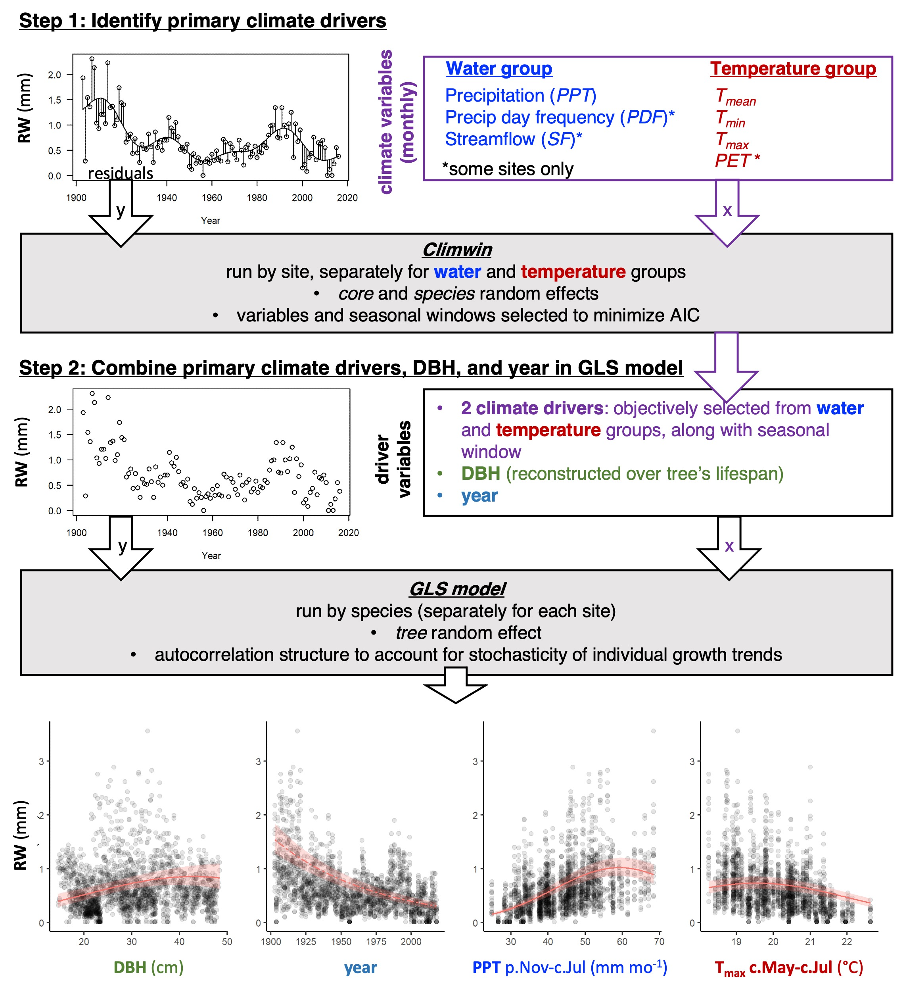

```{r setup, include=FALSE}
knitr::opts_chunk$set(echo = TRUE)
```


\raggedright

**Title:** Using tree-ring records to simultaneously characterize the influence of tree size, climate, and other environmental drivers on annual growth

**Authors (not yet complete, final order TBD):** 

Kristina J. Anderson-Teixeira^1,2^*

Valentine Herrmann^1^

Christy Rollinson^#^

Erika B. Gonzalez-Akre^1^

Bianca Gonzalez^1^

Neil Pederson^#^

Ross Alexander^#^

Camille Piponiot^1,2^

[all other contributers (see spreadsheet) in alphabetical order, including:]

Ryan Helcoski^1^

Alan J. Tepley^1,#^

*other contributers may move up in the list if they contribute a lot*


**Author Affiliations:**

1. Conservation Ecology Center; Smithsonian Conservation Biology Institute; Front Royal, VA 22630, USA
2. Center for Tropical Forest Science-Forest Global Earth Observatory; Smithsonian Tropical Research Institute; Panama, Republic of Panama
X#. Harvard Forest, Petersham, MA 01366, USA
X#. Canadian Forest Service, Northern Forestry Centre, Edmonton, Alberta, Canada

*corresponding author: teixeirak@si.edu; +1 540 635 6546

**Running headline:** [45 chars]

```{r eval=FALSE, echo=FALSE}
## Target journal: Methods in Ecology & Evolution (IF 7.09)
## Instructions for authors: https://besjournals.onlinelibrary.wiley.com/hub/journal/2041210X/author-guidelines
# Research article:  should have a maximum of 6000-7000 words (including tables/figure captions and references) and describe new methods and how they may be used.

### Length planning:
## Main text ~4300 words --> ~28 paragraphs averaging 150 words
# Intro- 900/ 6
# Methods- 1500 / (11)
# Results - 1000/ (6)
# Discussion - 900 / (5)
## References: figure ~40 words each, so 50 refs = 2000
## Display items: figure ~100 words for each caption = 700 words
# Table1- table of sites
# Fig0?- schematic illustrating our process
# Fig1- relationship of ∆r and ∆AGB to DBH (all site-species combinations)
# Fig2- climate senstivity (SCBI example): (a) Helcoski quilt plot, (b) Climwin panel a, (c) GLS output
# Fig3- multipanel- GLS results for climate sensitivity at all sites (3 columns with the 3 variable type groupings, 1 row per site)
# Fig4/ table2- DBH/climate interactions
# Fig 4/5- responses to CO2 and atmospheric deposition

```

\newpage

### Abstract

```{r eval=FALSE, echo=FALSE}
## The Abstract must not exceed 350 words and should list the main results and conclusions, using simple, factual, numbered statements:

#Point 1: set the context for and purpose of the work;

#Point 2: indicate the approach and methods;

#Point 3: outline the main results;

#Point 4: identify the conclusions and the wider implications.

# Key-words: A list in alphabetical order not exceeding eight words or short phrases. The most important key-words should appear in the title and the abstract as well as the key-word list. More advice on selecting good keywords can be found here.
```

**Keywords**: 

\newpage

### Introduction

**Tree rings provide a valuable record of for understanding forests in an era of global change.** 
[specifics/ example applications: 
estimating forest woody productivity; 
understanding the climate sensitivity of tree growth and forest woody productivity, and using this understanding to predict forest responses to climate change; 
understanding how CO2 and atmospheric deposition influence tree growth]... 
**Yet, traditional methods of analysis hold limitations for use of tree-rings to address these questions.** 
Traditional methods seek to remove the ecology. That's what's of interest to us.

**Traditional methods do not characterize the effect of tree size or its potential interactions with climate variables.** 
Tree size is among the most important variables affecting tree growth rate (Muller-Landau et al. 2006; Foster et al. 2016; REFS). 
Radial growth increments (*i.e.*, tree-ring widths; $\Delta r$) may increase or decrease with tree size, often in a non-linear manner.
Following a "juvenile growth phase", which is typically removed in traditional dendrological analyses, $\Delta r$ may decline, particularly in open-grown conifers (??; DENDRO_REFS).
In contrast, in mesic closed-canopy forests, $\Delta r$ typically increases with tree diameter at breast height ($DBH$; Muller-Landau et al. 2006; REFS, DENDRO_REFS).
For dendrological studies aimed at deciphering climate signals, tree size is not typically a variable of interest, and its influence is removed through detrending (DENDRO_REFS).
While suitable for identifying climate signals (DENDRO_REFS), this approach is not optimal for subsequent inference of the climate sensitivity of forest productivity. 
Although climate correlations can be transformed to climate sensitivity (*sensu* Charney) and scaled to characterize the climate sensitivity of $ANPP_{stem}$ based on the scaling of $\Delta r$ with $DBH$ (Helcoski et al. 2019), they cannot be used to characterize known interactive effects of $DBH$ and climate on tree growth.
For example, larger trees tend to be more sensitive to drought (Bennett et al. 2015; McGregor et al. in revision; REFS).
Thus, to use tree-rings to predict $ANPP_{stem}$ for a forest where not every tree was cored, we need models that include tree size.

**[limitations in how traditional methods look at climate variables]**
- [subjectively selected variables (e.g., T, PPT, PDSI)]
- [month-by-month, reflective of fact that historical climate data products often presented at this time scale. While useful for characterizing how monthly climate influence annual tree growth, month is an arbitrary unit of time, and this approach does not necessarily identify the most influential time windows over which climate shapes tree growth]
- [one variable at a time-- no additive or interactive effects (although VS-Lite starts to get there), which are expected and have been observed for tree-rings (Foster et al. 2016)]

**Traditional methods characterize only linear climate responses. This conflicts with biological expectations.**
Most biological rates—- from photosynthesis to animal metabolism—-display a unimodal relationship to temporal variation in temperature, wherein rates increase exponentially with temperature up to a point, typically reflective of the environment to which the organism is adapted / acclimatized, and decrease at higher temperatures (e.g., Slot and Winter 2017; Kumarathunge et al. 2019-cited in Helene's Tansley review). 
Similar relationships have also been observed for moisture availability, particularly in environments that are not strongly water-limited. 
In trees, responses of photosynthesis and respiration to environmental drivers are typically observed over time frames of seconds to days, and therefore do not directly reveal how annual tree growth and forest productivity respond to inter-annual variation in climate. 
The annual growth records of tree-rings allow can be used to study interannual variation, but the standard practice in dendrochronology has been to fit linear relationships (exception is VS-Lite, which fits plateau), and we therefore know little about what, if any, nonlinearities occur in tree growth responses to interannual variation in climate.

**Characterizing the influence of slowly-changing environtmental drivers is very challenging and uncertain.**
We want to know how changes in CO2 and atmospheric deposition are influencing tree growth.
A signficant challenge arises when tree-rings are used to characterize the influence of slowly changing environmental variables--climate, CO2, atmospheric deposition--on tree growth rates (REFS).
In these cases, a variety of methods are used to account for simultaneous changes in tree size, including... (DENDRO_REFS)
None of these methods is fully satisfactory; rather, it is necessary to *simultaneously* account for the influences of changing tree size and environmental drivers.

**Here, develop a new method that allows simultaneous consideration of the effects of tree size, objectively determined principle climate drivers, and other environemntal drivers on annual tree growth.** 
This allows us to ask:
(1) How do radial growth and aboveground biomass increments ($\Delta AGB$) vary with DBH?
(2) What are the most important climate drivers of annual growth, and over which time windows?
(3) What is the shape of the relationship between annual growth and climate drivers?
(4) Are there interactions between DBH and climate drivers common?
(5) How is growth simultaneously influenced by DBH, climate, and other environemental drivers (CO2, atmospheric deposition)?

### Materials and Methods

#### Data sources and preparation

We analyzed previously collected tree-ring data from  # sites of the Forest Global Earth Observatory (ForestGEO; Anderson-Teixeira et al. 2015) representing a wide range of forest and tree types: tropical broadleaf deciduous and evergreen, temperate broadleaf deciuous and needleleaf evergreen, and boreal needleleaf evergreen (Table 1).
Trees were cored within or close to the large forest dynamics plots following a variety of sampling protocols designed to meet the varied objectives of the original studies (REFS). 
In using this variety of data sources, we encountered and solved a variety of challenges for analyzing existing tree-ring records with this approach.

**Table 1 | Sites included in this analysis**


All tree cores were measured and cross-dated using standard dendrochronological practices. 
The full record for all cores was retained for analysis, with the following exceptions.
First, we excluded species with <7 cores.
Second, we excluded cores with <30 years of record.
Third, for any sites with a record of $\Delta r$ > 10 mm within the first 15 years of the record, we excluded those 15 years.
Fourth, for trees cored dead, we excluded the final 20 years prior to death to avoid periods of growth decline and potentially altered climate sensitivity prior to death ([Caillerete et al. 2017](https://github.com/EcoClimLab/ForestGEO-climate-sensitivity/blob/master/doc/references/Cailleret_et_al-2017-GCB.pdf); REF on climate sensitivity).

For each year in the tree-ring records, we reconstructed $DBH$, as detailed in Appendix S1. 
In most cases, when a recent $DBH$ measurement was available, $DBH$ was reconstructed from the outside in. 
In cases where $DBH$ was not available, but when we knew that the core hit pith or had a reasonable estimate of how far off it was, $DBH$ was reconstructed from the inside out. 
In either case, we used allometric equations relating bark thickness to $DBH$ to account for changes in bark thickness as the tree grew (Appendix S1; Table S2).

Once $DBH$ had been reconstructed, we calculated aboveground biomass growth increments ($\Delta AGB$) based on $DBH$ and $\Delta r$.
Specifically, for each year $y$, we used biomass allometries to estimate $ABG_y$ based on $DBH_y$ and $AGB_{y+1}$ based on [$DBH_y + \Delta r$]. 
We then calculated $\Delta AGB_y$ as [$AGB_{y+1}-AGB_y$]. 
For temperate sites, biomass allometries were sourced from allo-db (DETAILS; Gonzalez-Akre et al. in prep).
For BCI, biomass allometries were sourced from the BIOMASS package (REF).

Climate and environmental driver data were obtained from global databases. Monthly climate data for 1901-20XX was obtained from CRU v.4.0X (Harris et al. 2014, [2020](https://rdcu.be/b3U3e)). Variables considered here included mean, minimum, and maximum temperatures; daily temperture range; precipitation; wet day frequency; cloud cover; and potential evapotranspiration (PET). Atmospheric CO~2~... (**ISSUE: need to download**). Atmospheric deposition... (**ISSUE: need to obtain/ organize**). Analyses were, necessarily, limited ot the time frame over which these were available.

#### Analysis methods

Our analysis consisted of two main steps: (1) identification of the most important climate drivers, and (2) combining $DBH$ and environmental drivers into a multivariate model (Fig. 1). 



*Identifying key climate drivers*

First, we identified the most important climate driver for each of three categories of variables: a temperature group (mean, min, and max temperature; PET), a precipitation group (precipitation, number of days with precipitation), and a group linked to temperature variability and cloud cover (daily temperature range, percent cloud cover, and again PET). 
These groups were defined based on the dependencies of these variables on one another in the CRU database (Harris et al. 2014, [2020](https://rdcu.be/b3U3e)), as well as climatological and biological considerations.
Our first step was detrending to remove the influence of all non-climatic drivers, which is essential for identifying climatic drivers (DENDRO_REFS).
Specifically, we used a GAM model to fit a spline to individual tree growth records ($log[\Delta r]$ or $log[\Delta AGB]$), thereby producing residuals.
We note that an an attempt at the analysis without detrending failed to produce results consistent with biological expectations and results obtained via traditional dendrochronological methods, and generally failed to identify significant climate drivers.

We then used the *climwin* package in R (REF) [(van de Pol et. al. 2016)](https://besjournals.onlinelibrary.wiley.com/doi/full/10.1111/2041-210X.12590) to identify the most significant climate driver and time window for each of the three climate variable groups. 
*Climwin* searches through multiple climate variables and over a wide range of time frames to identify which are most strongly correlated to the biological variable of interest--in this case, residuals of $log[\Delta r]$ or $log[\Delta AGB]$.
Within *climwin*, we specified a mixed effects model using species and tree identity as random effect: `residual ~ [climate] + (1 | sp) + (1 | treeID)`. 
Here, for each permutation, `climate` specifies one of the climate drivers in the climate variable group, analyzed over one of all possible combinations of time periods, at monthly resolution, starting in the previous May and ending in August of the current year.
We note that analyzing all species together yields the most significant climate drivers across the full set of cores from each site (our goal here), whereas identification of the top climate drivers for individual species would be optimized by analyzing each species separately.
*Climwin* can check for linear and quadratic relationships. We specified quadratic relationships only because (i) quadratic relationships are more consistent with known biological mechanisms (see Indroduction), (ii) preliminarly tests revealed that quadratic fits usually had lower AIC, and when not there tended to be little difference in AIC and the curve would approximate a straight line, (iii) modeling only quadratic improves coding efficiency and speeds up the analysis process.
For each group of candidate climate variables, we move forward with the best variable over the time window identified by climwin as a candidate climate variable for the multivariate models. 
When PET came out as the best variable in both temperature and cloud cover groups, there were only two candidate variables for the GAM. 
We checked for colinearity among the selected climate variables and removed any variable with a variance inflation factor > 10.

To check that this process identified similar climate variables to what would be identified using traditional methods, ... (**ISSUE: do a standardized analysis similar to Helcoski et al. for each site? or just compare with previous studies for each site?**)
(**ISSUE: check that we get similar results with $\Delta r$ and $\Delta AGB$)

A challenge to this system arose for the site undergoing most rapid climate change: Scotty Creek. 
There, [temperatures have increased by X $^\circ$ over X years]..., resulting in negative growth trends in basal area index (BAI) starting around 1950 and significant growth declines since 1970 in `r round(249/(249+69+127)*100, digits=0)`% of trees (Sniderhan & Baltzer 2016).
Problematically, correlating tree growth residuals from which climate-driven trends had been removed against the climate signal with a strong directional trend would not necessarily identify the most signficant climate drivers.
(**ISSUE: How do we solve this? Any possibility besides subjectively selecting the drivers? Maybe try analysis without detrending**)

*Combining drivers in GLS model*

Second, we combined DBH, climate, and atmospheric pollution data in a GLS.

### Results

*Influence of DBH*

**Both $\Delta r$ and $\Delta AGB$ varied with $DBH$.** 
For $\Delta r$, the general tendency was a decline with DBH, sometimes following an initial increase (Fig. 2a). 
$\Delta AGB$ generally increased with $DBH$, although unimodal relationships were observed in some cases (Fig. 2b).


*Identifying climate drivers*

**Our process picked out similar climate drivers to what would be obtained via traditional methods (Fig. 3).**


![**Figure 3 | Example comparison of climate sensitivity derived via traditional methods (**a**) and our approach (**b-f**).** Example is for the sensitivity of 14 species at SCBI (codes given in Table S1) to potential evapotranspiration (PET), identified by both traditional methods and our method to be among the top climate drivers. Panel (**a**) shows a matrix of Pearson correlations between ring- width index and monthly climate variables. Panels (**b-d**) give statistics for time windows tested in *climwin*, where window open and close indicate months prior to current August, and cells across the lower diaganol indicate single-month tests (akin to panel **a**). Panels (**b**) and (**c**) give values of linear and quadratic terms for each correlation, and (**d**) gives the AIC for each. The time window with the minimum AIC (0-3 months prior to August, or May-Aug; black boxes), was identified as the optimal window. Panel (**e**) shows the correlation of individual-level residuals to PET, with the function fit in *climwin*. Finally, panel (**f**) shows GLS model output, where PET is one of several driver variables (*specify model*). Plotted are responses of species for which PET was identified as a signficant driver in the top model.](tables_figures/climate_figure_sketch.png)

**The most influential climate drivers...[what tended to be selected?].**
- Time windows
  - often current growing season
  - some exceptions
- Selection within groups:
  - precip vs n precip days
  - temperature group: mean, min, max or PET?
  - t range group: which tended to be most important?

*Climate sensitivity*

**Non-linear responses to climate variabels were common (Fig. 4).**
- Growth almost always increased with precipitation up to the long-term mean, but often declined under high precipitation.
- The most common response to temperture was unimodal, often peaking within 1SD of long-term mean. (**depending on how strongly this comes out, may warrent separate paper**)
- (results for cloudiness group)


*Climate-DBH interactions*

*Influence of atmospheric pollution*

### Discussion
**We present a new method that allows simultaneous consideration of the effects of tree size, objectively determined principle climate drivers, and other environemntal drivers on annual tree growth.**
Results are broadly consistent with those obtained by traditional methods, but offer several new insights.


First, $\Delta r$ typically declines with tree size in cored individuals, consistent with many previous observations from tree-ring records (DENDRO_REFS).

DBH is not always collected when cores are taken, and is not routinely preserved alongside tree-ring data. For example, the International Tree-Ring Data Bank (ITRDB) contains no structure for storing DBH records. 

### Acknowledgements
Scholarly Studies

### Authors' contributions

### References


