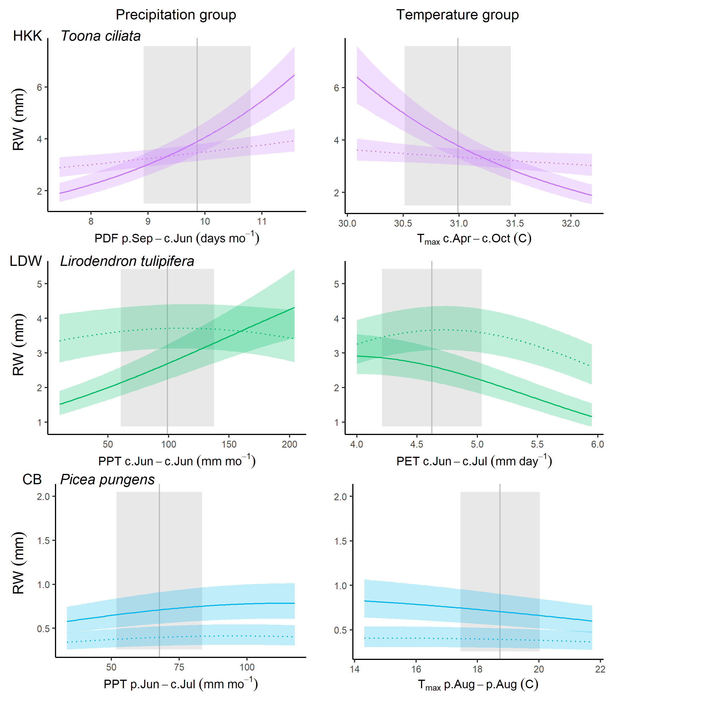

```{r setup, include=FALSE}
knitr::opts_chunk$set(echo = TRUE)
```


\raggedright

**Title:** Using tree-ring records to simultaneously characterize the influence of climate, tree size, and slowly changing environmental drivers on annual growth

**Authors:** 

[Kristina J. Anderson-Teixeira^1,2^*](0000-0001-8461-9713),
Valentine Herrmann^1^,
Christy Rollinson^3^,
Bianca Gonzalez^1^,
Erika B. Gonzalez-Akre^1^,
Neil Pederson^4^,
Camille Piponiot^1,2^,
Ross Alexander,
Craig D. Allen,
Raquel Alfaro-Sánchez^wl^,
Tala Awada,
Jennifer L. Baltzer^wl^,
Patrick J. Baker,
Sarayudh Bunyavejchewin,
Paolo Cherubini,
Justin Cooper,
Stuart J. Davies^2^,
Cameron Dow^1^,
Ryan Helcoski^1^,
[Jakub Kašpar^cz^](0000-0003-1780-6310),
James Lutz,
Ellis Q. Margolis,
Justin Maxwell^jm^,
Sean McMahon^2^,
Sabrina Russo,
[Pavel Šamonil^cz^](0000-0002-7722-8797),
Anastasia Sniderhan^wl^,
Alan J. Tepley^1,at^,
[Ivana Vašíčková^cz^](0000-0002-6070-5956), 
Mart Vlam,
Peter Zuidema


**Author Affiliations:**

1. Conservation Ecology Center; Smithsonian Conservation Biology Institute; Front Royal, VA 22630, USA

2. Center for Tropical Forest Science-Forest Global Earth Observatory; Smithsonian Tropical Research Institute; Panama, Republic of Panama

3. The Morton Arboretum, Lisle, Illinois, USA

4. Harvard Forest, Petersham, MA 01366, USA

wl. Biology Department, Wilfrid Laurier University, 75 University Ave W, Waterloo, ON, N2L 3C5

at. Canadian Forest Service, Northern Forestry Centre, Edmonton, Alberta, Canada

cz. Department of Forest Ecology, The Silva Tarouca Research Institute for Landscape and Ornamental Gardening, Lidická 25/27, 602 00 Brno, Czech Republic

jm. Department of Geography, Indiana University, Bloomington, Indiana, USA

*corresponding author: teixeirak@si.edu; +1 540 635 6546

**Running headline:** [45 chars]


```{r eval=FALSE, echo=FALSE}
## potential reviewers: Jane Foster, M. Evans,  van der Pol, DEN team, Klesse, J Matthias

## Target journal: Global Change Biology
## Instructions for authors: https://onlinelibrary-wiley-com.smithsonian.idm.oclc.org/page/journal/13652486/homepage/forauthors.html
## Primary Research Articles present the results of a completed research project and are up to 8000 words in length. Word limits apply to the main body of the text (Introduction, Materials and Methods, Results, Discussion, and Acknowledgements).
## I don't think GCB has an official limit on display items (a recently accepted article has 10 figures and 4 tables).

```

```{r eval = TRUE, echo=FALSE, warning=FALSE, results='hide'}
#Tables
sites = 1

#Figures
schematic=1
SCBI_example=2
clim_sens=3
size=4
interactions_fig = 5 #DBH/climate interactions
year_fig = 6

# SUPPLEMENTARY INFO (this chunk must be repeated in MEE_manuscript_SI.Rmd)

#Appendices
site_details_appendix <- "S1"
DBH_reconstruction <- "S2"
climate_correction <- "S3"
traditional_comparison <- "S4"
changing_climate <- "S5"
decadal_analysis_appendix <- "S6"

site_details_appendix_title<- "Appendix S1. Site Details"
DBH_reconstruction_title <- "Appendix S2. Methods for reconstruction of $DBH$"
climate_correction_title <- "Appendix S3. Methods for climate data evaluation and correction"
traditional_comparison_title <- "Appendix S4. Methods for comparing our approach with traditional methods"
changing_climate_title <- "Appendix S5. Dealing with rapidly changing climate and tree growth"
decadal_analysis_appendix_title <- "Appendix S6. Analysis of DBH-growth relationships by decade"

#SI table numbers
site_details = "S1"
species_table = "S2"
sampling_details_table = "S3"
bark_allometries = "S4"
qualitative_results_comparison = "S5"

#SI table captions
site_details_legend <- "Table S1. Site Details."
species_table_legend <-"Table S2. Species analyzed, their characteristics, and bark allometries applied."
sampling_details_legend <- "Table S3. Sampling details for species by site."
bark_allometries_legend <- "Table S4. Allometric equations for bark thickness."
qualitative_results_comparison_legend <- "Table S5. Qualtiative comparison of results from this study with previous studies employing conventional methods."

#SI figure numbers
all_traditional_comparisons = "S1-S4"
SCBI_traditional_comparison = "S1"
Zofin_traditional_comparison = "S2"
CB_traditional_comparison = "S3"
SC_traditional_comparison = "S4"

all_climwin = "S5-S7"
climwin_sameV_sameW = "S5"
climwin_sameV_diffW = "S6"
climwin_diffV_diffW = "S8"

all_GLS = "S9-S28"
GLS_BCNM = "S9"
GLS_BCNM_year = "S10"
GLS_HKK = "S11"
GLS_HKK_year = "S12"
GLS_SCBI = "S13"
GLS_SCBI_year = "S14"
GLS_LDW = "S15"
GLS_LDW_year = "S16"
GLS_HF = "S17"
GLS_HF_year = "S18"
GLS_ZOF = "S19"
GLS_ZOF_year = "S20"
GLS_NIO = "S21"
GLS_NIO_year = "S22"
GLS_LT = "S23"
GLS_LT_year = "S24"
GLS_CB = "S25"
GLS_CB_year = "S26"
GLS_SC = "S27"
GLS_SC_year = "S28"

SC_1970break = "S29"

RW_interactions_all= "S30"
BAI_interactions_all= "S31"


#SI figure captions
SCBI_traditional_comparison_legend <- "Figure S1. Comparison of our approach with traditional methods of identifying climate signals: LITU at SCBI."
Zofin_traditional_comparison_legend <- "Figure S2. Comparison of our approach with traditional methods of identifying climate signals: ABAL at Zofin."
CB_traditional_comparison_legend <- "Figure S3. Comparison of our approach with traditional methods of identifying climate signals: PSME at Cedar Breaks."
SC_traditional_comparison_legend <- "Figure S4. Comparison of our approach with traditional methods of identifying climate signals: PIMA at Scotty Creek."

climwin_sameV_sameW_legend = "Figure S5. (PRE at SCBI)"
climwin_sameV_diffW_legend = "Figure S6. (PET at SCBI)"
climwin_diffV_diffW_legend = "Figure S7. (TMX/TMP at HKK)"

# without year
GLS_BCNM_legend = "Figure S9. Best GLS models including climate and DBH for Barro Colorado Nature Monument (Panama)"
GLS_BCNM_year_legend = "Figure S10. Best GLS models including climate, DBH, and year for Barro Colorado Nature Monument (Panama)"
GLS_HKK_legend = "Figure S11. Best GLS models including climate and DBH for Huai Kha Khaeng (Thailand)"
GLS_HKK_year_legend = "Figure S12. Best GLS models including climate, DBH, and year for Huai Kha Khaeng (Thailand)"
GLS_SCBI_legend = "Figure S13. Best GLS models including climate and DBH for the Smithsonian Conservation Biology Institute (Virginia, USA)"
GLS_SCBI_year_legend = "Figure S14. Best GLS models including climate, DBH, and year for the Smithsonian Conservation Biology Institute (Virginia, USA)"
GLS_LDW_legend = "Figure S15. Best GLS models including climate and DBH for Lilley Dickey Woods (Indiana, USA)"
GLS_LDW_year_legend = "Figure S16. Best GLS models including climate, DBH, and year for Lilley Dickey Woods (Indiana, USA)"
GLS_HF_legend = "Figure S17. Best GLS models including climate and DBH for Harvard Forest (Massachusetts, USA) "
GLS_HF_year_legend = "Figure S18. Best GLS models including climate, DBH, and year for Harvard Forest (Massachusetts, USA) "
GLS_ZOF_legend = "Figure S19. Best GLS models including climate and DBH for Zofin Forest (Czech Republic)"
GLS_ZOF_year_legend = "Figure S20. Best GLS models including climate, DBH, and year for Zofin Forest (Czech Republic)"
GLS_NIO_legend = "Figure S21. Best GLS models including climate and DBH for Niobrara (Nebraska, USA)"
GLS_NIO_year_legend = "Figure S22. Best GLS models including climate, DBH, and year for Niobrara (Nebraska, USA)"
GLS_LT_legend = "Figure S23. Best GLS models including climate and DBH for Little Tesuque (New Mexico, USA)"
GLS_LT_year_legend = "Figure S24. Best GLS models including climate, DBH, and year for Little Tesuque (New Mexico, USA)"
GLS_CB_legend = "Figure S25. Best GLS models including climate and DBH for Cedar Breaks (Utah, USA)"
GLS_CB_year_legend = "Figure S26. Best GLS models including climate, DBH, and year for Cedar Breaks (Utah, USA)"
GLS_SC_legend = "Figure S27. Best GLS models including climate and DBH for Scotty Creek (Northwest Territory, Canada)"
GLS_SC_year_legend = "Figure S28. Best GLS models including climate, DBH, and year for Scotty Creek (Northwest Territory, Canada)"

SC_1970break_legend = "Figure 29. Climate responses at Scotty Creek (Northwest Territory, Canada) before and after 1970."

RW_interactions_all_legend = "Figure S30. (RW_interactions_all)"
BAI_interactions_all_legend ="Figure S31. (BAI_interactions_all)"

```

```{r eval = TRUE, echo=FALSE, warning=FALSE, results='hide'}
#READING IN TABLES TO GET STATS FOR TEXT
path_to_repo <- (dirname(dirname(getwd()))) # this gets path so that anybody to knit

#species
species <- read.csv(paste0(path_to_repo, "/doc/manuscript/tables_figures/species.csv"), stringsAsFactors = FALSE, check.names = FALSE)
  n_species <- nrow(species) 
  
sampling_details <- read.csv(paste0(path_to_repo, "/doc/manuscript/tables_figures/sampling_details.csv"), stringsAsFactors = FALSE, check.names = FALSE)
  n_trees_all <- sum(na.omit(sampling_details[, "n trees all"]))  #CHECK WITH V IF THIS IS BEFORE OR AFTER EXCLUSION of cores
  n_trees_dbh <- sum(na.omit(sampling_details[, "n trees dbh"]))
  n_cores_all <- sum(na.omit(sampling_details[, "n cores all"]))  #CHECK WITH V IF THIS IS BEFORE OR AFTER EXCLUSION of cores
  n_cores_dbh <- sum(na.omit(sampling_details[, "n cores dbh"]))
```
\newpage

# Abstract  {-#Abstract} 

```{r eval=FALSE, echo=FALSE}
## Abstract: Limited to 300 words. 
```

*(needs to be re-written)*

1. Tree rings provide a valuable long-term record for understanding how climate shapes forest productivity. However, traditional analysis methods aggregate growth records of multiple trees into residual chronologies, and therefore cannot simultaneously account for the effects of climate, tree size, and slowly changing environmental drivers.  This has limited the potential to use tree-rings to understand forest productivity, its climate sensitivity, and its global change responses. 

2. Here, we develop a new method to simultaneously model non-linear effects of principle climate drivers and reconstructed tree diameter ($DBH$). 
Specifically, after identifying the most important climate drivers and theirtime window of influence, we use generalized least squares models to model growth while accounting for the temporal autocorrelation inherent to each individual tree's growth.
We apply this method to tree-ring data from `r n_trees_all` trees representing `r n_species` species at ten globally distributed sites spanning a wide range of forest types. 

3. Our analysis identified similar climate drivers operating over similar time windows to those obtained via traditional methods, but revealed that non-linear responses to climate variables were common. Growth rates--expressed as ring widths, basal area increments, or biomass increments--varied non-linearly with $DBH$. The relative importance of $DBH$ versus climate varied across sites, and interactions between $DBH$ and climate were prevalent (*~50%* of cases tested). After accounting for $DBH$, growth rate varied directionally over time in most species-- declining in most (90%).

4. Our method provides a rigorous analytical framework for statistically modeling tree growth responses to the most important climate drivers, $DBH$, and year in nonlinear models.
The need for such an approach is highlighted by our findings that nonlinear growth responses to climate variables are common, that growth rates vary nonlinearly with $DBH$,  that significant $DBH$ - climate interactions are common, and that growth rates often change over time. 
By providing a framework for such analyses, our approach opens the door for using tree-rings to improve our understanding of forest responses to climate change. 

**Keywords**:  climate sensitivity;  diameter; environmental change; Forest Global Earth Observatory (ForestGEO); generalized least squares; nonlinear; tree-ring

\newpage

# Introduction {-#Introduction} 

**Tree rings provide a long-term record of annual growth increments that is invaluable for understanding forests in an era of global change [@amoroso_dendroecology_2017; @fritts_dendroecology_1989].** 
Spanning time scales of decades to centuries or even millennia, they provide by far the most robust method for characterization of the interannual climate sensitivity of tree growth [@fritts_tree_1976; @braker_measuring_2002] and how it is changing [e.g., @sniderhan_growth_2016; @maxwell_declining_2016]. 
Combined with forest censuses, they can be used to estimate forest woody productivity [$ANPP_{woody}$; @graumlich_long-term_1989; @teets_linking_2018] and its climate sensitivity [@klesse_sampling_2018; @teets_quantifying_2018; @helcoski_growing_2019]. 
*other global change drivers*
This information is critical to predicting forest responses to climate change, and thereby reducing the enormous uncertainty surrounding future contributions of Earth's forests to the global carbon cycle [@friedlingstein_climatecarbon_2006].
Yet, collection and analysis of dendrochronological records has been traditionally been optimized to detect climate signals rather than to predict forest productivity, its climate sensitivity, and how it may be changing [@cherubini_potential_1998; @nehrbassahles_influence_2014; @klesse_sampling_2018].
As a result, prevailing approaches hold a number of limitations for using tree-rings to address pressing questions concerning forest productivity in the current era of rapid environmental change.

**Dendrochronological methods to characterize the climate sensitivity of tree growth have been optimized to obtain the strongest possible climate signal for climate reconstructions, but face limitations when it comes to characterizing the climate sensitivity of individual trees or $ANPP_{woody}$.**
Traditional methods begin by fitting a function (commonly a spline) to the growth record captured by each core, extracting residuals around the long-term trends, and then standardizing and averaging the residuals across cores to form a species-level ring-width index chronology [@fritts_tree_1976; @speer_fundamentals_2010].
Climate signals are then identified by examining month-by-month or seasonal correlations of the ring-width index chronology to one or more climate variables over the current year and, typically, previous year [e.g., @fritts_tree_1976; @meko_seascorr_2011; @zang_treeclim_2015].
Following identification of the top climate driver(s), statistical models describing their relationships to tree growth can be used for applications such as climate reconstruction (*DENDRO_REFS*) or projection of tree growth responses to climate change [e.g., @charney_observed_2016].
An important caveat for the latter, however, is that the slopes of correlations between climate variables and ring-width index chronologies are not identical to the mean sensitivity of individuals within the population, as the process of building species chronologies fundamentally alters and obfuscates individual-level responses (*REF-NEIL?*). 
Although population-level climate responses have been approximated based on climate sensitives derived from species chronologies [e.g., @charney_observed_2016; @helcoski_growing_2019], the removal of individual-level variation prior to analysis of climate sensitivity limits potential for using species chronologies to characterize the climate sensitivity of $ANPP_{woody}$.
In particular, analysis of species-level chronologies does not allow characterization of known variation in climate sensitivity in relation to tree size (discussed below), canopy position, or microhabitat [e.g., @bennett_larger_2015; @mcgregor_tree_2020; @rollinson_climate_nodate].

**Dendrochronological studies most commonly focus on linear climate responses to single climate drivers and the settings in which these occur, thereby missing  nonlinearities and additive or interactive climate effects known to be widespread within forest settings.** 
Nonlinearities in climate sensitivities of tree metabolism and growth have been observed across a wide range spatio-temporal scales.
Over time frames of seconds to days, photosynthesis and respiration display a unimodal relationships to temporal variation in temperature (REFS), typically peaking at temperatures *reflective of the environment to which the organism is acclimated [@kumarathunge_acclimation_2019]*. 
Across broad geographical climate gradients, annual forest productivity generally increases with temperature, precipitation, and potential evapotranspiration ($PET$)  up to a point, after which it plateaus or decreases [@sullivan_long-term_2020; @banbury_morgan_global_nodate]. 
Filling a critical gap between short-term physiological responses and the global gradients representing millennia of community assembly and species adaptation, the annual growth records of tree-rings capture tree growth responses to interannual climatic variation.
Yet, because non-linearities are very problematic for reconstructing climate variables [@esper_divergence_2009], systems exhibiting these are typically avoided--e.g., by sampling climate-limited forest boundaries, and analysis methods are designed around first-order linear growth-climate relationships [@fritts_tree_1976 **??**]. 
Dendrochronological studies allowing for nonlinear or threshold responses of tree growth to climate are less common [@cook_climate_1989; @woodhouse_artificial_1999; @tolwinski-ward_bayesian_2013; @tumajer_increasing_2017; @cavin_highest_2017], and we therefore know little about the nonlinearities in growth responses to interannual variation in climate that occur for trees within forest settings.
Furthermore, tree-ring studies do not commonly consider the additive or interactive effects of climate variables on annual growth [but see @meko_seascorr_2011; @foster_predicting_2016; @sanchez-salguero_disentangling_2015]. 
Temperature and moisture are known to jointly shape tree growth [@beedlow_importance_2013; @foster_predicting_2016] and forest productivity [e.g., @alexander_relative_2018; @banbury_morgan_global_nodate], but their influence may occur over different time windows.

**Tree diameter at breast height ($DBH$) is closely correlated with numerous variables affecting tree growth rate [e.g., height, crown size and position, root mass; REF] and therefore is one of the most important variables influencing growth [e.g., @muller-landau_testing_2006; @foster_predicting_2016] and its climate sensitivity [e.g., @bennett_larger_2015; @mcgregor_tree_2020].**
However, for dendrochronological studies aimed at deciphering climate signals, $DBH$ is not typically a variable of interest, and its influence is removed through detrending [@cook_calculating_1997].
Moreover, many studies constrain sampling to only larger size classes.
While convenient for identifying climate signals [Fritz 1976?(DENDRO_REFS)], this approach is not optimal for subsequent inference of the climate sensitivity of forest productivity.
Although climate correlations can be transformed to climate sensitivity [*i.e.*, magnitude of response, *sensu* @charney_observed_2016] and scaled to characterize the climate sensitivity of $ANPP_{woody}$ based on the scaling of $RW$ with $DBH$ [@helcoski_growing_2019], they cannot be used to characterize known interactive effects of $DBH$ and climate on tree growth.
For example, larger trees tend to be relatively more sensitive to drought [@bennett_larger_2015; @gillerot_tree_2020; @mcgregor_tree_2020], and responses to temperature can also vary with tree size [@rossi_age-dependent_2007; @rollinson_climate_nodate].
However, the removal of $DBH$ signals via detrending makes it impossible to account for such size differences in climate sensitivity in a systematic, integrative way.
To use tree-rings to predict tree growth, $ANPP_{woody}$, and forest dynamics, we need models that include $DBH$ [e.g., @evans_fusing_2017; @klesse_amplifying_2020] and its potential climate interactions [e.g., @rollinson_climate_nodate].

**Characterizing how tree growth and forest productivity are responding to global change (slowly-changing environmental drivers) is very challenging and uncertain.**

- directional climate change (as opposed to variation), CO~2~, and atmospheric deposition are all potentially influencing tree growth.

- at the same time, stand dynamics influence growth; many forests are secondary, and ANPP_woody may decline as stands age 

- a variety of methods are used to account for simultaneous changes in tree size, including... (DENDRO_REFS).

- One commonly applied approach is to assume that $BAI$ is fundamentally independent of size (DENDRO_REFS).

- None of these methods is fully satisfactory, being subject to various sampling and analysis biases [@cherubini_potential_1998; @nehrbassahles_influence_2014], leaving great uncertainty as to what the tree-ring record can tell us about the impact of rising CO~2~ [@sullivan_effect_2016; @walker_integrating_2020]. 

- It is necessary to *simultaneously* account for the influences of changing tree size and environmental drivers.

**Here, we develop a new method that allows simultaneous consideration of the effects of principle climate drivers (pre-selected in an objective manner), tree size and year on annual tree growth.** 
This approach allows us to ask:
(1) What are the most important climate drivers (and their time windows), and what is the shape of the relationship between annual growth and these drivers?
(2) How do $RW$, $BAI$, and aboveground biomass increments ($\Delta AGB$) vary with $DBH$?
(3) How do climate drivers and $DBH$ additively and interactively shape growth? 
(4) How have growth rates changed through time?

# Materials and Methods {-#Materials} 

## Data sources and preparation {-#Data}

We analyzed previously collected tree-ring data from ten sites ranging from 9.15$^\circ$ to 61.30$^\circ$ N latitude and representing a wide range of forest and tree types: tropical broadleaf deciduous and evergreen, temperate broadleaf deciduous and needleleaf evergreen, and boreal needleleaf evergreen (Tables `r sites`, `r site_details`, `r species_table`).
Nine of these sites (exception: LT) are large forest dynamics plots of the Forest Global Earth Observatory [ForestGEO; @anderson-teixeira_ctfs-forestgeo_2015].
Trees of species represented within the ForestGEO plots were cored within the plot (n=#) and/or within 10 km (n=#), following a variety of sampling protocols designed to meet the varied objectives of the original studies (Tables `r site_details`, `r sampling_details_table`). 
In using this diversity of data sources, we ensured that our approach was able to handle challenges presented by varying methodologies and forest types.

**Table 1 | Sites included in this analysis**. Here and throughout, sites are ordered by descending mean annual temperature. Additional site information is provided in Table `r site_details`, and species and their sample sizes are detailed in Tables `r species_table`-`r sampling_details_table`. 

```{r eval=FALSE, echo=FALSE}
# refs in this table need to go in the nocite field below
```
---
nocite: | 
  @vlam_temperature_2014; @maxwell_declining_2016; @sniderhan_growth_2016; @alfaro-sanchez_growth_2017; @helcoski_growing_2019 @gonzalez-akre_scbi-forestgeoscbi-forestgeo-data_2020-1; @bumann_assessing_2019; @samonil_individual-based_2013; @kaspar_species-specific_nodate; @alexander_potential_2019; @finzi_carbon_2020
---

All tree cores were cross-dated and measured by the original researchers using standard dendrochronological practices. 
From among the full set of $RW$ measurements from *#* original cores, we excluded cores for which we detected errors (e.g., labeling inconsistencies, obvious dating errors) that could not be resolved before finalizing the analysis (n=*#*). 
We also excluded records that had to be excluded due to insufficient sample size or anomalous growth patterns, including
(1) species with <7 cores,
(2) cores with <30 years of record,
(3) contiguous portions of cores containing large outliers ($RW$ > mean plus 5 x SD of $RW$ for the entire core),
and (4) the final 20 years prior to death of trees cored dead. 
The final criteria was implemented to avoid periods of growth decline and potentially altered climate sensitivity prior to death [@cailleret_synthesis_2017; @desoto_low_2020].
From analyses including $DBH$ (see below), we further excluded
(1) trees for which we lacked data required to reconstruct $DBH$,
(2) trees for which there was a significant inconsistency between measured $DBH$ and the sum of $RW$'s across the core (Appendix `r DBH_reconstruction`),
and (3) poorly represented edges of the $DBH$ range, starting where reconstructed $DBH$ (see below) was represented by <3 conspecific trees.
In total, this resulted in inclusion of *#* cores, `r n_cores_dbh` of which could be included in analyses with $DBH$ (Table `r sampling_details_table`).

For each year in the tree-ring records, we reconstructed $DBH$, as detailed in Appendix `r DBH_reconstruction`. 
We used allometric equations between $DBH$ and bark thickness to account for changes in bark thickness as the tree grew (Appendix `r DBH_reconstruction`; Tables `r species_table`, `r bark_allometries`).

Once $DBH$ had been reconstructed, we used biomass allometries to estimate the corresponding aboveground biomass and diameter to area equation to get the corresponding basal area. We then calculated aboveground biomass growth increments ($\Delta AGB$) as [$AGB_{y+1}-AGB_y$] and basal area increment ($BAI$) as [$BAI_{y+1}-BAI_y$].
Biomass allometries for temperate and tropical species were calculated using the R packages *allo-db* (Gonzalez-Akre et al. in review) and *biomass* [@rejoumechain_biomass_2017], respectively.

Monthly climate data for 1901-2019 were obtained from CRU v.4.04 [@harris_updated_2014; @harris_version_2020], and in a few cases corrected based on more local records (Appendix `r climate_correction`). 
Variables considered here included average daily minimum, maximum, and mean temperatures ($T_{min}$, $T_{max}$, $T_{mean}$, respectively); precipitation ($PPT$); and, when deemed reliable (Appendix `r climate_correction`), potential evapotranspiration ($PET$) and precipitation day frequency ($PDF$).
All ForestGEO climate records used here are archived in the ForestGEO Climate Data Portal, v1.0 [@anderson-teixeira_forestgeoclimate_2020].

## Analysis methods {-#Analysis}

Our analysis consisted of two main steps: (1) identification of the most important climate drivers and the time window over which they operate, and (2) combining $DBH$ and climate drivers into a multivariate model (Fig. `r schematic`). 
The analysis was run separately for each site (step 1), site-species combination (step 2), and each response variable ($RW$, $BAI$, or $\Delta AGB$). 
We note that step 1 could be performed separately for each site-species combination, but for purposes of this analysis we sought to identify site-level climate drivers.


### Climate variable selection {-#Climate}

We used the *climwin* package in R [@van_de_pol_identifying_2016] to identify the most important climate driver and the time window over which its effect was strongest for each of two categories of variables: a temperature group ($T_{min}$, $T_{max}$, $T_{mean}$, and $PET$) and a precipitation group ($PPT$, $PDF$).
To remove low-frequency variation that most likely represents responses to non-climatic drivers (*e.g.*, growth and aging of the tree, change in competitive dynamics, atmospheric pollution), we detrended the response variables by using a generalized additive model (GAM) to fit a spline to individual growth records ($RW$, $BAI$, or $\Delta AGB$) from each core, thereby producing residuals. (*From coauthors: Include formula. How did you decide how flexible to make the spline?*)
We then used *climwin* to identify the climate variables most strongly correlated to the residuals of $RW$, $BAI$, or $\Delta AGB$, specifying quadratic fits to allow for potential nonlinearities in the climate response.
Within *climwin*, we specified a mixed effects model using species (when $n \ge 3$) and core identity as random effects (noting that these effects should be minimal given that residuals are centered around zero): `residual growth index ~ [climate] + (1 | sp) + (1 | treeID)`.
Here, for each permutation, `climate` specifies one of the climate drivers in the climate variable group, analyzed over one of all possible combinations of consecutive months over a 15 month period ending near the time of cessation of formation of each annual ring (Table `r site_details`). 
*Climwin* runs all potential models to select the best fit (lowest AIC), and does k-fold cross-validation in its computation of AIC to guard against over-fitting [@van_de_pol_identifying_2016]. 
For each group of candidate climate variables, we moved forward with the best variable over the time window identified by *climwin* as a candidate climate variable for the multivariate models. 

We tested whether this process identified similar climate variable-month combinations as what would be identified using traditional methods for individual species, as detailed in Appendix `r traditional_comparison`. 
Furthermore, we explored alternate methods of climate variable selection for the two sites that have undergone the most rapid changes in climate and tree growth: SC, where rapidly rising temperatures are causing melting permafrost, summer moisture stress, and growth declines [@sniderhan_growth_2016], and LT, where increasingly warm drought has dramatically reduced growth [@williams_temperature_2012]. 
We ultimately determined that the method described above was adequate for the purposes of this analysis (Appendix `r changing_climate`).

### Combining drivers in GLS model {-#Combining}

Having identified candidate climate drivers in temperature and precipitation variable groups, we next combined climate variables (all models) and $DBH$ (models with $DBH$ and its climate interactions) in a generalized least squares (GLS) model (Fig. `r schematic`). 
Before running the models, we checked for collinearity among the candidate variables using the *vifstep* function (**REF**) and removed any variable with a variance inflation factor > 3 (none required removal).
Within the GLS models, our response variables were $log[\Delta r]$, $log[BAI]$, or $log[\Delta AGB]$. 
Rather than detrending these variables to produce residuals, the temporal autocorrelation of individual tree's growth was accounted for by the specifying an autocorrelation structure of order 1, with $year$ as a continuous time covariate and $coreID$ as a grouping factor, in the GLS's model specification.
*(include model formula)*
For each species independently, we ran every combination of the candidate climate variables and $DBH$, including both first- and second-order terms of polynomial for each.
For climate responses, we allowed concave-down fits, but ignored any concave-up fits on the basis that these are not expected biologically and, when identified in initial analyses, often appeared to be cases of over-fitting.

For models including interactive effects of climate and $DBH$, we tested for interactions between first-order linear terms for climate variables and $DBH$.

To test for $year$ effects, we limited the analysis to species with reasonable coverage of an $DBH$ x `year` matrix.
Specifically, we required that the species be represented by cores from  $\ge$ 3 trees spanning  $\ge$ 40% the total $DBH$ range for $\ge 2/3$ of the total time range analyzed. 
Species that failed to meet this criteria (n= **N**) were excluded from this analysis.
We then ran models as described above, including a  first-order linear effect of $year$.
To verify that GLS model trends for $year$ were real, as opposed to an artifact of inherent covariation between $DBH$ and $year$ within each core, we separately analyzed $DBH$-growth relationships by decade (Appendix `r decadal_analysis_appendix`). 
For simplicity and consistency with previous literature, we present only the models with $BAI$ as the growth metric, noting that responses were similar across metrics. 

Within each of three categories of models run (climate only, climate + $DBH$, climate $\times DBH$, climate + $DBH$ + $year$), we selected as the top model that with the lowest AIC.  


# Results {-#Results}

## Climate sensitivity {-#Climate}

Using $RW$ as the growth metric, our process identified similar climate drivers to those identified via traditional dendrochronological analysis methods (Figs. `r SCBI_example`, `r all_traditional_comparisons`; Table `r qualitative_results_comparison`; Appendix `r traditional_comparison`).
While one-to-one correspondence of estimated climate coefficients was neither expected nor observed, estimates were correlated and rarely differed significantly (Appendix `r traditional_comparison`; `r all_traditional_comparisons`).

![**Figure 2 | Example comparison of climate sensitivity derived via traditional methods (**a**) and our approach (**b-f**).** Example is for the sensitivity of 14 species at SCBI (codes given in Table `r species_table`) to potential evapotranspiration ($PET$). Panel (**a**) shows a matrix of Pearson correlations between ring-width index and monthly climate variables (using the chronologies of Helcoski et al. 2019). Black rectangle represents the period selected by *climwin* as the most influential window. Panels (**b-d**) give statistics for time windows tested in *climwin*, where window open and close indicate months prior to current August, and cells across the lower diaganol indicate single-month tests (akin to panel **a**). Panels (**b**) and (**c**) give values of linear and quadratic terms for each time window, and (**d**) gives the $\Delta AIC$ for each. The time window with the minimum $\Delta AIC$ (1-3 months prior to August, or May-July; black circles), was identified as the optimal window. Panel (**e**) shows the correlation of individual-level residuals to PET, with the function fit in *climwin*. Finally, panel (**f**) shows GLS model output, where $PET$ was a candidate driver variable (along with $PPT$; $DBH$ not included in this model). Plotted are responses of species for which $PET$ was included in the top model, with best-fit polynomials plotted with solid lines when both first- and second-order terms are significant, dashed lines when only one term is significant, and dotted lines when neither is significant. Transparent ribbons indicate 95% confidence intervals.](tables_figures/quilt_comparison.png)

```{r , eval=FALSE, echo=FALSE}
## Tallies for the following paragraph (Jan 12)
#sameV_sameW: LDWp, NMt,NMp, NIOt, NIOp, SCBIp,  ZOFp,ZOFt,  (8)
#sameV_diffW: BCNMp, BCNMt, HFt, HKKp, LDWt,  SCBIt, SCp,SCt,  CBp, CBt (10)
#diffV_diffW: HFp, HKKt
```
The three metrics of growth ($RW$, $BAI$, and $\Delta AGB$)  exhibited similar strength of correlation and direction of response to climate variables across the range of potential time windows, but the optimal time window or even the top climate variable sometimes differed (Figs. `r all_climwin`).
In 8 of 20 cases, both the optimal climate variable and time window were identical across growth metrics (e.g., Fig. `r climwin_sameV_sameW`). 
In 10 cases, *climwin* identified the same climate variable but different (often overlapping) time windows (e.g., Fig. `r climwin_sameV_diffW`). 
Finally, in two cases of variables that had only weak effects and mixed responses among species in the final models (temperature variable group at HKK, precipitation variable group at HF; Figs. `r clim_sens`, `r GLS_HKK`, `r GLS_HF`), *climwin* identified different climate variables and different time windows (e.g., Fig. `r climwin_diffV_diffW`). 
Henceforth, unless otherwise noted, we focus on the climate sensitivities identified with $RW$ as the growth metric and for the full set of cores (*i.e.*, including those for which $DBH$ could not be reconstructed).

```{r , eval=FALSE, echo=FALSE}
## Tallies for the paragraph below (as of Jan 12)
#BCNM: 1 species with both, 2 with just P
#HKK: 3 species with both, 1 with just T (CHTA)
#SCBI: 11 species with both, 3 with just P (FRNI, FAGR, PIST)
#LDW:  4 species with both,  2  with just P (ACSA, CAOV)
#HF:  4 species with both
#ZOF:  3 species with both
#NIO:  1 species with both
#LT:  2 species with both
#CB:  8 species with both
#SC:  1 species with both
```
Within the context of the GLS model, which tested for first- and negative second- order linear effects of both a precipitation and a temperature variable, both a precipitation and a temperature variable were included in the top model for 80% of site-species combinations (n=37 of 46; Fig. `r clim_sens`). 
There were seven site-species combinations for which only a precipitation term was significant (2 at BCNM, 3 at SCBI, and 2 at LDW), one for which only a temperature term was significant (*Chukrasia tabularis* at HKK), and none with no significant climate responses. 
Precipitation and temperature variables were rarely influential over the same time window (exception: LDW).
Below, we summarize the precipitation and temperature variables included in these models and their direction of response. 


![**Figure 3 | Species-level responses of $RW$ to climwin-selected variables in precipitation and temperature variable groups.** *Climwin*-selected climate variables are coded on the x-axes as the climate variable name followed by the range of months (p=previous year, c=current year) over which it is most influential. For each species (color-coded as in Fig. 4), relationships are plotted if included in top model. For each relationship shown, other terms in the model are held constant at their median. Best-fit polynomials are plotted with solid lines when both first- and second-order terms are significant (t-test’s p-value <0.05), dashed lines when only one term is significant, and dotted lines when neither is significant. Transparent ribbons indicate 95% confidence intervals. Vertical grey lines indicate the long-term mean for the climate variable, shading indicates 1 SD.](tables_figures/pre_temp_groups.png)

```{r , eval=FALSE, echo=FALSE}
## Tallies for the  paragraph below (Jan6)

###Variables selected: 
#PPT over PDF: 8 sites with both. PDF selected in HKK, HF, ZOF, Niobrara
#T group:Tmax at 5, PET at 3, Tmin at 1, Tmp at 1

###Windows selected: 
# BCNM: precip dry season (12mo), T dry season (2 mo) 
#HKK: PDF dry season + edges (9mo), T wet season (8 mo)
#SCBI: precip p June - cAug (15 mo), PET current gs (3 mo)
#LDW: precip c June (1 mo), PET current June (1mo)
#HF: PDF pMay (1mo), PET cMar (1mo)
#ZOF: pre pJune-pJul (2mo), TMX Jan-Mar (3mo)
#NIO: wet cMay (1mo), TMP pJune (1mo)
#LT: P pNov-cJul (9mo), TMX cMay-Jul (3mo)
#CB: P pJune-cJul(14mo), TMXpAug-pAug(1mo)
#SC: P pJun-pAug(3mo), TMXcJul (1mo)
```
Responses to precipitation amount ($PPT$) and frequency ($PDF$) were included in the best model for all but one species, and were predominantly positive (Fig. `r clim_sens`).
$PPT$ and $PDF$ were each identified as the top variable in four of the eight sites with both variables available, while $PPT$ was the only option at two (LT and CB).
Optimal time windows most commonly coincided at least partially with the months of most active growth in the current year (Fig. `r clim_sens`; Table `r site_details`):  wet seasons in the tropics (BCNM and HKK) or late spring/ early summer in the extratropics (n= 5 of 8).
In the tropics, the long time windows over which precipitation was influential (12 mo at BCNM, 9 mo at HKK) also included the majority (BCNM) or all (HKK) of the dry season.
At two extratropical sites (LDW, NIO), the most influential windows were limited to the current spring and early summer, whereas optimal windows at three sites extended back to the previous fall (LT, CB) or summer (SCBI).
Finally, at three sites (HF, ZOF, and SC), precipitation of the previous growing season was the most influential variable. 
Responses to $PPT$ or $PDF$ were predominantly positive, with positive first-order linear terms for all but two species (*Tsuga canadensis* at HF and *Betula papyrifera* at NIO; Fig. `r clim_sens`).
Negative second-order terms were commonly included in the best model (*# of #* with positive first-order terms), generally resulting in a deceleration or decline at the highest levels of precipitation, but occasionally producing a unimodal (e.g., several species at SCBI) or predominantly negative response (e.g., BEAL at HF; Fig. `r clim_sens`). 
At the riparian site (NIO), for which streamflow was included as a candidate variable in the precipitation group, May $PDF$ was selected as the strongest driver but had a modest negative effect on growth, indicating that water availability was not a significant limitation for *Betula papyrifera* at this site.

A temperature variable was included in the best model for all but eight site-species combinations, with predominantly negative responses (*#*% of species; Fig. `r clim_sens`).
The most commonly selected variables within the temperature group were $T_{max}$ and $PET$, which were identified by *climwin* as the top temperature-related driver at five and three of the ten sites, respectively, noting that $PET$ was not available for two sites. 
$T_{mean}$ and $T_{min}$ were each identified as the top driver at only one site (NIO and BCNM, respectively), noting that the effects of $T_{min}$ at BCNM were only marginally significant (Fig. `r clim_sens`).
Optimal time windows most commonly occurred during the peak growing season of the current year (n= 5 of 10 sites), but there were cases where optimal windows occurred during the preceding dry season (BCNM), late winter/early spring (HF, ZOF), or the previous growing season (NIO, CB).
Within the tropics, there was minimal effect of temperature at BCNM and a negative effect of wet season $T_{max}$ for three of four species at HKK.
For temperate sites with optimal time windows covering the current and/or past growing season, responses were universally negative (*i.e.*, negative first-order linear or unimodal, peaking at temperatures lower than the long-term mean). 
In contrast, there were positive effects of Jan-March $T_{max}$ for all three species at ZOF and of March $PET$ for *Tsuga Canadensis* at HF, the latter contrasting with a negative response of the other three species at HF (Fig. `r clim_sens`).
At the highest-latitude site (SC), which has undergone rapid warming and permafrost melt, *Picea mariana* responded positively (but with wide 95% CI on the slope) to temperature over the full analysis period (1903-2013); however, responses were predominately positive prior to 1970 and predominantly negative afterwards (Fig. `r SC_1970break`). 

## Influence of DBH {-#Influence}

```{r , eval=TRUE, echo=FALSE}
## Tallies for the  paragraph below (Jan6)
n_spst_DBH_analyzed= 43 # n species with DBH analyzed: 43 (45 - 2: 2 Hansley)
n_spst_RW_DBH_sig=35 #  species with sig first-order linear DBH term
n_spst_RW_DBH_2nd_order=27
n_spst_RW_DBH_2nd_order_neg=22
n_spst_BAI_DBH_best_model=42 #exception: ACRU at HF and 
n_spst_BAI_DBH_best_model_neg=40 #exceptions: PIPO at LT (reconstructed DBH down to only 15cm) and PILO at CB (short DBH range on old trees), both neg but not significant
n_spst_BAI_DBH_best_model_2nd=41
n_spst_BAI_DBH_best_model_2nd_neg=40 # exception: PILO at CB
n_spst_dAGB_DBH_best_model=42 # exception: PILO at CB
```

**All three growth metrics, $RW$, $BAI$, and $\Delta AGB$, varied with $DBH$ for most species at all sites (Fig. `r size`).** 
$RW$ varied significantly with $DBH$ for `r round(n_spst_RW_DBH_sig/ n_spst_DBH_analyzed*100)`% of species-site combinations (n= `r n_spst_RW_DBH_sig` of `r n_spst_DBH_analyzed`), and the majority of best models included a significant second-order linear $DBH$ term (n= `r n_spst_RW_DBH_2nd_order`, `r n_spst_RW_DBH_2nd_order_neg` of which were negative). 
There was substantial variation in these trends, with patterns mixed across both forests and species within a single stand (Fig. `r size`).
On one end of the spectrum, some species exhibited maximum $RW$ at low $DBH$, followed by fairly rapid declines in $RW$ with increasing $DBH$. 
Species following this pattern either had low to at most intermediate shade tolerance (e.g., *Melia azedarach* at HKK, *Juglans nigra* at SCBI, *Acer rubrum* at HF, *Betula papyrifera* at NIO; *Populous tremuloides* at CB; Table `r species_table`) and/or grew in relatively open stands (e.g., both species at LT, *Picea mariana* at SC; Fig. `r size`).
At the other end of the spectrum, some species had low $RW$ at small $DBH$, increased to peak $RW$ at intermediate $DBH$, and subsequently declined.
These included, but were not limited to, shade-tolerant species at sites where they presumably established under closed-canopy conditions (e.g., *Trichilia tuberculata* and *Tetragastris panamensis* at BCNM; *Fagus* spp. at SCBI and Žofín, *Acer saccharum* at LDW, *Picea* spp. at Žofín and CB; Table `r species_table`).  

**Trends in both $BAI$ and $\Delta AGB$ were far more consistent across sites and species, most commonly increasing to a peak at intermediate $DBH$ and then declining (Fig. `r size`).**
Best models for $BAI$ included $DBH$ and $DBH^2$ for `r n_spst_BAI_DBH_best_model` of `r n_spst_DBH_analyzed` species (exception: *Acer rubrum* at HF), with a positive coefficient for $DBH$ in `r n_spst_BAI_DBH_best_model_neg` (exceptions: non-significant negative coefficients for *Pinus ponderosa* at LT and *Pinus longaeva* at CB, whose reconstructed $DBH$s did not extend down to 0cm within the time frame analyzed) and near-universally negative coefficients for $DBH^2$ (exception: *Pinus longaeva* at CB).
For $\Delta AGB$, models were even more consistent, with the best models for `r round(n_spst_dAGB_DBH_best_model/ n_spst_DBH_analyzed*100)`% of species containing a positive coefficient for $DBH$ and a negative coefficient for $DBH^2$ (exception: *Pinus longaeva* at CB).


## Additive and interactive effects of climate and DBH {-#Additive}

When a precipitation variable, a temperature variable, and $DBH$ were all included as candidate variables in the GLS models, typically all three were included in the top model, regardless of the growth metric used.
Climate responses were generally similar to those described above for models without a $DBH$ term, although some of the weaker climate responses were not consistently included in top models (e.g., $T_{min}$ responses at BCNM; Figs. `r clim_sens`, `r all_GLS`).
Responses to $DBH$ were as described above (Fig. `r size`).

In general, $DBH$ explained more variation in growth rates than did climate, but its relative importance varied across growth metrics and sites (Figs. `r all_GLS`).
The relative importance of $DBH$ tended to be least for $RW$, intermediate for $BAI$, and highest for $\Delta AGB$ (e.g., at SCBI; Fig. `r GLS_SCBI`).
However, there were exceptions, particularly when $RW$ decreased steeply with $DBH$ (e.g., LT; Fig. `r GLS_LT`).
The relative importance of climate was modest (but still significant) at sites including SCBI (Fig. `r GLS_SCBI`), HF (Fig. `r GLS_HF`), and SC (Fig. `r GLS_SC`), and stronger at sites including BCNM (Fig. `r GLS_BCNM`) and LT (Fig. `r GLS_LT`). 

```{r , eval=TRUE, echo=FALSE}
## Tallies for the  paragraph below (Jan6)
n_DBHx_analyzed=202 #n rows in climate_interactions_coefficients, excluding Hansley
n_DBHx_analyzed_sig=84
#precip:
n_DBHxP_RW_analyzed= 35
n_DBHxP_RW_sig=16
n_DBHxP_RW_sig_pos=n_DBHxP_RW_sig-4 #(exceptions: BEAL, TSCA, ACRU at HF, AFXY at HKK*) *pos response to precip in current growing season

n_DBHxP_BAI_analyzed= n_DBHxP_RW_analyzed
n_DBHxP_BAI_sig=15
n_DBHxP_BAI_sig_pos=10 #(exceptions: QURU & ACRU at HF, BEPA at NIO, QUVE at SCBI*,  AFXY at HKK*) *pos response to precip in current growing season
#T:
n_DBHxT_RW_analyzed= 32
n_DBHxT_RW_sig=11
n_DBHxT_RW_sig_neg=5 #notable that it's minority for RW, contrasting with slight majority neg for BAI 

n_DBHxT_BAI_analyzed= n_DBHxT_RW_analyzed
n_DBHxT_BAI_sig=13
n_DBHxT_BAI_sig_neg=8 #mostly drought signal, including 4 species at CB
```

Interactive effects of climate and $DBH$ were found for `r n_DBHx_analyzed_sig` of the `r n_DBHx_analyzed` (`r round(n_DBHx_analyzed_sig/ n_DBHx_analyzed*100)`%) species-variable combinations for which they were tested. 
For precipitation variables, interactions were significant for `r n_DBHxP_RW_sig` of the `r n_DBHxP_RW_analyzed` (`r round(n_DBHxP_RW_sig/ n_DBHxP_RW_analyzed*100)`%) interactions with $RW$ as the growth metric (Fig. `r RW_interactions_all`) and for `r n_DBHxP_BAI_sig` of the `r n_DBHxP_BAI_analyzed` (`r round(n_DBHxP_BAI_sig/ n_DBHxP_BAI_analyzed*100)`%) with $BAI$ as the growth metric (Fig. `r BAI_interactions_all`).
The majority of these interactions were positive (`r round(n_DBHxP_RW_sig_pos/n_DBHxP_RW_sig*100)`% for $RW$; `r round(n_DBHxP_BAI_sig_pos/n_DBHxP_BAI_sig*100)`% for $BAI$), indicating that larger trees generally respond more positively (or less negatively) to precipitation or its frequency (Fig.  `r interactions_fig`).
Among the exceptions to this pattern (n=`r n_DBHxP_RW_sig-n_DBHxP_RW_sig_pos` for $RW$, `r n_DBHxP_BAI_sig-n_DBHxP_BAI_sig_pos` for $BAI$), only a minority (n=1 for $RW$, 2 for $BAI$) occurred in species responding positively to precipitation in the current growing season. 

Temperature variable $\times DBH$ interactions were significant for `r round(n_DBHxT_RW_sig/ n_DBHxT_RW_analyzed*100)`% of cases with $RW$ as the growth metric (Fig. `r RW_interactions_all`) and for `r round(n_DBHxT_BAI_sig/ n_DBHxT_BAI_analyzed*100)`% with $BAI$ as the growth metric (Fig. `r BAI_interactions_all`).
Directions of these interactions were mixed, with `r n_DBHxT_RW_sig_neg` of `r n_DBHxT_RW_sig` significant interactions negative with $RW$ as the growth metric and `r n_DBHxT_BAI_sig_neg` of `r n_DBHxT_BAI_sig` significant interactions negative when $BAI$ was the growth metric.
For both $RW$ and $BAI$, the majority of significant negative interactions (*i.e.*, more negative/ less positive response of larger trees to higher temperatures) occurred in the more water-limited forests (HKK, LT, CB), whereas positive interactions were more common in mesic forests (SCBI, HF, ZOF).



## Effects of year {-#Effects}

```{r , eval=TRUE, echo=FALSE}
## Tallies for the  paragraph below (Jan6)
n_tested=37 #same for all metrics
n_best_model_RW=30
n_best_model_BAI=31
n_best_model_AGB=30
n_best_model_neg_RW=n_best_model_RW-3 #(exceptions:  FASY at ZOF, PIPU and PIFL at CB)  90%
n_best_model_neg_BAI=n_best_model_BAI-3 #(exceptions:  FASY at ZOF, PIPU and PIFL at CB) 90.3%
n_best_model_neg_AGB=n_best_model_AGB-3 #(exceptions:  FASY at ZOF, PIPU and PIFL at CB) 90%
percent_sig_neg_trend_of_analyzed = n_best_model_neg_RW=n_best_model_RW/ n_tested*100
#species consistently independent of year: PIEN and PILO at CB, CHTA at HKK, PIST3 at NM, 

```

There was a significant effect of `year` in the GLS models for `r n_best_model_RW` - `r n_best_model_BAI` (depending on growth metric) of the `r n_tested` species- site combinations tested (Figs. `r year_fig`, `r all_GLS`), and these trends were consistent with those observed in a separate analysis of $DBH$-growth relationships by year (Appendix `r decadal_analysis_appendix`; [**ADD SI FIGS--issue 104**](https://github.com/EcoClimLab/ForestGEO-climate-sensitivity/issues/104)).
In 90% of cases, the growth trend over time was negative.
Declines were particularly dramatic for *Picea mariana* at SC, *Pinus ponderosa* at LT, all four species at HF, and several species at SCBI  (Fig. `r year_fig`).
In these cases, models without `year` predicted declines in growth at large DBH that should more properly be attributed to the effect of year (Fig. `r year_fig`).
Significant positive growth trends were observed for only three species, *Fagus sylvatica* at ZOF, *Picea pungens* and *Pinus flexilis* at CB, and all were modest compared to the steep negative trends observed for some species.
Growth rate was consistently independent of `year` for only four species: *Chukrasia tabularis* at HKK, *Pinus strobiformis* at LT, and *Picea engelmannii* and *Pinus longaeva* at CB.

Effects of year and $DBH$ interacted such that inclusion of year in in models altered the shape of $DBH$ responses, typically resulting in less pronounced growth declines with increasing $DBH$ (Figs. `r all_GLS`).

![**Figure 6 | Effect of year, when included in the best model, on BAI. For each species (color-coded as in Fig. 4), relationships are plotted if included in top model. Other terms in the model are held constant at their median. Best-fit polynomials are plotted with solid lines when both first- and second-order terms are significant (t-test’s p-value <0.05), dashed lines when only one term is significant, and dotted lines when neither is significant.  Transparent ribbons indicate 95% confidence intervals. ](tables_figures/Year_responses_BAI_only.png)

# Discussion {-#Discussion}

Our new tree-ring analysis method allows simultaneous consideration of the effects of dominant climate drivers, tree size, and slowly changing environmental conditions on annual growth (Fig. `r schematic`), yielding results that are consistent with those that would be obtained using conventional methods (Figs. `r SCBI_example`, `r all_traditional_comparisons`;  Table `r qualitative_results_comparison`) while offering a fuller picture of the drivers of tree growth in an era of global change.
Below, we summarize how our results on the effects of climate, tree size, and year corroborate current understanding of the drivers of tree growth while yielding new insights made possible by the approach.


## Climate sensitivity {-#Climate}

Across diverse climates and forest types (Tables `r sites`, `r species_table`), growth rates of `r n_species` tree species generally responded positively to water availability ($PPT$ or $PDF$)--at least up until the long-term mean--
and negatively to temperature (usually $T_{max}$ or $PET$), with the exception of several positive responses at times and in places where temperature was limiting (Fig. `r clim_sens`).
*(Discuss how this fits with regional to global-scale studies)*

While our approach identifies similar climate sensitivities to those that would be identified using conventional methods (Figs. `r SCBI_example`, `r all_traditional_comparisons`;  Table `r qualitative_results_comparison`), it differs in some substantive ways.
First, in determining the most important climate drivers (step 1; Fig. `r schematic`), we consider the full sample of individual cores, as opposed to a residual chronology in which variance has been standardized and the individual cores have been averaged. 
Some differences in variables identified and the slope between growth and climate are to be expected giving the methodological differences (Appendix `r traditional_comparison`); however, as a whole the identified drivers and directions of response are consistent with conventional methods (`r SCBI_example`, `r all_traditional_comparisons`;  Table `r qualitative_results_comparison`). 
Another way in which the current analysis differed from conventional methods is that we pooled species by site when determining the top climate drivers (step 1; Fig. `r schematic`). 
This decision was motivated by the expectation that differences in optimal climate windows across species in one site would be minimal compared to cross-site differences (cf. Figs. `r SCBI_example`, `r clim_sens`); however, analyses focused on interspecific differences could optimize species-specific climate sensitivity estimates by fitting *climwin* individually be species.

Another way in which our analysis differed fundamentally from most conventional approaches was in testing for non-linear responses of growth to climate, finding that nonlinear responses were *common/ prevalent*. 
*(DISCUSS)*

Finally, our analysis differed from conventional approaches in the use of GLS models to simultaneously quantify the effects of climate, $DBH$, and year, while accounting for idiosyncratic growth trends of individual trees through an autocorrelation structure [step 2; Fig. `r schematic`; see also @evans_fusing_2017; @rollinson_climate_nodate].
This approach allowed the consideration of additive and interactive effects of climate with variables that change over longer time frames--here, $DBH$ and year, although other slowly-changing drivers could also be used.
We found that interactions between climate variables and $DBH$ were common (`r round(n_DBHx_analyzed_sig/ n_DBHx_analyzed*100)`%;  Figs. `r interactions_fig`, `r RW_interactions_all`, `r BAI_interactions_all`).
The most coherent pattern observed in this analysis was a tendency for larger trees to be more sensitive to precipitation and high temperatures (Fig. `r interactions_fig`), consistent with widespread observations that larger trees are more sensitive to drought [REFS; @bennett_larger_2015; @gillerot_tree_2020; @mcgregor_tree_2020].
An analytical structure that can account for this and other such DBH-climate interactions [e.g., @rossi_age-dependent_2007; @rollinson_climate_nodate] will be critical to using tree-ring records to understand and forecast the effects of climate on tree growth and forest productivity.

## Variation with $DBH$  {-#Variation}

**Growth rate--whether measured as $RW$, $BAI$, or $\Delta AGB$-- varied nonlinearly with $DBH$ for the vast majority of site-species combinations (`r round(n_spst_RW_DBH_sig/ n_spst_DBH_analyzed*100)` - `r round(n_spst_dAGB_DBH_best_model/ n_spst_DBH_analyzed*100)`% depending on growth metric; Fig. `r size`).** 
Variation in these patterns--particularly for $RW$, for which variation was most pronounced--was driven by two primary, interrelated factors: species ecology and stand history.
Species that would have established in fairly open conditions--*i.e.*, shade-intolerant species (Table `r species_table`) and those at sites with more open canopies (e.g., LT, SC)-- exhibited rapid initial growth, measured as $RW$, followed by a roughly exponential decline.
Such patterns are consistent with dendrochronology's "textbook" patterns, which have been derived primarily from trees that established in high-light environments (*DENDRO_REFS: See refs in Biondi and Qeadan 2008. Tree-Ring Research 64:81-96.; There are several earlier references in B&B 2006 describing this pattern. *).
However, within these forest settings, the majority of species exhibited initially low, but increasing, $RW$.
This pattern is consistent with patterns observed in stand-level census data from closed-canopy forests, including three in this analysis (BCNM, HKK, SCBI), where $RW$ increases continuously with $DBH$ [@muller-landau_testing_2006; @anderson-teixeira_size-related_2015]. 
While the low community mean $RW$ at small $DBH$ observed in closed-canopy forests is in large part driven by slow-growing small stems that will never enter the cohort of trees sampled by coring (e.g., $\ge$ 10cm DBH) (*see Cherubini et al. 1998*), increases in $RW$ with $DBH$ have also been observed for most species at SCBI using the same tree-ring data set analyzed here, but comparing across individuals using only contemporary data [@helcoski_growing_2019].

Thus, patterns of decreasing $RW$ with $DBH$ are likely limited to open-grown trees or those establishing in gaps.  
--  (*cite Sheil et al. 2017 [Clark et al. 2007?](https://esajournals-onlinelibrary-wiley-com.smithsonian.idm.oclc.org/doi/epdf/10.1890/06-1039.1); [Schleip et al. 2015](https://onlinelibrary-wiley-com.smithsonian.idm.oclc.org/doi/abs/10.1002/env.2324)*).
-- *from PB: I think the one thing that is very hard to take into account (and which you noted in bold at the start of the paragraph) is stand history. I worry about looking for/finding general patterns just on tree size, as that ignores the historical dynamics that might influence these patterns.*

Contrary to the finding that $\Delta AGB$ increases continuously with $DBH$, which was derived from census data from globally distributed forests [@stephenson_rate_2014] and has also been observed in tree-rings [@foster_predicting_2016], we found evidence of saturation or decline in the majority (`r round(20/26*100, digits=0)`%) of species-site combinations analyzed.
$\Delta AGB$ declines at high $DBH$ are presumably because trees are investing fixed C elsewhere--for example, reproduction.

@forrester_does_2021 clarifies that $\Delta AGB$ increases with size across census data, but often declines with size over the course of a tree's life. 

## Changing growth rates {-#Changing}

It is notable that growth rates are changing directionally for the majority (`r percent_sig_neg_trend_of_analyzed`%) of site-species combinations that could be analyzed (Fig. `r year_fig`).

Stand dynamics strongly affect stand structure and therefore tree diameter and growth trends.

*corroboration of existing evidence*


At HKK, @nock_longterm_2011 observed decreases in BAI (by standardized size classes) over time

*new insight*

Analyses of CO~2~ effects reach inconsistent conclusions because of stand dynamics, sampling bias, analysis methods...

We believe our analysis methods to be robust,

Our sampling varies by sites, and sites analyzed have decent year x DBH coverage, but biases could remain (need to do some research on this, believe it's mostly stand dynamics)

Main bias would be stand dynamics. This is probably the case at secondary forests (HF, SCBI...). Even within mature forests, light-demanding species that establish in gaps (JACO at BCNM, MEAZ at HKK) would tend to experience an increasingly competitive environment. 

In stands with no known stand-clearing disturbance within or shortly prior to the analysis time frame (ZOF?, NM?, CB, SC), trends would represent more gradual successional trends or responses to global change.

At NM and SC, rapid declines in growth make sense in light of rapid climate change. They also correspond to observations of high tree mortality rates.

At ZOF and CB,  trends are more mixed...


(*conclusions*)
Altogether, results obtained using our analysis method reveal a much richer picture of the factors influencing tree growth than has previously been possible. 
We find that growth is generally simultaneously influenced by temperature and precipitation over different time windows, 
that nonlinear climate responses and interactive effects of climate with $DBH$ are common,
that growth--measured by any metric--almost universally varies with $DBH$, 
and that growth of most species has been changing directionally in response to changing environment (stand successional status or global change).
These findings go against many of the assumptions that traditional dendrochronology methods, which sample and analyze data in order to minimize such effects.
However, from an ecological perspective, these effects are of great significance.  

~~~~

## Future challenges (?) {-#Future}
*(still face a problem when future climate is outside of the range of values used to model the climate-growth relationship. )*

*(growth rate should respond strongly to a tree's relative DBH within a site, which we don't have going back in time/ disentangling DBH and year is tough)*


# Misc content/ notes to integrate {-#Misc}


**These results have important implications for using tree-rings to infer growth responses to slowly-changing environmental drivers, including climate, atmospheric CO~2~, and deposition of sulfur dioxide (SO~2~) and nitrogen oxides (NO~x~) [e.g., @mathias_disentangling_2018].** 
The observed trends in $RW$ and $BAI$ with $DBH$ (Fig. `r size`) imply that two of the most commonly used growth-trend detection methods (*clarify what this means*), conservative detrending and basal area correction [see @peters_detecting_2015], are inappropriate. 
Specifically, conservative detrending, which applies stiff splines or mathematical functions (e.g., negative exponential) to remove trends in $RW$ before analyzing residuals, would not be reliable across the diversity of $RW$-$DBH$ relationships observed here.
Basal area correction -- i.e., assuming that $BAI$ is fundamentally independent of tree size after the removal of the juvenile growth phase--is also problematic because $BAI$ shows a variety of trends with $DBH$ across large size classes. The most common pattern--an increase to a peak at intermediate sizes, followed by decrease--would imply that the basal area correction is most commonly biased towards finding positive trends for smaller trees and negative trends for larger trees.
It is therefore not surprising that tree-ring studies examining the impact of rising CO~2~ on long-term growth growth trends reach inconsistent conclusions [@walker_integrating_2020].


*Additive and interactive effects of climate and DBH*

**We show that DBH is a strong driver of growth (any metric) relative to climate and that climate sensitivity often varies with DBH-- findings that have important implications for understanding changes in forest productivity in response to climate change.**
The observed importance of $DBH$ as a driver of tree growth reinforces the concept that changes in forest structure/ demography are critical to changes in forest productivity [REFS; @mcdowell_pervasive_2020].
The prevalence of interactive $DBH$-climate effects reinforces the concepts that large trees tend to be disproportionately sensitive to drought  [@bennett_larger_2015; @mcgregor_tree_2020] ~~but less sensitive to high temperatures [@rollinson_climate_nodate]~~, implying that size should be considered in tree-ring analyses of climate sensitivity.
(@hacket-pain_consistent_2016 show an interaction)
However, the relatively strong importance of $DBH$ in no way negates the importance of climate, as its effect would dominate changes in productivity in stands with relatively constant size structure.
Some studies have made a start at combining tree rings and forest census data to get at the climate sensitivity of whole-forest productivity [e.g., @helcoski_growing_2019], but have been limited in that they were not underlain by models of individual tree growth that simultaneously characterized the effects of tree size and climate, as we do here.
Further work will be required to combine this model with forest census data in order to understand the climate sensitivity of whole-forest productivity.
To accomplish this, more tree-ring studies including all range of sizes of the stands are required, i.e., exhaustive sampling of plots [e.g. @sanchez-salguero_disentangling_2015; Alfaro-Sanchez et al. 2020; *LOTS MORE*]. 

*Recommendations*

Need to record/ preserve DBH.  DBH is not always collected when cores are taken, and is not routinely preserved alongside tree-ring data. For example, the International Tree-Ring Data Bank (ITRDB) contains no structure for storing DBH records. DEN is new alternative [@rayback_dendroecological_2020]. 

Also need to record canopy positions.

Sampling small trees should be important for disentangling whether non-stationarity of climate signals is a size artifact or driven by something else, may also be better for resolving temperature signals. 

*Conclusions* 

Sets the foundation for considering other, slowly changing environmental drivers.

Framework can be used with other variables.


Scotty temperture responses are probably not physiological, but due to permafrost.

# Acknowledgements {-#Acknowledgements}
Thanks to Helene Muller-Landau and Pete Kerby-Miller for bark thickness data.
Helpful feedback was provided by Helene Muller-Landau, Albert Kim...
This analysis was funded by a Smithsonian Scholarly Studies grant to KAT, SM, HCM, and CP.
The participation of PS, JK, and IV from the Czech Republic was supported by the Czech Science Foundation, project No. 19-09427S

# Authors' contributions {-#Authors}
KAT, VH, CR, RA, CP conceived the ideas and designed methodology; 
[most authors] collected the data; 
VH, BG, EGA, and NP organized and analysed the data; 
KAT led the writing of the manuscript. 
All authors contributed critically to the drafts and gave final approval for publication.

# Data availability {-#Data}
```{r eval=FALSE, echo=FALSE}
# To enable readers to locate archived data from papers, we require that authors list the database and the respective accession numbers or DOIs for all data from the manuscript that has been made publicly available.
```

*To enable readers to locate archived data from papers, we require that authors list the database and the respective accession numbers or DOIs for all data from the manuscript that has been made publicly available.*

Code and full results are available via the project repository in GitHub (github.com/EcoClimLab/ForestGEO-climate-sensitivity) and archived in Zenodo (DOI: TBD) .
Data for # of the sites are archived in the The DendroEcological Network (DEN) database [@rayback_dendroecological_2020]. 

# Supplementary files {-#Supplementary}

`r DBH_reconstruction_title`

`r climate_correction_title`

`r traditional_comparison_title`

`r changing_climate_title` 

`r site_details_legend` 

`r species_table_legend`

`r sampling_details_legend`

`r bark_allometries_legend` 

`r qualitative_results_comparison_legend`


# References {-#References}


