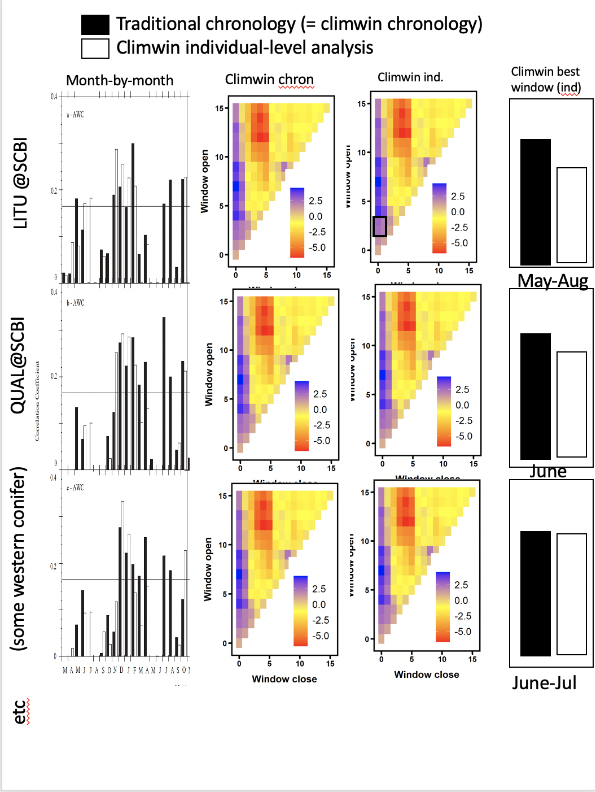

```{r, include=FALSE}
options(tinytex.verbose = TRUE)
options(knitr.table.format = "latex")
```


\newpage

## Appendix S1. Methods for reconstruction of $DBH$

*This is still rough/ mostly notes.*

For each core, $DBH$ can be reconstructed outside-in (based on recent $DBH$, subtracting growth recorded in tree rings) or inside-out (summing $\Delta r$ from the inside out). 
We generally gave precedence to the outside-in approach.
Specifically, when $DBH$ was taken at the time of coring,  
At some of our sites where DBH was not taken at the time of coring (*SCBI*,), DBH measurements taken before or slightly after the time of coring could be used.
(see [issue #19 in ForestGEO_dendro](https://github.com/EcoClimLab/ForestGEO_dendro/issues/19))
If before, ... 
If after...
For all outside-in reconstructions, if a negative $DBH$ was predicted...

When there were more than one cores for a tree, the $DBH$ reconstructions from each core were averaged to produce a single estimate of the tree's $DBH$ through time. 
When the start or end dates of the records from the cores differed, we extrapolated growth of the shorter core to match the years covered by the longer core. 
Specifically, to fill in years at the more recent end, we assumed that the average growth rate of the ten years prior to the missing records applied to the missing years. 
To fill in years at the beginning of the tree's lifespan, we likewise assumed that the ten years adjacent to the missing record applied to the missing years; however, if this yielded a negative $DBH$ estimate for the earliest year in the reconstruction, we divided the existing minimum $DBH$ by number of years missing and applied that value to each year.
We note that these reconstructed growth records were used only for the reconstruction of $DBH$ and were not included as response variables in any of our analyses.


In either case we need bark thickness--ideally allometries describing the relationship between DBH and bark thickness (Table S4). 
This is especially critical for thick-barked species.
When bark thickness data were available, we generated allometries ([issue #8 in ForestGEO_dendro](https://github.com/EcoClimLab/ForestGEO_dendro/issues/8))... 
lognormal model with intercept forced to zero: `lm(bark_depth.mm ~ -1 + log(dbh_no_bark.cm+1):bark_species, data = bark)`.
When bark thickness data were not available, we used published bark allometries from other sources (Table S4)


\newpage

## Appendix S2.  Methods for comparing climwin results with traditional methods
(**[ISSUE #35 in ForestGEO-climate-sensitivity ](https://github.com/EcoClimLab/ForestGEO-climate-sensitivity/issues/35)

*This is in process. For ~4 selected species (well-studied), we will build chronologies that exactly match the data used in this analysis. We'll then generate a figure like Fig. S1. We expect a pretty good match, as our results are basically consistent with previous studies at all these sites.*

\newpage

## Appendix S3.  Dealing with rapidly changing climate and tree growth

[ISSUE #25 in ForestGEO-climate-sensitivity ](https://github.com/EcoClimLab/ForestGEO-climate-sensitivity/issues/25)

Our analysis included two sites where climate change has had pronounced effects on tree growth: Scotty Creek, NW Territories, Canada (SC) and Little Tesuque, New Mexico, USA (LT).
At SC, [temperatures have increased by X $^\circ$ over X years]..., resulting in negative growth trends in basal area index ($BAI$) starting around 1950 and significant growth declines since 1970 in `r round(249/(249+69+127)*100, digits=0)`% of trees [@sniderhan_growth_2016].
At LT, *(drought has increased dramatically)*, resulting in many missing rings in recent years.

*This is in process. We will try and compare 3 methods: (1) our standard approach, (2) detrending the climate variables (#53), (3) applying the climwin step only for older records--before the most rapid climate change. We will work with SC and LT researchers to determine which makes most sense, and use that as the main approach for these sites.*

\newpage
## Table S1. Site Details
```{r eval = TRUE, echo=FALSE, warning=FALSE}
library(knitr)
library(kableExtra)
S1 <- read.csv("tables_figures/site_details.csv", stringsAsFactors = FALSE, check.names = FALSE)
kable(S1, format = "latex", booktabs = TRUE,   escape = F)%>%
  column_spec(2, width = "3cm") %>%
  column_spec(5, width = "2cm") %>%
  column_spec(6, width = "1.5cm") %>%
  kable_styling(latex_options = c("scale_down", "hold_position"), protect_latex = T) 
```

\newpage
## Table S2. Species analyzed, their characteristics, and bark allometries applied
(**[ISSUE #72 in ForestGEO-climate-sensitivity ](https://github.com/EcoClimLab/ForestGEO-climate-sensitivity/issues/72)
```{r eval = TRUE, echo=FALSE, warning=FALSE}
library(knitr)
library(kableExtra)
S2 <- read.csv("tables_figures/species.csv", stringsAsFactors = FALSE, check.names = FALSE)
kable(S2, format = "latex", booktabs = TRUE,  escape = F)%>%
  kable_styling(latex_options = c("scale_down", "hold_position")) 
```
*Bark allometry field indicates the species and site sampled to construct the bark allometry. When neither raw data nor an allometric equation for the study species was available, we selected the most appropriate equation that could be located for similar species. Equations are given in Table S4.

\newpage

## Table S3. Sampling details for species by site
*([ISSUE #73 in ForestGEO-climate-sensitivity ](https://github.com/EcoClimLab/ForestGEO-climate-sensitivity/issues/73))*

```{r eval = TRUE, echo=FALSE, warning=FALSE}
library(knitr)
library(kableExtra)
ss_table <- read.csv("tables_figures/sampling_details.csv", stringsAsFactors = FALSE, check.names = FALSE)
kable(ss_table, format = "latex", booktabs = TRUE,   escape = F, linesep = c('\\addlinespace'))%>%
  row_spec(0, italic = F, bold = T) %>%
  kable_styling(latex_options = c("scale_down", "hold_position"), protect_latex = T) 
```

\newpage

## Table S4. Allometric equations for bark thickness 

```{r eval = TRUE, echo=FALSE, warning=FALSE}
library(knitr)
library(kableExtra)
allometries_table <- read.csv("/Users/kteixeira/Dropbox (Smithsonian)/GitHub/EcoClimLab/ForestGEO_dendro/data_processed/dbh_to_bark_allometries_table.csv", stringsAsFactors = FALSE, check.names = FALSE)
kable(allometries_table, format = "latex", booktabs = TRUE,   escape = F, linesep = c('\\addlinespace'))%>%
  column_spec(1, italic = T) %>%
  column_spec(5, width = "3cm") %>%
  column_spec(6, width = "6cm") %>%
  row_spec(0, italic = F, bold = T) %>%
  kable_styling(latex_options = c("scale_down", "hold_position"), protect_latex = T) 
```


\newpage
## Table S5. Frequency of $DBH$-climate interactions across all sites and growth metrics
```{r eval = TRUE, echo=FALSE, warning=FALSE}
library(knitr)
library(kableExtra)
table_raw <- read.csv("/Users/kteixeira/Dropbox (Smithsonian)/GitHub/EcoClimLab/ForestGEO-climate-sensitivity/results/climate_interactions_summary.csv", stringsAsFactors = FALSE, check.names = FALSE)
#this reads in the table, but knit fails if I try to render it (probably because of underscores). It also needs ot be rearranged
#kable(table_raw, format = "latex", booktabs = TRUE, caption = "Table S  . Frequency of DBH-climate interactions", escape = F)%>%
#  kable_styling(latex_options = c("scale_down", "hold_position")) 
```


\newpage 
## Figure S1. Comparison of our approach with traditional methods of identifying climate signals
{ width=70% }

\newpage
## Figure S2. Comparison of climwin output across growth metrics for the temperature variable group at Little Tesuque (New Mexico, USA)
/GitHub/EcoClimLab/ForestGEO-climate-sensitivity/results/climwin_plots_combined/NewMexico_pet.png)

\newpage
## Figure S3. Comparison of climwin output across growth metrics for the precipitation variable group at Little Tesuque (New Mexico, USA)
/GitHub/EcoClimLab/ForestGEO-climate-sensitivity/results/climwin_plots_combined/NewMexico_wet_pre.png)

\newpage
## Figure S4. Comparison of climwin output across growth metrics for the precipitation variable group at Harvard Forest (Massachusetts, USA)
/GitHub/EcoClimLab/ForestGEO-climate-sensitivity/results/climwin_plots_combined/HarvardForest_pre_wet.png)

\newpage
## Figure S5. Best GLS models for Barro Colorado Island (Panama)

/GitHub/EcoClimLab/ForestGEO-climate-sensitivity/results/composite_plots/BCI.png){ width=78% }

\newpage
## Figure S6. Best GLS models for Huai Kha Khaeng (Thailand) 

/GitHub/EcoClimLab/ForestGEO-climate-sensitivity/results/composite_plots/HKK.png){ width=78% }

\newpage
## Figure S7. Best GLS models for Little Tesuque (New Mexico, USA) 

/GitHub/EcoClimLab/ForestGEO-climate-sensitivity/results/composite_plots/NewMexico.png){ width=78% }

\newpage
## Figure S8. Best GLS models for Cedar Breaks (Utah, USA) 

[**Figure S8 | Best GLS models for Cedar Breaks  (Utah, USA) for all three growth metrics: $\Delta r$, $BAI$, and $\Delta AGB$.** Precipitation and temperature group variables are as selected by *climwin*. For each species, relationships are plotted if included in top model, with dashed lines indicating terms that do not significantly improve the model (relative to a model without). Vertical grey lines indicate the long-term mean for the climate variable, shading indicates 1 SD.]

\newpage
## Figure S9. Best GLS models for SCBI (Virginia, USA) 

/GitHub/EcoClimLab/ForestGEO-climate-sensitivity/results/composite_plots/SCBI.png){ width=78% }

\newpage
## Figure S10. Best GLS models for Lilly Dickey Woods (Indiana, USA) 

/GitHub/EcoClimLab/ForestGEO-climate-sensitivity/results/composite_plots/LillyDickey.png){ width=78% }


\newpage
## Figure S11. Best GLS models for Harvard Forest (Massachusetts, USA) 

/GitHub/EcoClimLab/ForestGEO-climate-sensitivity/results/composite_plots/HarvardForest.png){ width=78% }

\newpage
## Figure S12. Best GLS models for Niobrara/ Hansley (Nebraska, USA) 

\newpage
## Figure S13. Best GLS models for Zofin (Czech Republic) 

/GitHub/EcoClimLab/ForestGEO-climate-sensitivity/results/composite_plots/Zofin.png){ width=78% }

\newpage
## Figure S14. Best GLS models for Scotty Creek (NW Territories, Canada) 

/GitHub/EcoClimLab/ForestGEO-climate-sensitivity/results/composite_plots/ScottyCreek.png){ width=78% }
