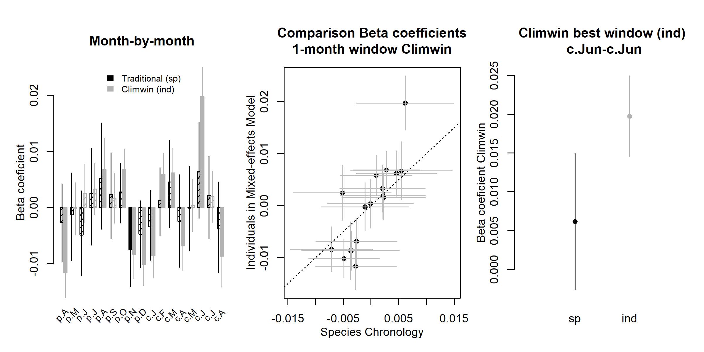

```{r, include=FALSE}
options(tinytex.verbose = TRUE)
options(knitr.table.format = "latex")
```

```{r eval = TRUE, echo=FALSE, warning=FALSE, results='hide'}
#READING IN TABLES TO GET STATS FOR TEXT
path_to_dir <- dirname(dirname(getwd())) # get path to repo (ForestGEO-climate-sensitivity)

# MOVE FIGURE FILES (doing this because I got an error when using the absolute path to call figures)
#traditional comparison
do.call(file.remove, list(list.files("/Users/kteixeira/Dropbox (Smithsonian)/GitHub/EcoClimLab/ForestGEO-climate-sensitivity/doc/manuscript/tables_figures/SI_figures/traditional_comparison/", full.names = TRUE))) # first remove old files
flist <- list.files("/Users/kteixeira/Dropbox (Smithsonian)/GitHub/EcoClimLab/ForestGEO-climate-sensitivity/results/formal_comparison/figures/", "^climwin_vs_dcc_.+[.]png$", full.names = TRUE)
file.copy(flist, "/Users/kteixeira/Dropbox (Smithsonian)/GitHub/EcoClimLab/ForestGEO-climate-sensitivity/doc/manuscript/tables_figures/SI_figures/traditional_comparison/")

# climwin plots
do.call(file.remove, list(list.files("/Users/kteixeira/Dropbox (Smithsonian)/GitHub/EcoClimLab/ForestGEO-climate-sensitivity/doc/manuscript/tables_figures/SI_figures/climwin_plots_combined/", full.names = TRUE))) # first remove old files
flist <- list.files("/Users/kteixeira/Dropbox (Smithsonian)/GitHub/EcoClimLab/ForestGEO-climate-sensitivity/results/climwin_plots_combined/", full.names = TRUE)
file.copy(flist, "/Users/kteixeira/Dropbox (Smithsonian)/GitHub/EcoClimLab/ForestGEO-climate-sensitivity/doc/manuscript/tables_figures/SI_figures/climwin_plots_combined/")


#composite plots
do.call(file.remove, list(list.files("/Users/kteixeira/Dropbox (Smithsonian)/GitHub/EcoClimLab/ForestGEO-climate-sensitivity/doc/manuscript/tables_figures/SI_figures/composite_plots/", full.names = TRUE))) # first remove old files
flist <- list.files("/Users/kteixeira/Dropbox (Smithsonian)/GitHub/EcoClimLab/ForestGEO-climate-sensitivity/results/composite_plots/", full.names = TRUE)
file.copy(flist, "/Users/kteixeira/Dropbox (Smithsonian)/GitHub/EcoClimLab/ForestGEO-climate-sensitivity/doc/manuscript/tables_figures/SI_figures/composite_plots/")

# SUPPLEMENTARY INFO (this chunk must be repeated in MEE_manuscript_SI.Rmd)

#Appendices
site_details_appendix <- "S1"
DBH_reconstruction <- "S2"
climate_correction <- "S3"
traditional_comparison <- "S4"
changing_climate <- "S5"
decadal_analysis_appendix <- "S6"

site_details_appendix_title<- "Appendix S1. Site Details"
DBH_reconstruction_title <- "Appendix S2. Methods for reconstruction of $DBH$"
climate_correction_title <- "Appendix S3. Methods for climate data evaluation and correction"
traditional_comparison_title <- "Appendix S4. Methods for comparing our approach with traditional methods"
changing_climate_title <- "Appendix S5. Dealing with rapidly changing climate and tree growth"
decadal_analysis_appendix_title <- "Appendix S6. Analysis of DBH-growth relationships by decade"

#SI table numbers
site_details = "S1"
species_table = "S2"
sampling_details_table = "S3"
bark_allometries = "S4"
qualitative_results_comparison = "S5"

#SI table captions
site_details_legend <- "Table S1. Site Details."
species_table_legend <-"Table S2. Species analyzed, their characteristics, and bark allometries applied."
sampling_details_legend <- "Table S3. Sampling details for species by site."
bark_allometries_legend <- "Table S4. Allometric equations for bark thickness."
qualitative_results_comparison_legend <- "Table S5. Qualtiative comparison of results from this study with previous studies employing conventional methods."

#SI figure numbers
all_traditional_comparisons = "S1-S4"
SCBI_traditional_comparison = "S1"
Zofin_traditional_comparison = "S2"
CB_traditional_comparison = "S3"
SC_traditional_comparison = "S4"

all_climwin = "S5-S7"
climwin_sameV_sameW = "S5"
climwin_sameV_diffW = "S6"
climwin_diffV_diffW = "S8"

all_GLS = "S9-S28"
GLS_BCNM = "S9"
GLS_BCNM_year = "S10"
GLS_HKK = "S11"
GLS_HKK_year = "S12"
GLS_SCBI = "S13"
GLS_SCBI_year = "S14"
GLS_LDW = "S15"
GLS_LDW_year = "S16"
GLS_HF = "S17"
GLS_HF_year = "S18"
GLS_ZOF = "S19"
GLS_ZOF_year = "S20"
GLS_NIO = "S21"
GLS_NIO_year = "S22"
GLS_LT = "S23"
GLS_LT_year = "S24"
GLS_CB = "S25"
GLS_CB_year = "S26"
GLS_SC = "S27"
GLS_SC_year = "S28"

SC_1970break = "S29"

RW_interactions_all= "S30"
BAI_interactions_all= "S31"

decadal_analysis_figs_all = "S32-SXX"
decades_figure_ZOF= "SXX"

#SI figure captions
SCBI_traditional_comparison_legend <- "Figure S1. Comparison of our approach with traditional methods of identifying climate signals: LITU at SCBI."
Zofin_traditional_comparison_legend <- "Figure S2. Comparison of our approach with traditional methods of identifying climate signals: ABAL at Zofin."
CB_traditional_comparison_legend <- "Figure S3. Comparison of our approach with traditional methods of identifying climate signals: PSME at Cedar Breaks."
SC_traditional_comparison_legend <- "Figure S4. Comparison of our approach with traditional methods of identifying climate signals: PIMA at Scotty Creek."

climwin_sameV_sameW_legend = "Figure S5. (PRE at SCBI)"
climwin_sameV_diffW_legend = "Figure S6. (PET at SCBI)"
climwin_diffV_diffW_legend = "Figure S7. (TMX/TMP at HKK)"

# without year
GLS_BCNM_legend = "Figure S9. Best GLS models including climate and DBH for Barro Colorado Nature Monument (Panama)"
GLS_BCNM_year_legend = "Figure S10. Best GLS models including climate, DBH, and year for Barro Colorado Nature Monument (Panama)"
GLS_HKK_legend = "Figure S11. Best GLS models including climate and DBH for Huai Kha Khaeng (Thailand)"
GLS_HKK_year_legend = "Figure S12. Best GLS models including climate, DBH, and year for Huai Kha Khaeng (Thailand)"
GLS_SCBI_legend = "Figure S13. Best GLS models including climate and DBH for the Smithsonian Conservation Biology Institute (Virginia, USA)"
GLS_SCBI_year_legend = "Figure S14. Best GLS models including climate, DBH, and year for the Smithsonian Conservation Biology Institute (Virginia, USA)"
GLS_LDW_legend = "Figure S15. Best GLS models including climate and DBH for Lilley Dickey Woods (Indiana, USA)"
GLS_LDW_year_legend = "Figure S16. Best GLS models including climate, DBH, and year for Lilley Dickey Woods (Indiana, USA)"
GLS_HF_legend = "Figure S17. Best GLS models including climate and DBH for Harvard Forest (Massachusetts, USA) "
GLS_HF_year_legend = "Figure S18. Best GLS models including climate, DBH, and year for Harvard Forest (Massachusetts, USA) "
GLS_ZOF_legend = "Figure S19. Best GLS models including climate and DBH for Zofin Forest (Czech Republic)"
GLS_ZOF_year_legend = "Figure S20. Best GLS models including climate, DBH, and year for Zofin Forest (Czech Republic)"
GLS_NIO_legend = "Figure S21. Best GLS models including climate and DBH for Niobrara (Nebraska, USA)"
GLS_NIO_year_legend = "Figure S22. Best GLS models including climate, DBH, and year for Niobrara (Nebraska, USA)"
GLS_LT_legend = "Figure S23. Best GLS models including climate and DBH for Little Tesuque (New Mexico, USA)"
GLS_LT_year_legend = "Figure S24. Best GLS models including climate, DBH, and year for Little Tesuque (New Mexico, USA)"
GLS_CB_legend = "Figure S25. Best GLS models including climate and DBH for Cedar Breaks (Utah, USA)"
GLS_CB_year_legend = "Figure S26. Best GLS models including climate, DBH, and year for Cedar Breaks (Utah, USA)"
GLS_SC_legend = "Figure S27. Best GLS models including climate and DBH for Scotty Creek (Northwest Territory, Canada)"
GLS_SC_year_legend = "Figure S28. Best GLS models including climate, DBH, and year for Scotty Creek (Northwest Territory, Canada)"

SC_1970break_legend = "Figure S29. Climate responses at Scotty Creek (Northwest Territory, Canada) before and after 1970."

RW_interactions_all_legend = "Figure S30. (RW_interactions_all)"
BAI_interactions_all_legend ="Figure S31. (BAI_interactions_all)"


# ~~~~~~~~~~ (below here does not need to be copied to main doc) ~~~~~~~~~~
# Generic legends
traditional_comparison_generic_legend = "Shown are repsonses to the precipitation- and temperature-group variables selected as most influential by the *climwin* analysis. Left panels show a month-by-month comparison of *beta* (slope) coefficients for the relationship between tree growth and the monthly climate variable from species-level residual chronologies (traditional approach) and from individual-level analysis in *climwin* (approach presented here). Center panels compare the monthly *beta* coefficient estimates, with the dotted line indicating 1:1 correspondence. Finally, the right panels compare *beta* coefficients for the optimal window selected by *climwin*. Error bars indicate standard error of slope estimates. Note that 1:1 correspondence is not necessarily expected. See Appendix 5 for analysis methods and discussion of expected correspondence."

GLS_generic_legend = " for all three growth metrics examined here. Precipitation and temperature group variables are as selected by *climwin* (p=previous year, c=current year). For each species, relationships are plotted if included in top model, with best-fit polynomials plotted with solid lines when both first- and second-order terms are signficant, dashed lines when only one term is signficant, and dotted lines when neither is signficant. Transparent ribbons indicate 95% confidence intervals. Vertical grey lines indicate the long-term mean for the climate variable, shading indicates 1 SD."

```


\newpage

## `r site_details_appendix_title`

*(include descriptions of stand history, global change dynamics)*

### Barro Colorado Nature Monument, Panama

We note that the secondary forest status of much of BCNM differs from ForestGEO's 50-ha plot on Barro Colorado Island (within BCNM), which is old-growth, and shows little directional trend in tree growth [@rutishauser_testing_2020].

### Huai Kha Khaeng, Thailand

*Melia azedarach* --a highly shade-intolerant species that establishes in the open [@baker_suppression_2006] and was sampled opportunistically outside the ForestGEO plot at HKK [@vlam_temperature_2014], where it presumably established under open conditions [@baker_disturbance_2005].

The site underwent a widespread, catastrophic disturbance in the mid-1800s and several smaller, more localized disutrbances in the 1910s, 1940s, and 1960s [@baker_disturbance_2005]

### Smithsonian Conservation Biology Institute, Virginia, USA

### Lilly Dickey Woods, Indiana, USA

### Harvard Forest, USA

### $\v{Z}$of$\'{i}$n Forest Dynamics Plot, Czech Republic


### Niobrara, Nebraska, USA
Riparian site
BEPA are growing on N facing slopes near stream

### Little Tesuque, New Mexico, USA

### Cedar Breaks, Utah, USA

### Scotty Creek, Northwest Territories, Canada
melting permafrost

\newpage

## `r DBH_reconstruction_title`

*This is still rough/ mostly notes.*

In most cases, when a recent $DBH$ measurement was available, $DBH$ was reconstructed from the outside in. 
In cases where $DBH$ was not available, but when we knew that the core hit pith or could reasonably estimate how far off it was based on the curvature of the rings [@applequist_simple_1958; @duncan_evaluation_1989], $DBH$ was reconstructed from the inside out. 

For each core, $DBH$ can be reconstructed outside-in (based on recent $DBH$, subtracting growth recorded in tree rings) or inside-out (summing $RW$ from the inside out,--only when core hit pith or distance to pith can be reliably estimated). 
We generally gave precedence to the outside-in approach.
Specifically, when $DBH$ was taken at the time of coring,  
At some of our sites where DBH was not taken at the time of coring (*SCBI*,), DBH measurements taken before or slightly after the time of coring could be used.
(see [issue #19 in ForestGEO_dendro](https://github.com/EcoClimLab/ForestGEO_dendro/issues/19))
If before, ... 
If after...
For all outside-in reconstructions, if a negative $DBH$ was predicted...

When there were more than one cores for a tree, the $DBH$ reconstructions from each core were averaged to produce a single estimate of the tree's $DBH$ through time. 
When the start or end dates of the records from the cores differed, we extrapolated growth of the shorter core to match the years covered by the longer core. 
Specifically, to fill in years at the more recent end, we assumed that the average growth rate of the ten years prior to the missing records applied to the missing years. 
To fill in years at the beginning of the tree's lifespan, we likewise assumed that the ten years adjacent to the missing record applied to the missing years; however, if this yielded a negative $DBH$ estimate for the earliest year in the reconstruction, we divided the existing minimum $DBH$ by number of years missing and applied that value to each year.
We note that these reconstructed growth records were used only for the reconstruction of $DBH$ and were not included as response variables in any of our analyses.


In either case we need bark thickness--ideally allometries describing the relationship between DBH and bark thickness (Table S4). 
This is especially critical for thick-barked species.
When bark thickness data were available, we generated allometries ([issue #8 in ForestGEO_dendro](https://github.com/EcoClimLab/ForestGEO_dendro/issues/8))... 
lognormal model with intercept forced to zero: `lm(bark_depth.mm ~ -1 + log(dbh_no_bark.cm+1):bark_species, data = bark)`.
When bark thickness data were not available, we used published bark allometries from other sources (Table S4)

\newpage
## `r climate_correction_title`

*For BCNM, we calculated monthly $PPT$ and $PDF$ from daily precipitation readings made on BCNM starting in 1929 [@paton_barro_2019].*

\newpage

## `r traditional_comparison_title`

To test whether our methods gave similar results to traditional methods, we conducted qualitative comparisons of our results to previous studies based on the same cores (Table `r qualitative_results_comparison`) and conducted a formal quantitative comparison for four species (Figs. `r all_traditional_comparisons`), as detailed below. 

*Qualitative comparison*

For all species-site combinations, we reviewed previous studies characterizing the climate sensitivity of growth using conventional methods. 
In most cases, we were able to compare with previous studies from the same sites and sets of cores. 
When these were not available, we reviewed regional-level analyses believed to be representative of the site. 

Results from previous studies were compiled alongside results from the climate-only model in this study (Table `r qualitative_results_comparison`). 
Where previous studies examined numerous climate variables or time windows [e.g., @helcoski_growing_2019], we focus on those most relevant to our findings. 

Beyond the methodological differences, original studies based on the same sets of cores varied from this one and from one another in factors including
the exact set of cores analyzed,
climate data sources,
time frame of analysis,
approaches to identifying candidate climate variables and windows (including whether this is done on a site or species level), 
methods for detrending and standardizing to build chronologies,
and whether the effects of temperature and precipitation are considered separately (original studies) or additively (this study).
To standardize for such differences, we selected a subset of species for a standardized quantitative comparison, as detailed below.

*Quantitative comparison*

We also conducted a formal comparison of our approach to conventional methods using identical tree-ring and climate data for four species: PSME (Cedar Breaks, Utah), ABAL ($\v{Z}$of$\'{i}$n), PIMA (Scotty Creek), and LITU (SCBI; Figs. `r all_traditional_comparisons`). 
These species were selected for analysis because they have been well-studied in the past.
For each species, we compared climate sensitivities for the top precipitation- and temperature- group variables, as identified in the main analysis. 

Prior to analysis, data were prepared and cleaned as described in the Methods section, resulting in an identical set of records for input into each analysis.
For the approach developed here, analysis was conducted as described in the Methods section, but with the *climwin* climate variable selection process limited to just the species of interest (as opposed to all species at the site), climate variables considered individually rather than additively, analysis of only first-order linear relationships, and with start date adjusted to match the conventional method (see below).
*Climwin* is a useful analytical tool that automates the process of running and comparing numerous regressions, but its use does not alter results relative to what would be obtained via a more conventional approach; numerous climate drivers and time windows can be compared without climwin (e.g., REFS), and *climwin* can also be used on residual chronologies. 
Following the *climwin* analysis step, we extracted *beta* coefficients describing the slope of the relationship between climate and $RW$.
*Beta* coefficients, along with their standard error, were obtained for each month within the analysis time frame (Table `r site_details`) and for the time window identified as optimal by *climwin*.

For the analysis using conventional methods, the ring-width series from each core was standardized via ARSTAN using a 2/3rds $n$ spline, where $n$ is the number of years in the series [@cook_time_1985; @cook_methods_1990]. 
*(The following italic text is self-plagarized from Helcoski and needs to be reworded:)* *The influence of outliers in all series was reduced using the adaptive power transformation, which also stabilises the variance over time [@cook_calculating_1997]. Next, each series was stabilised using either the average correlation between raw ring-width series (rbar) method or a 1/3rds spline method to adjust changes in variance as series replication decreased towards the earlier portion of each chronology [@jones_estimating_1997]. The 1/3rds spline method was chosen when replication in the inner portion of each chronology (c. the inner 30–50 yr of each record depending on full chronology length) dropped below three trees. Once that step was complete, a robust biweight mean chronology for each species was calculated from the ring-width indices [@cook_time_1985]. We chose to use residual chronologies because the autoregressive standardisation process in creating them removes much of the tree-level autocorrelation in growth and these chronologies would most likely contain the most conservative information on drivers of interannual growth [@cook_time_1985].*

We defined chronology start dates according to the subsample signal strength (SSS), using a cutoff of SSS = 0.80 (or 80% of the population signal).
Thus, for this analysis only, we defined chronology start dates as the year the SSS exceeded 0.80 or two years after the start of the climate record, whichever came later. 
SSS exceeded 0.80 well before the start of the 1901 start of climate records for PSME (1800s), ABAL (1700), and PIMA (1850s). For LITU, SSS reached 0.8 with 11 trees in 1919, which we used as the start date for this series.
We note that these start date criteria differ from those used in the main analysis (Table `r sampling_details_table`), which had earlier start dates because the analysis was not constrained by a need to represent the full population signal.
End dates were defined as the last full year prior to sampling (Table `r sampling_details_table`), or 2007 for CB.

*Beta* (slope) coefficients for the relationship between tree growth and the monthly climate variable were derived as in @helcoski_growing_2019:
*(SELF-PLAGIARIZED CONTENT:) Analyses of climate–growth relationships were conducted using ‘dplR’ (Bunn, 2008) and ‘bootRes’ (Zang & Biondi, 2013), which correlated functions and bootstrapped confidence intervals for the relationships between annual growth and monthly climate variables following Biondi & Waikul (2004).* 
Pearson correlations between climate variables and tree-ring chronologies were converted to linear slopes using the method of @charney_observed_2016.

Finally, we generated plots comparing month-by-month *beta* coefficients describing climate sensitivity, and also comparing *beta* coefficients for the window identified as optimal by *climwin* Figs. `r all_traditional_comparisons`). 

*The result is that our approach yields climate correlations with greater variance but lower standard error of slope estimates (Figs. `r all_traditional_comparisons`).*

We note that despite designing the analyses to be as comparable as possible, one-to-one correspondence of *beta* coefficients is not necessarily expected for several reasons.
First, although the analysis time frame is standardized between the two approaches, the relative influence of each year will generally vary between the two approaches. 
The traditional approach, which all cores into a single residual chronology with one value per year, gives equal weighting to each year.
In contrast, under the approach developed here, the number records per year will vary across the analysis time frame, generally increasing over time as the younger trees enter the analysis. 
Thus, where many younger trees are included in the analysis, the two approaches will effectively give different weights to the years included in the analysis period. 
In cases where climate-sensitivity differs between old and young trees, or where the climate and/or climate response changed substantially over the analysis time frame [e.g., at Scotty Creek; Fig. `r SC_traditional_comparison`; @sniderhan_growth_2016], this may lead to divergence of the climate sensitivities estimated by the two methods.  

Second, traditional analysis methods (using ARSTAN) were primarily designed to distill population-level variation to obtain the strongest possible climate signal for the reconstruction of past climate (**Cook & Kariustis **), not to characterize climate responses on the individual level, where variation is inherently higher. 
While conversion of Pearson correlations to linear slopes *sensu* @charney_observed_2016 approximates climate responses, it does not provide an exact slope describing the relationship between individual-level or population mean growth and climate. 
This is because standardization of variance and averaging of individual-level residuals prior to the climate analysis fundamentally alters and obfuscates individual-level responses. 

We suspect that both of these factors may underlie the tendency for the traditional method to estimate stronger climate sensitivity than the approach developed here for Scotty Creek (Fig. `r SC_traditional_comparison`), a comprehensively sampled black spruce forest (i.e., including young trees) on melting permafrost. 
We note, however, that there are no statistically significant differences in the *beta* coefficients of the two approaches at this site.


\newpage

## `r changing_climate_title`

[ISSUE #25 in ForestGEO-climate-sensitivity ](https://github.com/EcoClimLab/ForestGEO-climate-sensitivity/issues/25)

Our analysis included two sites where climate change has had pronounced effects on tree growth: Scotty Creek, NW Territories, Canada (SC) and Little Tesuque, New Mexico, USA (LT).
At SC, rapidly rising temperatures are causing melting permafrost, summer moisture stress, resulting in negative growth trends in basal area index ($BAI$) starting around 1950 and significant growth declines since 1970 in `r round(249/(249+69+127)*100, digits=0)`% of trees [@sniderhan_growth_2016].
At LT, increasingly warm drought has dramatically reduced growth [@williams_temperature_2012], resulting in many missing rings in recent years.

Problematically, correlating tree growth residuals from which climate-driven trends had been removed against the climate signal with a strong directional trend would not necessarily identify the most relevant climate drivers.

For these sites, we experimented with three approaches to identifying the most important climate drivers (1) the method described above, (2) detrending the climate variables **(AT:prewhitening?)** prior to the climwin step, and (3) splitting analyses into decades before and after 1970 [*sensu*  @sniderhan_growth_2016].

\newpage

## `r decadal_analysis_appendix_title`

**(CAMERON'S WORK [IN THIS REPO](https://github.com/EcoClimLab/tree-rings_global-change))**

\newpage
## `r site_details_legend` 
```{r eval = TRUE, echo=FALSE, warning=FALSE}
library(knitr)
library(kableExtra)
S1 <- read.csv("tables_figures/site_details.csv", stringsAsFactors = FALSE, check.names = FALSE)
kable(S1, format = "latex", booktabs = TRUE,   escape = F)%>%
  column_spec(2, width = "3cm") %>%
  column_spec(5, width = "2cm") %>%
  column_spec(6, width = "2cm") %>%
  column_spec(7, width = "1.5cm") %>%
  kable_styling(latex_options = c("scale_down", "hold_position"), protect_latex = T) 
```
*Refers to approximate period during which woody growth ceases (dry season in the tropics, winter for temperate and boreal sites).

\newpage
## `r species_table_legend` 


```{r eval = TRUE, echo=FALSE, warning=FALSE}
library(knitr)
library(kableExtra)
S2 <- read.csv("tables_figures/species.csv", col.names = c("species code", "family","latin name", "sites sampled", "leaf type", "leaf phenology", "light requirements*", "bark allometry**"), stringsAsFactors = FALSE, check.names = FALSE)
kable(S2, format = "latex", booktabs = TRUE,  escape = F, linesep = c('\\addlinespace'))%>%
  row_spec(0, italic = F, bold = T) %>%
  column_spec(3, italic = T) %>%
  kable_styling(latex_options = c("scale_down", "hold_position")) 
```
*For extratropical species, light requirements are classified based on the database of @niinemets_tolerance_2006. For tropical species, categorization is based on @alfaro-sanchez_growth_2017 for BCNM and @vlam_temperature_2014 for HKK.

**Bark allometry field indicates the species and site sampled to construct the bark allometry. When neither raw data nor an allometric equation for the study species was available, we selected the most appropriate equation that could be located for similar species. Equations are given in Table `r bark_allometries`.

\newpage

## `r sampling_details_legend` 

```{r eval = TRUE, echo=FALSE, warning=FALSE}
library(knitr)
library(kableExtra)
ss_table <- read.csv("tables_figures/sampling_details.csv", col.names = c("site", "species code", "n trees", "n cores", "n trees", "n cores", "sampled", "reconstructed*", "date range"), stringsAsFactors = FALSE, check.names = FALSE)
kable(ss_table, format = "latex", booktabs = TRUE,   escape = F, linesep = c('\\addlinespace'), longtable = T)%>%
  add_header_above(c(" ", " ", "all"=2, "with DBH"=2, "DBH range" = 2, " ")) %>%
  kable_styling(latex_options = c("scale_down", "hold_position","repeat_header"), protect_latex = T) 
```
*Maximum reconstructed $DBH$'s analyzed are less than maximum sampled $DBH$'s because we discard size ranges with < 3 conspecific trees.

\newpage

## `r bark_allometries_legend`

```{r eval = TRUE, echo=FALSE, warning=FALSE}
library(knitr)
library(kableExtra)
allometries_table <- read.csv("/Users/kteixeira/Dropbox (Smithsonian)/GitHub/EcoClimLab/ForestGEO_dendro/data_processed/dbh_to_bark_allometries_table.csv", stringsAsFactors = FALSE, check.names = FALSE)
kable(allometries_table, format = "latex", booktabs = TRUE,   escape = F, linesep = c('\\addlinespace'))%>%
  column_spec(1, italic = T) %>%
  column_spec(6, width = "3cm") %>%
  column_spec(7, width = "6cm") %>%
  row_spec(0, italic = F, bold = T) %>%
  kable_styling(latex_options = c("scale_down", "hold_position"), protect_latex = T) 
```
For assignments of species as proxies for those with out available bark allometries, see Table `r species_table`.

**NEED TO ADD REFERENCES FOR THE BARK ALLOMETRIES!!!**

\newpage
## `r qualitative_results_comparison_legend`

```{r eval = TRUE, echo=FALSE, warning=FALSE}
library(knitr)
library(kableExtra)
breakrow1<-15
breakrow2<-29
breakrow3<-42
col_width<-"2.5cm"
table_pt1 <- read.csv("tables_figures/qualitative_results_comparison.csv", 
                     colClasses=c("NULL", NA, NA, NA, NA, NA, NA), 
                     col.names=c("NULL", "species", "previously observed", "observed here", "previously observed", "observed here", "reference"), 
                     skip=0, nrows=breakrow1,
                     stringsAsFactors = FALSE, check.names = FALSE)
kable(table_pt1, format = "latex", booktabs = TRUE, longtable = TRUE,  escape = F, linesep = c('\\addlinespace'))%>%
  add_header_above(c(" ", "Precipitation response" = 2, "Temperature response" = 2)) %>%
  column_spec(2:5, width = col_width) %>%
  column_spec(6, width = "2cm") %>%
  pack_rows("Barro Colorado Nature Monument, Panama", 1, 3, latex_gap_space = "1em", colnum = 4, hline_before = FALSE) %>%
  pack_rows("Huai Kha Khaeng, Thailand", 4, 7, latex_gap_space = "1em", colnum = 4, hline_before = FALSE) %>%
  pack_rows("Smithsonian Conservation Biology Institute, Virginia, USA", 8, 15, latex_gap_space = "1em", colnum = 4, hline_before = FALSE) %>%
  kable_styling(latex_options = c( "hold_position", "repeat header"), protect_latex = T, font_size = 7) 
# refs in this table need to go in the nocite field below
```

\newpage
`r qualitative_results_comparison`, cont.
```{r eval = TRUE, echo=FALSE, warning=FALSE}
table_pt2 <- read.csv("tables_figures/qualitative_results_comparison.csv", 
                     colClasses=c("NULL", NA, NA, NA, NA, NA, NA), 
                     col.names=c("NULL", "species", "previously observed", "observed here", "previously observed", "observed here", "reference"), 
                     skip=breakrow1, nrows=breakrow2-breakrow1,
                     stringsAsFactors = FALSE, check.names = FALSE)
kable(table_pt2, format = "latex", booktabs = TRUE, longtable = TRUE,  escape = F, linesep = c('\\addlinespace'))%>%
  add_header_above(c(" ", "Precipitation response" = 2, "Temperature response" = 2)) %>%
  column_spec(2:5, width = col_width) %>%
  column_spec(6, width = "2cm") %>%
  pack_rows("Smithsonian Conservation Biology Institute, Virginia, USA (cont.)", 1, 6, latex_gap_space = "1em", colnum = 4, hline_before = FALSE) %>%
  pack_rows("Lilly Dickey Woods, Indiana, USA", 7, 10, latex_gap_space = "1em", colnum = 4, hline_before = FALSE) %>%
  pack_rows("Harvard Forest, Massachusetts, USA", 11, 14, latex_gap_space = "1em", colnum = 4, hline_before = FALSE) %>%
  kable_styling(latex_options = c( "hold_position", "repeat header"), protect_latex = T, font_size = 7) 
# refs in this table need to go in the nocite field below
```

\newpage
`r qualitative_results_comparison`, cont.
```{r eval = TRUE, echo=FALSE, warning=FALSE}
table_pt3 <- read.csv("tables_figures/qualitative_results_comparison.csv", 
                     colClasses=c("NULL", NA, NA, NA, NA, NA, NA), 
                     col.names=c("NULL", "species", "previously observed", "observed here", "previously observed", "observed here", "reference"), 
                     skip=breakrow2, nrows=breakrow3-breakrow2,
                     stringsAsFactors = FALSE, check.names = FALSE)
kable(table_pt3, format = "latex", booktabs = TRUE, longtable = TRUE,  escape = F, linesep = c('\\addlinespace'))%>%
  add_header_above(c(" ", "Precipitation response" = 2, "Temperature response" = 2)) %>%
  column_spec(2:5, width = col_width) %>%
  column_spec(6, width = "2cm") %>%
  pack_rows("Žofín Forest Dynamics Plot, Czech Republic", 1, 4, latex_gap_space = "1em", colnum = 4, hline_before = FALSE) %>%
  pack_rows("Niobrara, Nebraska, USA", 5, 5, latex_gap_space = "1em", colnum = 4, hline_before = FALSE) %>%
  pack_rows("Little Tesuque, New Mexico, USA", 6, 7, latex_gap_space = "1em", colnum = 4, hline_before = FALSE) %>%
  pack_rows("Cedar Breaks, Utah, USA", 8, 8, latex_gap_space = "1em", colnum = 4, hline_before = FALSE) %>%
  pack_rows("Scotty Creek, NW Territories, Canada", 9, 9, latex_gap_space = "1em", colnum = 4, hline_before = FALSE) %>%
  kable_styling(latex_options = c( "hold_position", "repeat header"), protect_latex = T, font_size = 7) 
# refs in this table need to go in the nocite field below
```
---
nocite: | 
  @alfaro-sanchez_growth_2017; @vlam_temperature_2014; @helcoski_growing_2019; @maxwell_declining_2016; @bumann_assessing_2019; @tumajer_increasing_2017; @sniderhan_growth_2016; @kaspar_species-specific_nodate
---
*Indicates results from a regional study including but not limited to cores from the focal site.

**Indicates results from a regional study not including the focal site, but believed to be representative.

\newpage 
## `r SCBI_traditional_comparison_legend`
**Precipitation**

{ width=95% }

**Potential Evapotranspiration**

{ width=95%}

**`r SCBI_traditional_comparison_legend`**  `r traditional_comparison_generic_legend`

\newpage 

## `r Zofin_traditional_comparison_legend`

**Precipitation Day Frequency**

{ width=95% }

**Maximum temperature**

{ width=95% }

**`r Zofin_traditional_comparison_legend`**  `r traditional_comparison_generic_legend`

\newpage 
## `r CB_traditional_comparison_legend`

**Precipitation**

{ width=95% }

**Maximum temperature**

{ width=95% }

**`r CB_traditional_comparison_legend`**  `r traditional_comparison_generic_legend`

\newpage 
## `r SC_traditional_comparison_legend`

**Precipitation**

{ width=95% }

**Maximum temperature**

{ width=95% }

**`r SC_traditional_comparison_legend`**  `r traditional_comparison_generic_legend`


\newpage
## `r climwin_sameV_sameW_legend`


**`r climwin_sameV_sameW_legend`** Here, *climwin* identified **GIVE WINDOW** precipitation ($PPT$) as the strongest climate variable across all four analyses ($RW$ with and without trees for which $DBH$ could not be reconstructed, $BAI$, $\Delta AGB$).

\newpage
## `r climwin_sameV_diffW_legend`


**`r climwin_sameV_diffW_legend`** Here, *climwin* identified potential evapotranspiration ($PET$) as the strongest climate variable across all four analyses ($RW$ with and without trees for which $DBH$ could not be reconstructed, $BAI$, $\Delta AGB$), but a different window (**GIVE WINDOW**) was chosen for  $BAI$ and $\Delta AGB$ than for $RW$ (**GIVE WINDOW**).

\newpage
## `r climwin_diffV_diffW_legend`


**`r climwin_diffV_diffW_legend`** Here....


\newpage
## `r GLS_BCNM_legend`


{ width=90% }

\newpage
## `r GLS_BCNM_year_legend`

{ width=90% }


\newpage
## `r GLS_HKK_legend`

{ width=90% }


\newpage
## `r GLS_HKK_year_legend`

{ width=90% }


\newpage
## `r GLS_SCBI_legend`

{ width=90% }

\newpage
## `r GLS_SCBI_year_legend`

{ width=90% }


\newpage
## `r GLS_LDW_legend`

{ width=90% }

\newpage
## `r GLS_LDW_year_legend`

{ width=90% }


\newpage
## `r GLS_HF_legend`

{ width=90% }

\newpage
## `r GLS_HF_year_legend`

{ width=90% }


\newpage
## `r GLS_ZOF_legend`

{ width=90% }

\newpage
## `r GLS_ZOF_year_legend`

{ width=90% }


\newpage
## `r GLS_NIO_legend`


{ width=90% }

\newpage
## `r GLS_NIO_year_legend`


{ width=90% }


\newpage
## `r GLS_LT_legend`

{ width=90% }


\newpage
## `r GLS_LT_year_legend`

{ width=90% }


\newpage
## `r GLS_CB_legend`


{ width=90% }

\newpage
## `r GLS_CB_year_legend`


{ width=90% }


\newpage
## `r GLS_SC_legend`

{ width=90% }

\newpage
## `r GLS_SC_year_legend`

{ width=90% }

\newpage

## `r SC_1970break_legend`

**(a) pre-1970**

{ width=57% }

**(b) post-1970**

{ width=57% }


\newpage

## `r RW_interactions_all_legend`

{ width=100% }

\newpage
## `r BAI_interactions_all_legend`

{ width=100% }


\newpage
## SI References