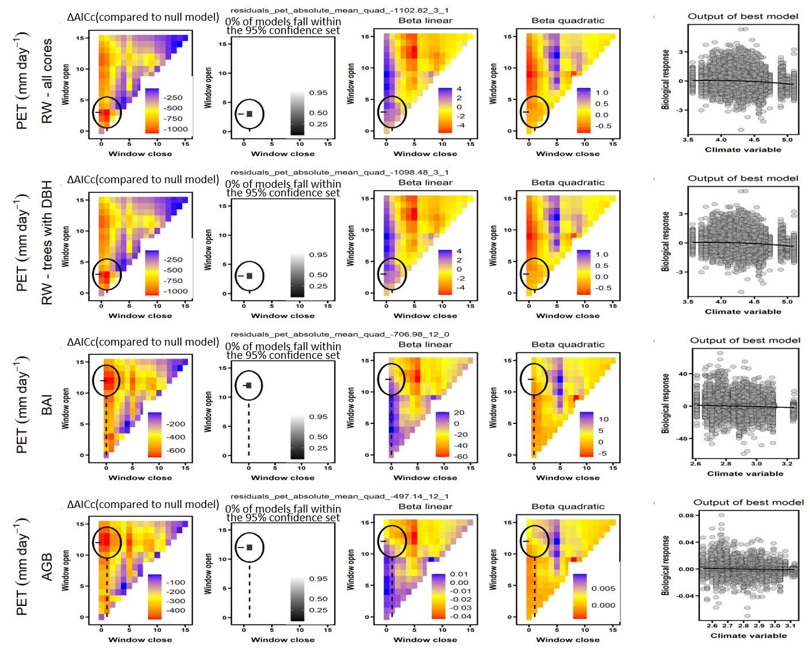

```{r, include=FALSE}
options(tinytex.verbose = TRUE)
options(knitr.table.format = "latex")
```

```{r eval = TRUE, echo=FALSE, warning=FALSE, results='hide'}
#READING IN TABLES TO GET STATS FOR TEXT
path_to_dir <- dirname(dirname(getwd())) # get path to repo (ForestGEO-climate-sensitivity)

# MOVE FIGURE FILES (doing this because I got an error when using the absolute path to call figures)
#traditional comparison
flist <- list.files("/Users/kteixeira/Dropbox (Smithsonian)/GitHub/EcoClimLab/ForestGEO-climate-sensitivity/results/formal_comparison/figures/", "^climwin_vs_dcc_.+[.]png$", full.names = TRUE)
file.copy(flist, "/Users/kteixeira/Dropbox (Smithsonian)/GitHub/EcoClimLab/ForestGEO-climate-sensitivity/doc/manuscript/tables_figures/SI_figures/traditional_comparison/")

# climwin plots
flist <- list.files("/Users/kteixeira/Dropbox (Smithsonian)/GitHub/EcoClimLab/ForestGEO-climate-sensitivity/results/climwin_plots_combined/", full.names = TRUE)
file.copy(flist, "/Users/kteixeira/Dropbox (Smithsonian)/GitHub/EcoClimLab/ForestGEO-climate-sensitivity/doc/manuscript/tables_figures/SI_figures/climwin_plots_combined/")


#composite plots
flist <- list.files("/Users/kteixeira/Dropbox (Smithsonian)/GitHub/EcoClimLab/ForestGEO-climate-sensitivity/results/composite_plots/", full.names = TRUE)
file.copy(flist, "/Users/kteixeira/Dropbox (Smithsonian)/GitHub/EcoClimLab/ForestGEO-climate-sensitivity/doc/manuscript/tables_figures/SI_figures/composite_plots/")

# SUPPLEMENTARY INFO (this chunk must be repeated in MEE_manuscript_SI.Rmd)

#Appendices
DBH_reconstruction <- "S1"
climate_correction <- "S2"
traditional_comparison <- "S3"
changing_climate <- "S4"

DBH_reconstruction_title <- "Appendix S1. Methods for reconstruction of $DBH$"
climate_correction_title <- "Appendix S2. Methods for climate data evaluation and correction"
traditional_comparison_title <- "Appendix S3.  Methods for comparing climwin results with traditional methods"
changing_climate_title <- "Appendix S4.  Dealing with rapidly changing climate and tree growth"

#SI table numbers
site_details = "S1"
species_table = "S2"
sampling_details_table = "S3"
bark_allometries = "S4"
qualitative_results_comparison = "S5"
climate_interactions_summary = "S6"

#SI table captions
site_details_legend <- "Table S1. Site Details."
species_table_legend <-"Table S2. Species analyzed, their characteristics, and bark allometries applied."
sampling_details_legend <- "Table S3. Sampling details for species by site."
bark_allometries_legend <- "Table S4. Allometric equations for bark thickness."
qualitative_results_comparison_legend <- "Table S5. Qualtiative comparison of results from this study with previous studies employing conventional methods."
climate_interactions_summary_legend <- "Table S6. Frequency of $DBH$-climate interactions across all sites and growth metrics."

#SI figure numbers
all_traditional_comparisons = "S1-S4"
SCBI_traditional_comparison = "S1"
Zofin_traditional_comparison = "S2"
CB_traditional_comparison = "S3"
SC_traditional_comparison = "S4"

all_climwin = "S5-S7"
climwin_sameV_sameW = "S5"
climwin_sameV_diffW = "S6"
climwin_diffV_diffW = "S8"

all_GLS = "S9-S18"
GLS_BCI = "S9"
GLS_HKK = "S10"
GLS_SCBI = "S11"
GLS_LDW = "S12"
GLS_HF = "S13"
GLS_ZOF = "S14"
GLS_NE = "S15"
GLS_LT = "S16"
GLS_CB = "S17"
GLS_SC = "S18"

#SI figure captions
SCBI_traditional_comparison_legend <- "Figure S1. Comparison of our approach with traditional methods of identifying climate signals: LITU at SCBI."
Zofin_traditional_comparison_legend <- "Figure S2. Comparison of our approach with traditional methods of identifying climate signals: ABAL at Zofin."
CB_traditional_comparison_legend <- "Figure S3. Comparison of our approach with traditional methods of identifying climate signals: PSME at Cedar Breaks."
SC_traditional_comparison_legend <- "Figure S4. Comparison of our approach with traditional methods of identifying climate signals: PIMA at Scotty Creek."

climwin_sameV_sameW_legend = "Figure S5. (PRE at SCBI)"
climwin_sameV_diffW_legend = "Figure S6. (PET at SCBI)"
climwin_diffV_diffW_legend = "Figure S7. (TMP/TMN at BCI)"


GLS_BCI_legend = "Figure S9. Best GLS models for Barro Colorado Island (Panama)"
GLS_HKK_legend = "Figure S10. Best GLS models for Huai Kha Khaeng (Thailand)"
GLS_SCBI_legend = "Figure S11. Best GLS models for the Smithsonian Conservation Biology Institute (Virginia, USA)"
GLS_LDW_legend = "Figure S12. Best GLS models for Lilley Dickey Woods (Indiana, USA)"
GLS_HF_legend = "Figure S13. Best GLS models for Harvard Forest (Massachusetts, USA) "
GLS_ZOF_legend = "Figure S14. Best GLS models for Zofin Forest (Czech Republic)"
GLS_NE_legend = "Figure S15. Best GLS models for Niobrara/ Halsey (Nebraska, USA)"
GLS_LT_legend = "Figure S16. Best GLS models for Little Tesuque (New Mexico, USA)"
GLS_CB_legend = "Figure S17. Best GLS models for Cedar Breaks (Utah, USA)"
GLS_SC_legend = "Figure S18. Best GLS models for Scotty Creek (Northwest Territory, Canada)"

# ~~~~~~~~~~ (below here does not need to be copied to main doc) ~~~~~~~~~~
# Generic legends
traditional_comparison_generic_legend = "Shown are repsonses to the precipitation- and temperature-group variables selected as most influential by the *climwin* analysis. Left panels show a month-by-month comparison of *beta* (slope) coefficients for the relationship between tree growth and the monthly climate variable from species-level residual chronologies (traditional approach) and from individual-level analysis in *climwin* (approach presented here). Center panels compare the monthly *beta* coefficient estimates, with the dotted line indicating 1:1 correspondence. Finally, the right panels compare *beta* coefficients for the optimal window selected by *climwin*. Error bars indicate standard error of slope estimates. Note that 1:1 correspondence is not necessarily expected. See Appendix 5 for analysis methods and discussion of expected correspondence."

GLS_generic_legend = " for all three growth metrics examined here. Precipitation and temperature group variables are as selected by *climwin* (p=previous year, c=current year). For each species, relationships are plotted if included in top model, with best-fit polynomials plotted with solid lines when both first- and second-order terms are signficant, dashed lines when only one term is signficant, and dotted lines when neither is signficant. Transparent ribbons indicate 95% confidence intervals. Vertical grey lines indicate the long-term mean for the climate variable, shading indicates 1 SD."

```


\newpage

## `r DBH_reconstruction_title`

*This is still rough/ mostly notes.*

For each core, $DBH$ can be reconstructed outside-in (based on recent $DBH$, subtracting growth recorded in tree rings) or inside-out (summing $RW$ from the inside out). 
We generally gave precedence to the outside-in approach.
Specifically, when $DBH$ was taken at the time of coring,  
At some of our sites where DBH was not taken at the time of coring (*SCBI*,), DBH measurements taken before or slightly after the time of coring could be used.
(see [issue #19 in ForestGEO_dendro](https://github.com/EcoClimLab/ForestGEO_dendro/issues/19))
If before, ... 
If after...
For all outside-in reconstructions, if a negative $DBH$ was predicted...

When there were more than one cores for a tree, the $DBH$ reconstructions from each core were averaged to produce a single estimate of the tree's $DBH$ through time. 
When the start or end dates of the records from the cores differed, we extrapolated growth of the shorter core to match the years covered by the longer core. 
Specifically, to fill in years at the more recent end, we assumed that the average growth rate of the ten years prior to the missing records applied to the missing years. 
To fill in years at the beginning of the tree's lifespan, we likewise assumed that the ten years adjacent to the missing record applied to the missing years; however, if this yielded a negative $DBH$ estimate for the earliest year in the reconstruction, we divided the existing minimum $DBH$ by number of years missing and applied that value to each year.
We note that these reconstructed growth records were used only for the reconstruction of $DBH$ and were not included as response variables in any of our analyses.


In either case we need bark thickness--ideally allometries describing the relationship between DBH and bark thickness (Table S4). 
This is especially critical for thick-barked species.
When bark thickness data were available, we generated allometries ([issue #8 in ForestGEO_dendro](https://github.com/EcoClimLab/ForestGEO_dendro/issues/8))... 
lognormal model with intercept forced to zero: `lm(bark_depth.mm ~ -1 + log(dbh_no_bark.cm+1):bark_species, data = bark)`.
When bark thickness data were not available, we used published bark allometries from other sources (Table S4)

\newpage
## `r climate_correction_title`


\newpage

## `r traditional_comparison_title`

To verify that our methods gave similar results to traditional methods, we conducted qualitative comparisons of our results to previous studies based on the same cores (Table `r qualitative_results_comparison`) and conducted a formal quantitative comparison for four species (Figs. `r all_traditional_comparisons`), as detailed below. 

*Qualitative comparison*

For all species-site combinations, we reviewed previous studies characterizing the climate sensitivity of growth using conventional methods. 
In most cases, we were able to compare with previous studies from the same sites and sets of cores. 
When these were not available, we reviewed regional-level analyses believed to be representative of the site. 

Results from previous studies were compiled alongside results from the climate-only model if this study (Table `r qualitative_results_comparison`). 
Where previous studies examined numerous climate variables or time windows [e.g., @helcoski_growing_2019], we focus on those most relevant to our findings. 

Beyond the methodological differences, original studies based on the same sets of cores varied from this one and from one another in factors including
the exact set of cores analyzed,
climate data sources,
time frame of analysis,
approaches to identifying candidate climate variables and windows (including whether this is done on a site or species level), 
methods for detrending and standardizing to build chronologies,
and whether the effects of temperature and precipitation are considered separately (original studies) or additively (this study).
To standardize for such differences, we selected a subset of species for a standardized quantitative comparison, as detailed below.

*Quantitative comparison*


*([ISSUE #35 in ForestGEO-climate-sensitivity ](https://github.com/EcoClimLab/ForestGEO-climate-sensitivity/issues/35))*

We also conducted a formal comparison using identical tree-ring and climate data for four species: PSME (Cedar Breaks, Utah), ABAL ($\v{Z}$of$\'{i}$n), PIMA (Scotty Creek), and LITU (SCBI; Figs. `r all_traditional_comparisons`). These species were selected for analysis because they have been well-studied in the past, and there was no manipulation of study species based on analysis results. 

We compared results from an analysis using conventional methods, as detailed below, to an analysis using our method as described in the Methods section, but with the *climwin* climate variable selection process limited to just the species of interest (as opposed to all species at the site), climate variables considered individually rather than additively, and with start date adjusted to match the conventional method.

The ring-width series from each core was standardized via ARSTAN using a 2/3rds $n$ spline, where $n$ is the number of years in the series (*Cook, 1985; Cook & Kairiukstis, 1990- citations in Helcoski*). 
*(The following italic text is self-plagarized from Helcoski and needs to be reworded:)* *The influence of outliers in all series was reduced using the adaptive power transformation, which also stabilises the variance over time (Cook & Peters, 1997). Next, each series was stabilised using either the average correlation between raw ring-width series (rbar) method or a 1/ 3rds spline method to adjust changes in variance as series replication decreased towards the earlier portion of each chronology (Jones et al., 1997). The 1/3rds spline method was chosen when replication in the inner portion of each chronology (c. the inner 30–50 yr of each record depending on full chronology length) dropped below three trees. Once that step was complete, a robust biweight mean chronology for each species was calculated from the ring-width indices (Cook, 1985). We chose to use residual chronologies because the autoregressive standardisation process in creating them removes much of the tree-level autocorrelation in growth and these chronologies would most likely contain the most conservative information on drivers of interannual growth (Cook, 1985).* 

Following @helcoski_growing_2019, we defined chronology start dates according to the subsample signal strength (SSS), using a cutoff of SSS = 0.80 (or 80% of the population signal).
Thus, for this analysis only, we defined chronology start dates as the year the SSS exceeded 0.80 or two years after the start of the climate record, whichever came later. 
SSS exceeded 0.80 well before the start of the 1901 start of climate records for PSME (1800s), ABAL (1700), and PIMA (1850s). For LITU , SSS reached 0.8 with 11 trees in 1919, which we used as the start date for this series.
We note that these start date criteria differ from those used in the main analysis (Table `r sampling_details_table`), which had earlier start dates because the analysis was not constrained by a need to represent the full population signal.
End dates were defined as the last full year prior to sampling (Table `r sampling_details_table`).


\newpage

## `r changing_climate_title`

[ISSUE #25 in ForestGEO-climate-sensitivity ](https://github.com/EcoClimLab/ForestGEO-climate-sensitivity/issues/25)

Our analysis included two sites where climate change has had pronounced effects on tree growth: Scotty Creek, NW Territories, Canada (SC) and Little Tesuque, New Mexico, USA (LT).
At SC, [temperatures have increased by X $^\circ$ over X years]..., resulting in negative growth trends in basal area index ($BAI$) starting around 1950 and significant growth declines since 1970 in `r round(249/(249+69+127)*100, digits=0)`% of trees [@sniderhan_growth_2016].
At LT, *(drought has increased dramatically)*, resulting in many missing rings in recent years.

*This is in process. We will try and compare 3 methods: (1) our standard approach, (2) detrending the climate variables (#53), (3) applying the climwin step only for older records--before the most rapid climate change. We will work with SC and LT researchers to determine which makes most sense, and use that as the main approach for these sites.*

\newpage
## `r site_details_legend` 
```{r eval = TRUE, echo=FALSE, warning=FALSE}
library(knitr)
library(kableExtra)
S1 <- read.csv("tables_figures/site_details.csv", stringsAsFactors = FALSE, check.names = FALSE)
kable(S1, format = "latex", booktabs = TRUE,   escape = F)%>%
  column_spec(2, width = "3cm") %>%
  column_spec(5, width = "2cm") %>%
  column_spec(6, width = "2cm") %>%
  column_spec(7, width = "1.5cm") %>%
  kable_styling(latex_options = c("scale_down", "hold_position"), protect_latex = T) 
```

\newpage
## `r species_table_legend` 
*([ISSUE #72 in ForestGEO-climate-sensitivity ](https://github.com/EcoClimLab/ForestGEO-climate-sensitivity/issues/72))*

*NOTE: bark.allometry field is not yet right-- we will have just one latin name per site, corresponding to allometries in Table `r bark_allometries`. But it does give correct info for what is currently applied. We also intend to find and apply more allometries.*

```{r eval = TRUE, echo=FALSE, warning=FALSE}
library(knitr)
library(kableExtra)
S2 <- read.csv("tables_figures/species.csv", stringsAsFactors = FALSE, check.names = FALSE)
kable(S2, format = "latex", booktabs = TRUE,  escape = F, linesep = c('\\addlinespace'))%>%
  row_spec(0, italic = F, bold = T) %>%
  column_spec(8, width = "5cm") %>%
  kable_styling(latex_options = c("scale_down", "hold_position")) 
```
*Bark allometry field indicates the species and site sampled to construct the bark allometry. When neither raw data nor an allometric equation for the study species was available, we selected the most appropriate equation that could be located for similar species. Equations are given in Table `r bark_allometries`.

\newpage

## `r sampling_details_legend` 
*([ISSUE #73 in ForestGEO-climate-sensitivity](https://github.com/EcoClimLab/ForestGEO-climate-sensitivity/issues/73))*

```{r eval = TRUE, echo=FALSE, warning=FALSE}
library(knitr)
library(kableExtra)
ss_table <- read.csv("tables_figures/sampling_details.csv", stringsAsFactors = FALSE, check.names = FALSE)
kable(ss_table, format = "latex", booktabs = TRUE,   escape = F, linesep = c('\\addlinespace'))%>%
  row_spec(0, italic = F, bold = T) %>%
  kable_styling(latex_options = c("scale_down", "hold_position"), protect_latex = T) 
```
*Maximum reconstructed $DBH$'s analyzed are less than maximum sampled $DBH$'s because we discard size ranges with < 3 conspecific trees.

\newpage

## `r bark_allometries_legend`

```{r eval = TRUE, echo=FALSE, warning=FALSE}
library(knitr)
library(kableExtra)
allometries_table <- read.csv("/Users/kteixeira/Dropbox (Smithsonian)/GitHub/EcoClimLab/ForestGEO_dendro/data_processed/dbh_to_bark_allometries_table.csv", stringsAsFactors = FALSE, check.names = FALSE)
kable(allometries_table, format = "latex", booktabs = TRUE,   escape = F, linesep = c('\\addlinespace'))%>%
  column_spec(1, italic = T) %>%
  column_spec(5, width = "3cm") %>%
  column_spec(6, width = "6cm") %>%
  row_spec(0, italic = F, bold = T) %>%
  kable_styling(latex_options = c("scale_down", "hold_position"), protect_latex = T) 
```
For assignments of species as proxies for those with out available bark allometries, see Table `r species_table`.

\newpage
## `r qualitative_results_comparison_legend`

```{r eval = TRUE, echo=FALSE, warning=FALSE}
library(knitr)
library(kableExtra)
breakrow1<-15
breakrow2<-29
breakrow3<-42
col_width<-"2.5cm"
table_pt1 <- read.csv("tables_figures/qualitative_results_comparison.csv", 
                     colClasses=c("NULL", NA, NA, NA, NA, NA, NA), 
                     col.names=c("NULL", "species", "previously observed", "observed here", "previously observed", "observed here", "reference"), 
                     skip=0, nrows=breakrow1,
                     stringsAsFactors = FALSE, check.names = FALSE)
kable(table_pt1, format = "latex", booktabs = TRUE, longtable = TRUE,  escape = F, linesep = c('\\addlinespace'))%>%
  add_header_above(c(" ", "Precipitation response" = 2, "Temperature response" = 2)) %>%
  column_spec(2:5, width = col_width) %>%
  column_spec(6, width = "2cm") %>%
  pack_rows("Barro Colorado Island, Panama", 1, 3, latex_gap_space = "1em", colnum = 4, hline_before = FALSE) %>%
  pack_rows("Huai Kha Khaeng, Thailand", 4, 7, latex_gap_space = "1em", colnum = 4, hline_before = FALSE) %>%
  pack_rows("Smithsonian Conservation Biology Institute, Virginia, USA", 8, 15, latex_gap_space = "1em", colnum = 4, hline_before = FALSE) %>%
  kable_styling(latex_options = c( "hold_position", "repeat header"), protect_latex = T, font_size = 7) 
# refs in this table need to go in the nocite field below
```

\newpage
`r qualitative_results_comparison`, cont.
```{r eval = TRUE, echo=FALSE, warning=FALSE}
table_pt2 <- read.csv("tables_figures/qualitative_results_comparison.csv", 
                     colClasses=c("NULL", NA, NA, NA, NA, NA, NA), 
                     col.names=c("NULL", "species", "previously observed", "observed here", "previously observed", "observed here", "reference"), 
                     skip=breakrow1, nrows=breakrow2-breakrow1,
                     stringsAsFactors = FALSE, check.names = FALSE)
kable(table_pt2, format = "latex", booktabs = TRUE, longtable = TRUE,  escape = F, linesep = c('\\addlinespace'))%>%
  add_header_above(c(" ", "Precipitation response" = 2, "Temperature response" = 2)) %>%
  column_spec(2:5, width = col_width) %>%
  column_spec(6, width = "2cm") %>%
  pack_rows("Smithsonian Conservation Biology Institute, Virginia, USA (cont.)", 1, 6, latex_gap_space = "1em", colnum = 4, hline_before = FALSE) %>%
  pack_rows("Lilly Dickey Woods, Indiana, USA", 7, 10, latex_gap_space = "1em", colnum = 4, hline_before = FALSE) %>%
  pack_rows("Harvard Forest, Massachusetts, USA", 11, 14, latex_gap_space = "1em", colnum = 4, hline_before = FALSE) %>%
  kable_styling(latex_options = c( "hold_position", "repeat header"), protect_latex = T, font_size = 7) 
# refs in this table need to go in the nocite field below
```

\newpage
`r qualitative_results_comparison`, cont.
```{r eval = TRUE, echo=FALSE, warning=FALSE}
table_pt3 <- read.csv("tables_figures/qualitative_results_comparison.csv", 
                     colClasses=c("NULL", NA, NA, NA, NA, NA, NA), 
                     col.names=c("NULL", "species", "previously observed", "observed here", "previously observed", "observed here", "reference"), 
                     skip=breakrow2, nrows=breakrow3-breakrow2,
                     stringsAsFactors = FALSE, check.names = FALSE)
kable(table_pt3, format = "latex", booktabs = TRUE, longtable = TRUE,  escape = F, linesep = c('\\addlinespace'))%>%
  add_header_above(c(" ", "Precipitation response" = 2, "Temperature response" = 2)) %>%
  column_spec(2:5, width = col_width) %>%
  column_spec(6, width = "2cm") %>%
  pack_rows("Žofín Forest Dynamics Plot, Czech Republic", 1, 3, latex_gap_space = "1em", colnum = 4, hline_before = FALSE) %>%
  pack_rows("Niobrara and Hansley, Nebraska, USA", 4, 7, latex_gap_space = "1em", colnum = 4, hline_before = FALSE) %>%
  #pack_rows("Scotty Creek, NW Territories, Canada", 13, 13, latex_gap_space = "1em", colnum = 4, hline_before = FALSE) %>%
  kable_styling(latex_options = c( "hold_position", "repeat header"), protect_latex = T, font_size = 7) 
# refs in this table need to go in the nocite field below
```
---
nocite: | 
  @alfaro-sanchez_growth_2017; @vlam_temperature_2014; @helcoski_growing_2019; @maxwell_declining_2016; @aus_de_ar_tree_2018; @bumann_assessing_2019; @tumajer_increasing_2017; @sniderhan_growth_2016; @kaspar_species-specific_nodate
---
*Indicates results from a regional study including but not limited to cores from the focal site.

**Indicates results from a regional study not including the focal site, but believed to be representative.


\newpage
## `r climate_interactions_summary_legend` 
```{r eval = TRUE, echo=FALSE, warning=FALSE}
library(knitr)
library(kableExtra)
table_raw <- read.csv("/Users/kteixeira/Dropbox (Smithsonian)/GitHub/EcoClimLab/ForestGEO-climate-sensitivity/results/climate_interactions_summary.csv", stringsAsFactors = FALSE, check.names = FALSE)
#this reads in the table, but knit fails if I try to render it (probably because of underscores). It also needs to be rearranged
#kable(table_raw, format = "latex", booktabs = TRUE, caption = "Table S  . Frequency of DBH-climate interactions", escape = F)%>%
#  kable_styling(latex_options = c("scale_down", "hold_position")) 
```

\newpage 
## `r SCBI_traditional_comparison_legend`
**Precipitation**

{ width=70% }

**Potential Evapotranspiration**

{ width=70% }

**`r SCBI_traditional_comparison_legend`**  `r traditional_comparison_generic_legend`

\newpage 

## `r Zofin_traditional_comparison_legend`

**Precipitation Day Frequency**

{ width=70% }

**Maximum temperature**

{ width=70% }

**`r Zofin_traditional_comparison_legend`**  `r traditional_comparison_generic_legend`

\newpage 
## `r CB_traditional_comparison_legend`

**Precipitation**

{ width=70% }

**Maximum temperature**

{ width=70% }

**`r CB_traditional_comparison_legend`**  `r traditional_comparison_generic_legend`

\newpage 
## `r SC_traditional_comparison_legend`

**Precipitation**

{ width=70% }

**Maximum temperature**

{ width=70% }

**`r SC_traditional_comparison_legend`**  `r traditional_comparison_generic_legend`


\newpage
## `r climwin_sameV_sameW_legend`


**`r climwin_sameV_sameW_legend`** Here, *climwin* identified **GIVE WINDOW** precipitation ($PPT$) as the strongest climate variable across all four analyses ($RW$ with and without trees for which $DBH$ could not be reconstructed, $BAI$, $\Delta AGB$).

\newpage
## `r climwin_sameV_diffW_legend`


**`r climwin_sameV_diffW_legend`** Here, *climwin* identified potential evapotranspiration ($PET$) as the strongest climate variable across all four analyses ($RW$ with and without trees for which $DBH$ could not be reconstructed, $BAI$, $\Delta AGB$), but a different window (**GIVE WINDOW**) was chosen for  $BAI$ and $\Delta AGB$ than for $RW$ (**GIVE WINDOW**).

\newpage
## `r climwin_diffV_diffW_legend`


**`r climwin_diffV_diffW_legend`** Here....


\newpage
## `r GLS_BCI_legend`

{ width=75% }


\newpage
## `r GLS_HKK_legend`

{ width=75% }

\newpage
## `r GLS_SCBI_legend`

{ width=75% }

\newpage
## `r GLS_LDW_legend`

{ width=75% }

\newpage
## `r GLS_HF_legend`

{ width=75% }

\newpage
## `r GLS_ZOF_legend`

{ width=75% }

\newpage
## `r GLS_NE_legend`


{ width=75% }


\newpage
## `r GLS_LT_legend`

{ width=75% }

\newpage
## `r GLS_CB_legend`


{ width=75% }


\newpage
## `r GLS_SC_legend`

{ width=75% }


\newpage
## SI References